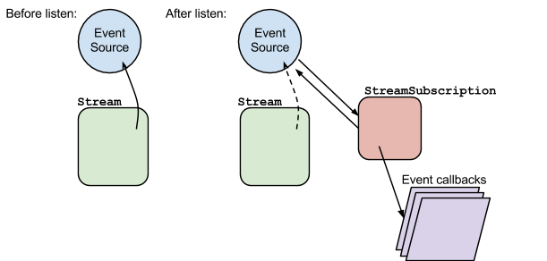
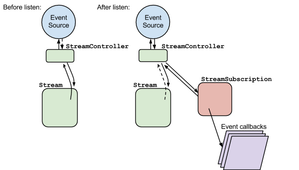
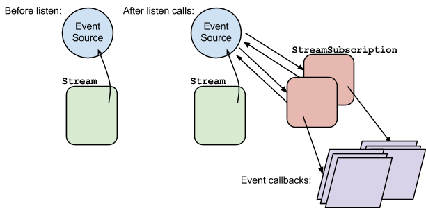

_Written by Florian Loitsch  
January 2014_

Dart features two different flavors of Streams:
_single-subscription streams_ and _broadcast streams._
This article discusses the differences between the two
and provides recommendations on when to use which.

If you aren't already familiar with Dart streams,
you can learn the basics from the tutorial
[Asynchronous Programming: Streams](/tutorials/language/streams).

## Introduction

Single-subscription and broadcast streams are intended to be used in
different contexts and have different requirements.
In many aspects they're similar to TCP and UDP:
single-subscription streams are stable with
guaranteed properties (like TCP),
whereas broadcast streams can lose events and
listeners don't have a tight connection to the source
(like UDP).

The following list summarizes the main differences between the two:

<table class="table">
<tr>
<th></th>
<th>Single subscription</th>
<th>Broadcast</th>
</tr>
<tr>
<td>Number of listeners</td>
<td>1</td>
<td>∞</td>
</tr>
<tr>
<td>Can lose events</td>
<td>No</td>
<td>Yes</td>
</tr>
<tr>
<td>Well-defined life cycle</td>
<td>Yes</td>
<td>No</td>
</tr>
<tr>
<td>Ease of use</td>
<td>Hard</td>
<td>Easy</td>
</tr>
</table>

Let's look at each difference in detail.

Number of listeners
: Single-subscription streams allow
  listening only once to the stream.
  This includes internal listen calls (such as calls to `isNotEmpty`).
  Broadcast streams don't have this limitation.

Can lose events
: Single-subscription streams do not lose events.
  If necessary they buffer their data until a listener appears.
  Broadcast streams are free to drop events if they don't have any listeners.

Well-defined life cycle
: Single-subscription streams have a well-defined life cycle:
  they start when a user starts listening,
  and they end when the user cancels or
  when the stream sends a close event.
  Broadcast streams generally don't give the listener any means to
  influence the lifetime from the listener's end.

  Getting the lifetime of streams right is very important:
  in dart:io the lifetime of the stream determines how long
  the Dart program holds on to
  the system resource it uses to deliver its data.
  The wrong choice of stream type can lead to resource leaks.

Ease of use
: Internally, many Stream members (for example `first`)
  start listening to the stream.
  Because single-subscription streams allow only one listener,
  invoking getters and methods on them can automatically use up the stream.
  As such, single-subscription streams are less convenient to use than
  broadcast streams,
  which do not have this restriction.

  Broadcast streams have their own pitfalls, though.
  For instance, `isEmpty` returns false only after
  _consuming_ an element.
  The user can then continue listening to the stream,
  but the first event is lost.

Before discussing the stream types in detail,
let's take a closer look at subscriptions,
which are fundamental to understanding how both kinds of streams work.

## Subscriptions

The easiest way to receive events from a stream
(single-subscription and broadcast) is to
invoke its `listen` method:
`stream.listen(onDataCallback)`.
In fact, `listen` really is the only method
where the implementation is different for different streams.
It connects a stream's listener to its event source.
All other methods can be (and usually are) implemented
on top of the `listen` method.

The `listen` method creates a new _stream subscription_,
connects it to the stream's event source, and
installs the callbacks (if given) in the subscription.
This stream subscription is then returned from the `listen` call.
The installation of the callbacks is just for convenience.
The handlers on the subscription can be changed at a later time.
It is not uncommon to see a `stream.listen(null)` just
to receive the stream subscription.

Once a stream creates a stream subscription, it hands off the
event generation and propagation to the subscription.
Most implementations of Stream
don't even keep track of their listeners.
As soon as a stream creates the subscription,
the stream doesn't need to know anything about the listener anymore.

The following diagram explains the `listen` call:

Note that a single-subscription stream
does not need to keep a reference to the event source,
once its `listen` method has been invoked.
That's why the arrow from the Stream to the event source is dashed
in the "after" picture.
Also note that the event source never sees
(or needs to see) the stream.
The event source only needs a reference to its subscription(s).
In return, a stream subscription needs a pointer to its event source,
so that it can cancel its subscription and thus shut down the event source.

Another consequence of this setup is that Stream instances are
unaware of the state of the event source.
In particular, they do not know if the event source is paused or not.
The StreamSubscription instance takes over this task.
In fact, the stream subscription ensures
that pause requests are respected.
If the actual event source can not be paused (for whatever reason)
the stream subscription must buffer the events.
In general, streams should inform their users if
the created subscriptions are able to pause their event source, or not.
Not knowing could easily lead to excessive memory use.

## Single-subscription streams

A single-subscription stream allows only one subscriber.
Use a single-subscription stream when the consumer can trigger
the generation ("production") of events
and when losing events would be an error.
The best example for such a stream is File.openRead():
the user starts the stream by listening to it,
and the user generally doesn't want to lose events.

The fact that single-subscription streams can be listened to only once
has some important implications.
First, and most importantly, with a single-subscription stream
it's extremely obvious
when the stream should produce events,
and when it should stop doing so.
Second, and more annoyingly, many Stream
getters and methods are less useful
for single-subscription streams.
For example, just using the `isNotEmpty` getter
internally listens to the stream and cancels its subscription
after it gets data.
At this point a single-subscription stream is finished:
the stream has already had a listener (the `isNotEmpty` getter),
and no other listener is allowed.
Similarly, the `first` getter can be invoked only once.

### Creating single-subscription streams

The easiest way to create a stream is to use a StreamController
where the default constructor instantiates a controller
with a single-subscription stream.

A controller implements the StreamSink interface with methods like
`add`, `addError`, and `close`.
Event sources, such as native I/O extensions, simply
invoke the corresponding functions when they have new data.
StreamControllers provide an easy abstraction for implementers of streams,
but fundamentally the concept explained in the Subscription section is
still valid, as the following figure shows.

Because controllers exist before a user listens to its stream,
the event source can add data to the controller
before the user starts listening to it.
To avoid data loss, the controller buffers the data until
a subscriber starts listening.

**This safeguard is one of the most abused features of a stream controller**.
When instantiating a controller,
you can register an `onListen` callback
to be notified when a listener is present.
Only after this callback is invoked
should the event source add events to the controller.
Similarly you should register an `onCancel` callback
that shuts down the stream.
The `onCancel` callback is invoked
when the user cancels the subscription,
or when the controller is shut down with `close()`.

Note that generating events only when the stream has a listener
is not a strict rule, but a good guideline.
Some perfectly valid use cases exist for adding data to a
controller before any subscribers are listening.
Be aware, however, that StreamSubscription's
buffering approach is optimized for just a few events,
and don't abuse it.

Frequently, a good way to avoid data generation is to
delay computations until a listener exists.
For example, `File.openRead()` doesn't touch the file system until
a listener exists.
A strange implication of this fact is that `File.openRead()` doesn't throw
if it's invoked on a nonexistent file.
Only when a user starts listening for the file contents does
the stream open the file on the hard drive.
If the file is created (through some other means)
in the time before the listener subscribes,
the stream works normally.
A direct corollary is that calling `File.openRead()`
doesn't lock the file on the hard drive.

As a good guideline, assume that a stream is never listened to.
Exceptions to this rule are small, local code snippets,
such as tests, where the subscription is guaranteed to happen.
**If a stream must be listened to (to avoid memory leaks)
clearly state this fact in the comments of
the function that creates the stream.**

## Broadcast streams

As a counterpart to single-subscription streams,
Dart also comes with broadcast streams.
Their intended use is for event sources that
produce output independently of listeners,
and where missing some events is not a problem.
Typically all DOM event sources are broadcast streams.

We can extend our subscription diagram for broadcast streams after
multiple listen calls:

The StreamSubscription instances have, again,
the responsibility to ensure that pause requests are respected.
Since stream subscriptions generally don't know of each other,
the easiest solution is to buffer all incoming events at
the subscription level.
This can lead to memory leaks if the subscription is not
resumed or canceled.

Being able to listen multiple times to a stream has some nice implications.
One of them is that `first`, `isEmpty`, and so on
don't make the stream unusable.
In return, determining the life cycle of a stream is more difficult.
Should the stream ever shut down?
If yes, should it shut down after it lost all its subscriptions
(making the stream multi-subscription only as long as
it has at least one subscriber),
or should it allow subscribers only as long as
a specific, crucial data event hasn't been emitted?
All of these proposals are valid,
so broadcast streams should document their closing behavior.
Generally we assume that no documentation means that
the stream has an infinite lifetime.

### Creating broadcast streams

The StreamController class comes with a factory constructor
`StreamController.broadcast` that has been designed for broadcast streams.
Contrary to single-subscription streams, it does not buffer events.
It either sends events directly to subscribers or,
if none is present, discards events.

<aside class="alert alert-info" markdown="1">
**Note:**
Without buffering, broadcast controllers seemingly have a
simpler and thus faster implementation.
However they need to deal with events that are
added to the controller
while the previous event hasn't been distributed yet.
The current broadcast implementation is therefore
more complicated than the one for single-subscription streams.
</aside>

The StreamController.broadcast constructor also has two callbacks:
onListen and onCancel.
They are invoked whenever the controller switches
from unsubscribed to subscribed and
from subscribed to unsubscribed, respectively
(including when the stream is closed from the event-source side).

A more dangerous way of creating a stream controller is to
view a single-subscription controller through `asBroadcastStream()`.
Invoking `asBroadcastStream` basically tells the single-subscription stream
that the user wants to take over the lifetime management of the stream.
In combination with cancelOnError subscribers,
this can easily lead to single-stream subscriptions
that are never closed and thus leak memory or resources.

The following example demonstrates such a case:

<!--- BEGIN(src/tests/site/articles/broadcast-streams/example1.dart) -->
import 'dart:io';
import 'dart:async';

main() {
  ServerSocket.bind("localhost", 4999).then((socket) {
    socket.asBroadcastStream()  // <== asBroadcastStream.
       .map((x) { throw "oops, my mistake"; })
       .listen(print)
       .asFuture()  // Automatically cancels on error.
       .catchError((_) { print("caught error"); });
  });
}
<!--- END(PENDING TEST FILE) -->

In this example, the single-subscription stream `socket` is
viewed as a broadcast stream.
The `asBroadcastStream` does not shut down after
its only listener cancels, and the socket remains open.
This is a typical case of resource leakage.
If the `asBroadcastStream()` call was left out,
the single-subscription stream would get notified that
its subscriber has disappeared and would close the socket.

Remember: `asBroadcastStream` is dangerous.
Use it only in rare circumstances.
We have seen `asBroadcastStream` used in circumstances where
listener changes and StreamIterators are the better choices.
See the next section for examples.

Alternatively, use the callbacks that can be given to `asBroadcastStream`.
They allow managing subscription changes
(similar to the StreamController.broadcast constructor)
and provide means to cancel
the subscription to the single-subscription stream.

## Alternatives to asBroadcastStream

Commonly `asBroadcastStream` is (ab)used so that Stream getters and methods,
such as `first` and `take`, can be invoked multiple times.
As shown above this is a dangerous trade-off.
This section shows some safer alternatives.

### Listener swapping

Stream subscriptions allow exchanging their listeners.
Instead of calling `first` multiple times on the stream,
you can often just exchange the listener callback
on the subscription.
For example:

<!--- BEGIN(src/tests/site/articles/broadcast-streams/example2.dart) -->
var bstream = stream.asBroadcastStream();
bstream.first.then((x) {
  handleFirstMessage();
  return bstream.first;
}).then((x) {
  handleSecondMessage();
  bstream.listen(handleAllOtherMessages);
});
<!--- END(PENDING TEST FILE) -->

could be written as:

<!--- BEGIN(src/tests/site/articles/broadcast-streams/example3.dart) -->
StreamSubscription subscription = stream.listen(null);
subscription.onData((x) {
  handleFirstMessage();
  subscription.onData((x) {
    handleSecondMessage();
    subscription.onData(handleAllOtherMessages);
  });
});
<!--- END(PENDING TEST FILE) -->

This introduces some nesting,
but some abstractions
(or using methods instead of anonymous closures)
can easily get rid of them.
A popular abstraction is, for example, a state machine.
Another one is the StreamIterator class.

### StreamIterator

Frequently, different events of an asynchronous stream
are destined for different parts of a system.
In such a case, a StreamIterator is often convenient.
Events of StreamIterators are pulled one by one,
and each part can pull the event it needs separately.
The operation is still asynchronous, though:
contrary to synchronous Iterators, moving to the next event can take time,
and the `moveNext` function therefore returns a future.

<!--- BEGIN(src/tests/site/articles/broadcast-streams/example4.dart) -->
Future moveNextAssert(iterator) {
  var future = iterator.moveNext();
  return future.then((hasNext) {
    if (!hasNext) throw new StateError("missing element");
    return iterator.current;
  });
}

var lines = new File(...).openRead()
    .transform(utf8.decoder)
    .transform(new LineSplitter());
var iterator = new StreamIterator(lines);
moveNextAssert(iterator)
  .then((line) {
    print("First line: $line");
    return moveNextAssert(iterator);
  })
  .then((fileName) {  // Assume second line is a file.
    return handleFile(fileName)  // Wait for it to finish.
      .then((_) => moveNextAssert(iterator));
  })
  .then((line) {
    print("Last line: $line");
    return iterator.moveNext();
  })
  .then((hasNext) {
    if (hasNext) throw "More lines than expected";
  });
<!--- END(PENDING TEST FILE) -->

## Conclusion

Despite their similarities, single-subscription and broadcast streams
have important differences.
You need to understand these differences,
so you can avoid
resource leaks and unnecessary memory consumption.

Single-subscription streams are designed for use cases where
events must not be lost,
and/or where the stream must have a well-defined lifetime.
Broadcast streams are tuned for event sources that are
not necessarily controlled by the listeners and
where some events can be lost or ignored.

Using `asBroadcastStream` on single-subscription streams
can lead to resource leaks.
Consider safer alternatives such as
listener swapping and StreamIterators.

For more information, see the API documentation:

* [Stream]({{site.dart_api}}/{{site.data.pkg-vers.SDK.channel}}/dart-async/Stream-class.html)
* [StreamSubscription]({{site.dart_api}}/{{site.data.pkg-vers.SDK.channel}}/dart-async/StreamSubscription-class.html)
* [StreamIterator]({{site.dart_api}}/{{site.data.pkg-vers.SDK.channel}}/dart-async/StreamIterator-class.html)

_Thanks to Lasse Reichstein Holst Nielsen, Anders Johnsen,
and Kathy Walrath for their suggestions and help to improve this article._

