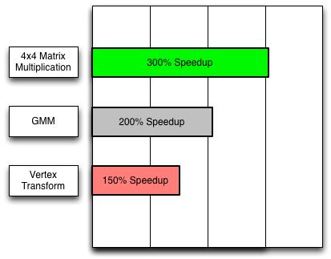
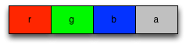
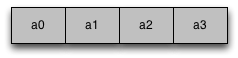
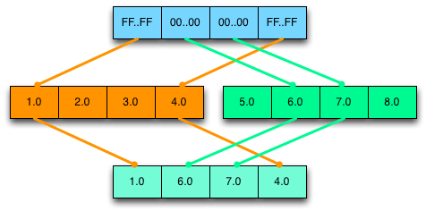

_Written by John McCutchan  
August 2013 (note added July 2018)_

<aside class="alert alert-info" markdown="1">
  This article's content is still relevant in Dart 2.
  However, the examples haven't been tested recently,
  and they use the now-optional `new` keyword.
</aside>

Programs written in Dart can use numeric types
that take advantage of
[Single Instruction Multiple Data (SIMD)](http://en.wikipedia.org/wiki/SIMD)
instruction sets.
By using the SIMD numeric type Float32x4,
programs can operate on four floating-point numbers in parallel,
providing a **potential speedup of 400%** for
3D graphics, image processing, audio processing,
and other numeric computation algorithms.

This article tells you how to use the SIMD numeric types
that the **dart:typed_data** library provides—Float32x4 and Int32x4.
Both types hold four numbers together
and operate on the four numbers simultaneously.
**Int32x4** is more limited;
it's useful for comparison, branching, and selection.
**Float32x4** offers the standard set of arithmetic operations and more.

## Performance gains

Depending on the algorithms involved,
SIMD instructions can speed up numeric computation
150% or more.
As the figure shows, the greatest speedups tend to occur
with 4x4 matrix multiplication.

3D graphics applications multiply 4x4
[transformation matrices](https://en.wikipedia.org/wiki/Transformation_matrix)
many times per frame.
By using Float32x4 instead of double,
you can speed up 4x4 matrix multiplication by **over 300%**.
The following video features a skeletal animation demo in which
the SIMD version of the animation has
**almost 400%** the performance of the non-SIMD version.

<iframe width="560" height="315" src="https://www.youtube.com/embed/huawCRlo9H4?start=2996" frameborder="0" allowfullscreen></iframe>

Machine learning algorithms
(such as automatic speech recognition)
that use a
[Gauss Mixture Model (GMM)](http://en.wikipedia.org/wiki/Mixture_model)
can also benefit from SIMD.
Using Float32x4 instead of double
[doubled the speed of one GMM implementation](http://dartogreniyorum.blogspot.com/2013/05/dart-beats-java-in-numerical-computing.html).

## Implementation status

As the next table shows,
although all of your code can _use_
dart:typed_data APIs such as Float32x4,
your code might not be _accelerated_.
When the types are not accelerated in the runtime environment,
the performance is equivalent to or slower than
the analogous scalar code.

|                 | IA32/X64 | ARM             | JavaScript |
|---|---|---|---|
| **Supported**   | Yes      | Yes             | Yes |
| **Accelerated** | Yes      | If NEON present | [Pending](http://www.slideshare.net/BrendanEich/value-objects) |
{: .table}

## Thinking in SIMD

Imagine a SIMD value as having four _lanes_ each containing a scalar value.
The lanes are organized horizontally
and named _x_, _y_, _z_, and _w_.
Note that the _w_ lane is the _fourth_ lane.

![4 bytes of data labeled x, y, z, and w, and containing [1.0, 2.0, 3.0, 4.0]](images/float32x4.png)

Operations on SIMD values occur vertically,
as the following figure shows.
For example, the result of adding (1.0, 2.0, 3.0, 4.0) and (5.0, 6.0, 7.0, 8.0)
is (6.0, 8.0, 10.0, 12.0).

![Results of adding 2 float32x4s: [1.0, 2.0, 3.0, 4.0] + [5.0, 6.0, 7.0, 8.0] = [6.0, 8.0, 10.0, 12.0]](images/float32x4_addition.png)

Remember that all four of the additions happen in parallel.

### Memory model

Despite the fact that a Float32x4 is organized as
four lanes holding distinct floating-point values,
you should not write programs that
treat a Float32x4 as a list of floating-point numbers
that can be read individually.
Instead, think of a Float32x4 as an immutable object
with operations that create new immutable Float32x4 objects.

### Horizontal operations

Horizontal operations read or write the individual lane values
inside a Float32x4 or Int32x4 value.
Operating on these values horizontally—for example,
adding the individual lane values together—is slow; avoid it.
If you can’t avoid a horizontal operation entirely,
adjust the code to perform the operation as few times as possible.

### Uniform data

Because operations performed on SIMD values affect all four lanes,
the data you store in a Float32x4 should be uniform—for
example, the alpha value of four pixels.
An example of non-uniform data would be the
red, green, blue, and alpha values of a single pixel.

Consider an algorithm that alters the alpha channel of an image.
Each pixel is represented as 4 floating-point values representing the
red, green, blue, and alpha channels respectively.
If the Float32x4 holds non-uniform data,
as in the following diagram,
then you cannot efficiently alter the alpha channel
without altering the red, green, and blue channels as well.

**Non-uniform data (bad!)**

Contrast this with a Float32x4 holding uniform data from four pixels,
as in the following diagram:

**Uniform data (good!)**

A single operation can adjust the alpha channel without altering
the red, green, or blue channels.

When a Float32x4 stores uniform data,
you don't have to treat a lane specially (which is slow).
Organizing your data to be uniform is often easier said than done,
but it can reap performance wins.

## Types

The [dart:typed_data library]({{site.dart_api}}/{{site.data.pkg-vers.SDK.channel}}/dart-typed_data/dart-typed_data-library.html)
has four types to support SIMD:
Float32x4, Int32x4, Float32x4List and Int32x4List.

### Float32x4

Each lane in a Float32x4 holds a single-precision (32-bit) floating-point value.
Most of the examples in this article use Float32x4.
For a complete list of methods and constructors,
see the [Float32x4 API reference]({{site.dart_api}}/{{site.data.pkg-vers.SDK.channel}}/dart-typed_data/Float32x4-class.html).

### Int32x4

Each lane in a Int32x4 API reference
holds an unsigned, 32-bit integer value.
Int32x4 has no support for arithmetic.
Instead, use it for logical operations
such as comparison and selection.

You can get Int32x4 objects by explicitly creating them or,
as the [Branching](#branching) section shows,
from the return values of Float32x4 methods.
To create an explicit selection mask,
you can use the Int32x4.bool() constructor:


Int32x4.bool(bool x, bool y, bool z, bool w);


This constructor creates a new Int32x4 instance
with 0xFFFFFFFF in lanes where the boolean parameter is true
and 0x0 in lanes where the boolean parameter is false.

The [Int32x4 API reference]({{site.dart_api}}/{{site.data.pkg-vers.SDK.channel}}/dart-typed_data/Int32x4-class.html)
has a complete list of methods and constructors.

### Float32x4List

When you need a list of Float32x4 objects, use
[Float32x4List]({{site.dart_api}}/{{site.data.pkg-vers.SDK.channel}}/dart-typed_data/Float32x4List-class.html)
instead of List\<Float32x4> whenever possible.
See the [Examples](#examples) section
for code that uses Float32x4List.
For a complete list of methods and constructors, see the
[Float32x4List API reference]({{site.dart_api}}/{{site.data.pkg-vers.SDK.channel}}/dart-typed_data/Float32x4List-class.html).

## Common techniques

This section shows code for some common tasks.

### Performing arithmetic

Arithmetic on instances of Float32x4 is no different than
arithmetic on double or integer numbers in Dart.
Example:


var a = new Float32x4(1.0, 2.0, 3.0, 4.0);
var b = new Float32x4(5.0, 6.0, 7.0, 8.0);
var sum = a + b;


### Reading the value of individual lanes

<aside class="alert alert-warning" markdown="1">
  **Warning:**
  Reading individual lanes is **slow**.
</aside>

You can read individual lanes using the getters x, y, z, and w.
For example:


double addXY(Float32x4 v) {
  return v.x + v.y;
}


### Writing the value of individual lanes

<aside class="alert alert-warning" markdown="1">
  **Warning:**
  This technique is **slow**.
</aside>

Remember that all instances of Float32x4 and Int32x4 are immutable,
so you can’t change the value in a given lane.
However you can construct a new instance
using the lane values from an existing instance,
while altering the value in one lane.
For example:


Float32x4 v = ...;
v = v.withX(x); // Change the value in the x lane of v.


### Shuffling or re-ordering

You can shuffle the order of values stored in a Float32x4 instance
without resorting to code that looks like this:


Float32x4 v = ...;
double x = v.x;
double y = v.y;
double z = v.z;
double w = v.w;
Float32x4 v2 = new Float32x4(w, z, y, x); // Reverse the order of the values.


Instead, simply use one of the many fields
that returns a new object with values in the specified order:


Float32x4 v2 = v.shuffle(Float32x4.WZYX);  // Reverse the order of the values.


Not only is the code easier to read,
but the performance is significantly better, too.

### Branching

Take care when writing code that branches.
Consider the following code snippet:


Float32x4 a = ...;
Float32x4 b = ...;
Float32x4 c;

if (a > b) {
  c = a;
} else {
  c = b;
}


It has a problem:
What if only some lanes in a are greater than b,
while the remaining lanes are not?
Comparisons between two Float32x4 instances cannot be
reduced down to a single boolean value.
Because of this,
Float32x4 does not support the standard comparison operators;
instead it defines the following methods:


Int32x4 greaterThan(Float32x4 other);
Int32x4 greaterThanOrEqual(Float32x4 other);
Int32x4 lessThan(Float32x4 other);
Int32x4 lessThanOrEqual(Float32x4 other);
Int32x4 equal(Float32x4 other);
Int32x4 notEqual(Float32x4 other);


Each method returns a Int32x4,
where the lane values are 0xFFFFFFFF when the comparison is true
and 0x0 when the comparison is false.
This Int32x4 is called a selection mask
and is used to select values from two Float32x4s,
lane by lane.
Here is the preceding code snippet rewritten for SIMD:


Float32x4 a = ...;
Float32x4 b = ...;
Int32x4 mask = a.greaterThan(b);  // Create selection mask.
Float32x4 c = mask.select(a, b);   // Select.


The select() method is defined in the Int32x4 class as follows:


Float32x4 select(Float32x4 trueValue, Float32x4 falseValue);


If the mask has 0xFFFFFFFF in a lane,
the result has the lane value from _trueValue_;
if the mask has 0x0 in a lane,
the result has the lane value from _falseValue_.
The following diagram demonstrates a selection:

In general, programs that branch based on the values in a Float32x4
execute both the true path and the false path.
They then merge the results by performing a select operation.

### Masking lanes

Some algorithms compute updated values for some but not all of the lanes.
Although you can’t operate on a fraction of the lanes of a Float32x4,
you *can* create a custom selection mask.
You can then use that mask to merge the updated lanes
with the original value.
For example:


// v = [2.0, 3.0, 4.0, 5.0]
Float32x4 v = new Float32x4(2.0, 3.0, 4.0, 5.0);

// mask = [0xFFFFFFFF, 0xFFFFFFFF, 0xFFFFFFFF, 0x0]
Int32x4 mask = new Int32x4.bool(true, true, true, false);

// r = [4.0, 9.0, 16.0, 25.0].
Float32x4 r = v * v;

// v = [4.0, 9.0, 16.0, 5.0].
v = mask.select(r, v);


## Examples

This section contains a few algorithms written to take advantage of SIMD.

### Example #1: Average

This example computes the average of the individual floats
stored in a Float32x4List.
The loop computes a sum for the x, y, z, and w lanes.
Outside of the loop,
the four sub-sums are summed together,
resulting in the true sum of the numbers.


double computeAverage(Float32x4List list) {
  Float32x4 sum = new Float32x4.zero();
  for (int i = 0; i < list.length; i++) {
    sum += list[i];
  }
  // Perform horizontal operations once.
  double average = sum.x + sum.y + sum.z + sum.w;
  return average / (list.length*4);
}


### Example #2: 4x4 matrix multiplication

This example multiplies two 4x4 matrices, A and B.
The result of the multiplication is stored into R.


// R = A * B;
void multiplyMatrices(Float32x4List A, Float32x4List B, Float32x4List R) {
    var a0 = A[0];
    var a1 = A[1];
    var a2 = A[2];
    var a3 = A[3];

    var b0 = B[0];
    R[0] = b0.shuffle(Float32x4.XXXX) * a0 + b0.shuffle(Float32x4.YYYY) * a1 + b0.shuffle(Float32x4.ZZZZ) * a2 + b0.shuffle(Float32x4.WWWW) * a3;
    var b1 = B[1];
    R[1] = b1.shuffle(Float32x4.XXXX) * a0 + b1.shuffle(Float32x4.YYYY) * a1 + b1.shuffle(Float32x4.ZZZZ) * a2 + b1.shuffle(Float32x4.WWWW) * a3;
    var b2 = B[2];
    R[2] = b2.shuffle(Float32x4.XXXX) * a0 + b2.shuffle(Float32x4.YYYY) * a1 + b2.shuffle(Float32x4.ZZZZ) * a2 + b2.shuffle(Float32x4.WWWW) * a3;
    var b3 = B[3];
    R[3] = b3.shuffle(Float32x4.XXXX) * a0 + b3.shuffle(Float32x4.YYYY) * a1 + b3.shuffle(Float32x4.ZZZZ) * a2 + b3.shuffle(Float32x4.WWWW) * a3;
}


### Example #3: Largest number

This example determines the largest floating point number in a Float32x4List.
First, the loop determines the largest number in each lane.
Then, outside of the loop,
the largest of those 4 largest numbers is determined.


double findLargestNumber(Float32x4List list) {
  Float32x4 largest = list[0];
  for (int i = 1; i < list.length; i++) {
    largest = largest.max(list[i]);
  }
  // Perform horizontal operations once.
  double x = largest.x;
  double y = largest.y;
  double z = largest.z;
  double w = largest.w;
  double t0 = Math.max(x, y);
  double t1 = Math.max(z, w);
  return Math.max(t0, t1);
}


## More information

For more details, check out these resources:

* API reference documentation for
  [Float32x4]({{site.dart_api}}/{{site.data.pkg-vers.SDK.channel}}/dart-typed_data/Float32x4-class.html),
  [Int32x4]({{site.dart_api}}/{{site.data.pkg-vers.SDK.channel}}/dart-typed_data/Int32x4-class.html), and
  [Float32x4List]({{site.dart_api}}/{{site.data.pkg-vers.SDK.channel}}/dart-typed_data/Float32x4List-class.html)
* Code that uses SIMD:
  * [vector_math](https://github.com/johnmccutchan/vector_math),
    a library for 2D and 3D applications
    that relies on Float32x4 and Float32x4List
* My [SIMD talk](https://www.youtube.com/watch?v=CKh7UOELpPo)
  from the February 2013 [SFHTML5 meetup](http://www.meetup.com/sfhtml5/)
* [Numeric Computation](numeric-computation),
  an article about number representations in Dart
  and how they affect performance

