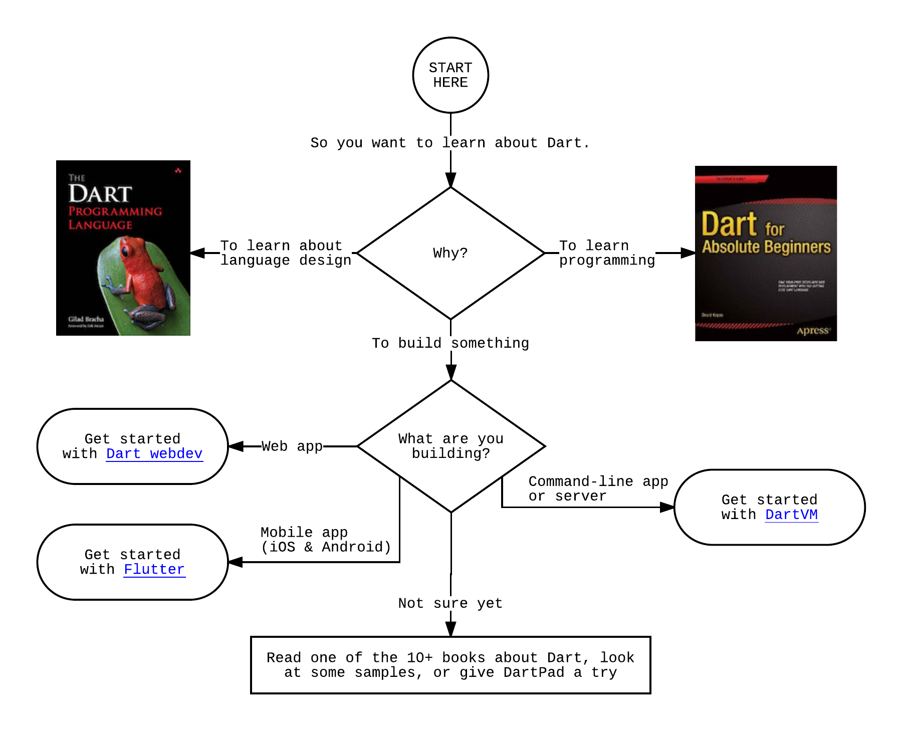

Jump right in. Use the embedded DartPad below to play with Dart and to experience the language and core APIs.
[DartPad](/tools/dartpad) is a quick and easy way to
become familiar with Dart language features.
You can also open <a href="http://dartpad.dartlang.org" target="_blank">DartPad in a new window</a>.

<iframe
src="{{site.custom.dartpad.embed-dart-prefix}}?horizontalRatio=70&verticalRatio=65"
    width="100%"
    height="310px"
    style="border: 1px solid #ccc;">
</iframe>

Note that DartPad supports only a few core libraries.
If you want to use other libraries,
such as dart:io or libraries from packages,
you'll need to install an SDK.

  <h2>Ready for something more?</h2>
  

    This website (<a href="/">www.dartlang.org</a>) contains
    information about the fundamental Dart technologies:
  

  <ul>
    <li>the <a href="/guides/language/">language</a></li>
    <li><a href="/guides/libraries/">core libraries</a></li>
  </ul>
  

    But where do you go when you have a use case in mind?
  

| | | **Use case** | **Get started** |
| <i class="fa fa-code" aria-hidden="true"></i> | **Web** | Create an app that runs in any modern browser | <a href="{{site.webdev}}/guides/get-started" class="btn btn-primary no-automatic-external">Dart webdev</a> |
| <i class="fa fa-android" aria-hidden="true"></i> <i class="fa fa-apple" aria-hidden="true"></i> | **Mobile** | Create an app from a single codebase that runs on both iOS and Android | <a href="https://flutter.io/getting-started/" class="btn btn-primary no-automatic-external">Flutter</a> |
| <i class="fa fa-qrcode" aria-hidden="true"></i> | **IoT** | Create an app that runs on an embedded device | <a href="https://dartino.org/getting-started/" class="btn btn-primary no-automatic-external">Dartino</a> |
| <i class="fa fa-terminal" aria-hidden="true"></i> | **Server** | Create a command-line app or server | <a href="/tutorials/dart-vm/get-started" class="btn btn-primary">Dart VM</a> |
{:.get-started-table}


*If you have a favorite IDE, there is probably a Dart plugin for that.
See the link for tips on how to configure the recommended IDE.
For general IDE advice, see [Tools](/tools).


## Helpful flowchart


The original Lucid Chart is here:
https://www.lucidchart.com/documents/edit/0f170001-d5f4-4b17-8cdc-72d5575f2e78?shared=true&#
Created by filiph, the Lucid app is available to Googlers in mystuff.


<object class="get-started-flowchart" type="image/svg+xml" data="images/get-started-flowchart.svg">
  
</object>

## Books

If you're looking for a more guided approach to learning Dart, we recommend you
pick up one of the many [books about Dart](/resources/books).

## Samples

Check out the Dart [samples](/samples/).

## Get help

There are a number of communities and platforms where you can ask,
or answer, Dart-related questions. For a list, see
[Community and Support](/community/).

