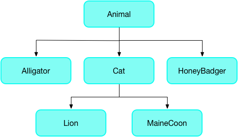
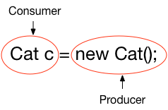
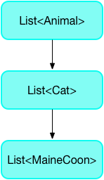
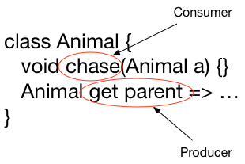

<?code-excerpt replace="/([A-Z]\w*)\d\b/$1/g; /\b(main)\d\b/$1/g"?>


update-for-dart-2


This guide tells you why and how to write sound (type safe) Dart code.
You'll learn how to use strong mode to enable soundness, as well as
how to substitute types safely when overriding methods.

**Strong mode** is a sound static
type system that uses a combination of static and runtime checks to
ensure your code is type safe&mdash;that you can never see a value
whose runtime type does not match its static type.
With strong mode enabled (in an implementation that has both the
static and runtime checks), Dart is a sound language.

<aside class="alert alert-warning" markdown="1">
  **Warning:**
  Currently, the Dart dev compiler
  ([dartdevc,]({{site.webdev}}/tools/dartdevc) also known as _DDC_)
  is the only full implementation of strong mode.
  VM and dart2js support are on their way.
</aside>

<aside class="alert alert-info" markdown="1">
  **Terminology note:**
  The terms **sound** Dart, **strong mode** Dart, and **type safe** Dart
  are sometimes used interchangeably.
  **Classic** Dart refers to Dart before soundness was added to the language.
</aside>

By writing sound Dart code today, you'll reap some benefits now,
with more in the near future. Current benefits include finding bugs
at compile time (rather than at runtime) using Dart's static analyzer.
And soon you'll be able to use new tools that quickly and incrementally
compile your sound Dart code, giving you a better overall
developer experience.

Strong mode Dart adds only a few additional rules beyond that for classic
Dart&mdash;mostly you clarify code where the types are ambiguous or
incorrect. In fact, most strong mode errors can be fixed by adding type
annotations to your Lists and Maps.

For example, in the following code the `fn()` function prints an integer list,
and `main()` creates a list and passes it to `fn()`.
In classic Dart, the analyzer reports no issues and the code runs without errors.

{:.fails-sa}
<?code-excerpt "strong/lib/strong_analysis.dart (opening-example)" replace="/list(?=\))/[!$&!]/g"?>

void fn(List<int> a) => print(a);

void main() {
  var list = [];
  list.add(1);
  list.add("2");
  fn([!list!]);
}


If you enable strong mode, a type error is reported on `list` (highlighted
above) at the call of `fn(list)`:

{:.console-output}
<?code-excerpt "strong/analyzer-2-results.txt" retain="/List.*strong_analysis.*argument_type_not_assignable/" replace="/ at (lib|test)\/\w+\.dart:\d+:\d+//g"?>
```nocode
error • The argument type 'List' can't be assigned to the parameter type 'List<int>' • argument_type_not_assignable
```

The error, reported at runtime and by the analyzer (when
[implicit casts are disabled](#call-dartanalyzer-with-strong-mode-enabled)),
highlights an unsound implicit cast from `List<dynamic>` to `List<int>`.
The `list` variable has static type `List<dynamic>`. This is because the
initializing declaration `var list = []` doesn't provide the analyzer with
enough information for it to infer a type argument more specific than `dynamic`.
The `fn()` function expects a parameter of type `List<int>`,
causing a mismatch of types.

When adding a type annotation (`<int>`) on creation of the list
(highlighted below) the analyzer complains that a string argument can't be assigned to
an `int` parameter. Removing the quotes in `list.add("2")` results
in code that passes static analysis and runs with no errors or warnings.

{:.passes-sa}
<?code-excerpt "strong/test/strong_test.dart (opening-example)" replace="/<int.(?=\[)|2/[!$&!]/g"?>

void fn(List<int> a) => print(a);

void main() {
  var list = [!<int>!][];
  list.add(1);
  list.add([!2!]);
  fn(list);
}


 update-for-dart-2
Note: Can't use embedded DP because DartPad

- Does not support no-implicit-casts
- Runtime doesn't implement strong mode checks

https://github.com/dart-lang/dart-services/issues/334

[Try it in DartPad](https://dartpad.dartlang.org/3c7c95683f0c06be8326a2fd3975cd19).


## What is soundness?

*Soundness* is about ensuring your program can't get into certain
invalid states. A sound *type system* means you can never get into
a state where an expression evaluates to a value that doesn't match
the expression's static type. For example, if an expression's static
type is `String`, at runtime you are guaranteed to only get a string
when you evaluate it.

Strong mode, like the type systems in Java and C#, is sound. It
enforces that soundness using a combination of static checking
(compile errors) and runtime checks. For example, assigning a `String`
to `int` is a compile error. Casting an `Object` to a string using
`as String` will fail with a runtime error if the object isn't a
string.

Dart was created as an optionally typed language and is not sound.
For example, it is valid to create a list in Dart that contains
integers, strings, and streams. Your program will not fail to compile
or run just because the list contains mixed types, even if the list
is specified as a list of `float` but contains every type except
floating point values.

In classic Dart, the problem occurs at runtime&mdash;fetching a
`Stream` from a list but getting another type results in a runtime
exception and the app crashes. For example, the following code
assigns a list of type `dynamic` (which contains strings) to a list
of type `int`. Iterating through the list and substracting 10 from
each item causes a runtime exception because the minus operator isn't
defined for strings.

{:.fails-sa}
<?code-excerpt "strong/test/strong_test.dart (what-is-soundness)" replace="/List.int.*?;|print.*?;/[!$&!]/g"?>

void main() {
  List<dynamic> strings = ["not", "ints"];
  [!List<int> numbers = strings;!]
  for (var number in numbers) {
    [!print(number - 10);!] // Classic Dart runtime exception
  }
}


Once strong mode is enabled, the analyzer warns you that this assignment
is a problem, avoiding the runtime error.

Strong mode enables Dart to have a sound type system. Strong mode Dart
won't let a `List<dynamic>` pretend to be a `List<int>` and then let
you pull non-integers out of it.

## The benefits of soundness

A sound type system has several benefits:

* Revealing type-related bugs at compile time.<br>
  A sound type system forces code to be unambiguous about its types,
  so type-related bugs that might be tricky to find at runtime are
  revealed at compile time.

* More readable code.<br>
  Code is easier to read because you can rely on a value actually having
  the specified type. In sound Dart, types can't lie.

* More maintainable code.<br>
  With a sound type system, when you change one piece of code, the
  type system can warn you about the other pieces
  of code that just broke.

* Better ahead of time (AOT) compilation.<br>
  While AOT compilation is possible without strong types, the generated
  code is much less efficient.

* Cleaner JavaScript.<br>
  For web apps, strong mode's more restrictive typing allows
  dartdevc to generate cleaner, more compact JavaScript.

## What constitutes strong mode?

Dart's strong mode implementation, which enables soundness, consists
of three pieces:

1. Sound type system
2. Runtime checks
3. Type inference

### Sound type system

Bringing soundness to Dart required adding only a few rules to the
Dart language.
With strong mode enabled, the Dart analyzer enforces three additional rules:

* Use proper return types when overriding methods.
* Use proper parameter types when overriding methods.
* Don't use a dynamic list as a typed list.

Let's see the rules in detail, with examples that use the following
type hierarchy:



<a name="use-proper-return-types"></a>
#### Use proper return types when overriding methods

The return type of a method in a subclass must be the same type or a
subtype of the return type of the method in the superclass. Consider
the getter method in the Animal class:

<?code-excerpt "strong/lib/animal.dart (Animal)" replace="/Animal get.*/[!$&!]/g"?>

class Animal {
  void chase(Animal a) { ... }
  [!Animal get parent => ...!]
}


The `parent` getter method returns an Animal. In the HoneyBadger subclass,
you can replace the getter's return type with HoneyBadger (or any other subtype
of Animal), but an unrelated type is not allowed.

{:.passes-sa}
<?code-excerpt "strong/lib/animal.dart (HoneyBadger)" replace="/(\w+)(?= get)/[!$&!]/g"?>

class HoneyBadger extends Animal {
  void chase(Animal a) { ... }
  [!HoneyBadger!] get parent => ...
}


{:.fails-sa}
<?code-excerpt "strong/lib/animal_bad.dart (HoneyBadger)" replace="/(\w+)(?= get)/[!$&!]/g"?>

class HoneyBadger extends Animal {
  void chase(Animal a) { ... }
  [!Root!] get parent => ...
}


<a name="use-proper-param-types"></a>
#### Use proper parameter types when overriding methods

The parameter of an overridden method must have either the same type
or a supertype of the corresponding parameter in the superclass.
Don't "tighten" the parameter type by replacing the type with a
subtype of the original parameter.

<aside class="alert alert-info" markdown="1">
  **Note:** If you have a valid reason to use a subtype, you can use the
  [`covariant` keyword](/guides/language/sound-problems#the-covariant-keyword).
</aside>

Consider the `chase(Animal)` method for the Animal class:

<?code-excerpt "strong/lib/animal.dart (Animal)" replace="/void chase.*/[!$&!]/g"?>

class Animal {
  [!void chase(Animal a) { ... }!]
  Animal get parent => ...
}


The `chase()` method takes an Animal. A HoneyBadger chases anything.
It's OK to override the `chase()` method to take anything (Object).

{:.passes-sa}
<?code-excerpt "strong/lib/animal.dart (chase-Object)" replace="/Object/[!$&!]/g"?>

class HoneyBadger extends Animal {
  void chase([!Object!] a) { ... }
  Animal get parent => ...
}


The following code tightens the parameter on the `chase()` method
from Animal to Mouse, a subclass of Animal.

{:.fails-sa}
<?code-excerpt "strong/lib/animal_bad.dart (chase-Mouse)" replace="/(\w+)(?= x)/[!$&!]/g"?>

class Mouse extends Animal {...}

class Cat extends Animal {
  void chase([!Mouse!] x) { ... }
}


This code is not type safe because it would then be possible to define
a cat and send it after an alligator:

<?code-excerpt "strong/lib/animal_bad.dart (chase-Alligator)" replace="/Alligator/[!$&!]/g"?>

Animal a = new Cat();
a.chase(new [!Alligator!]()); // Not type safe or feline safe


#### Don't use a dynamic list as a typed list

Strong mode won't allow you to use a dynamic list as a typed list.
You can use a dynamic list when you want to have a list with
different kinds of things in it, but strong mode won't let you use
that list as a typed list.

This rule also applies to instances of generic types.

The following code creates a dynamic list of Dog, and assigns it to
a list of type Cat, which generates an error during static analysis.

{:.fails-sa}
<?code-excerpt "strong/lib/animal_bad.dart (dynamic-list)" replace="/.dynamic.(?!.*OK)/[!$&!]/g"?>

class Cat extends Animal { ... }

class Dog extends Animal { ... }

void main() {
  List<Cat> foo = [!<dynamic>!][new Dog()]; // Error
  List<dynamic> bar = <dynamic>[new Dog(), new Cat()]; // OK
}


## Runtime checks

The changes to Dart's type system as described in this document handle
most of what's needed to make the Dart language sound. Dartdevc has
runtime checks to deal with the remaining dynamism in the language.

For example, the following code throws an exception at runtime because it is an error
to assign a list of Dogs to a list of Cats:

{:.runtime-fail}
<?code-excerpt "strong/test/strong_test.dart (runtime-checks)" replace="/cats[^;]*/[!$&!]/g"?>

void main() {
  List<Animal> animals = [new Dog()];
  List<Cat> [!cats = animals!];
}


<aside class="alert alert-warning" markdown="1">
  **Important:** As of release 1.24, only [dartdevc][] implements these runtime checks,
  but support in other tools is coming.
</aside>

## Type inference

Does strong mode Dart mean that you _always_ have to specify a type?

No. Although _types_ are mandatory in strong mode,
type _annotations_ are optional.
The analyzer can infer types for fields, methods, local variables,
and generic type arguments.

When the analyzer doesn't have enough information to infer
a specific type, it uses the `dynamic` type.

How does type inference work with collections and generics?
For example, what happens when you use `var` with maps or lists
under strong mode?

### Example 1: From Map\<String, dynamic> to `var`

Original definition:

<?code-excerpt "strong/lib/strong_analysis.dart (type-inference-1-orig)"?>

Map<String, dynamic> arguments = {'argA': 'hello', 'argB': 42};


New definition:

<?code-excerpt "strong/lib/strong_analysis.dart (type-inference-1)"?>

var arguments = {'argA': 'hello', 'argB': 42};


The map literal infers its type from the elements.
The keys are both strings. Since the values have different
types (String and int), you get the least upper bound of those,
which is Object.
So the resulting map has type Map<String, Object>, and `arguments`
gets the same type by inferring it from its initializer.

### Example 2: From Map\<String, dynamic> to `var`

Original definition:

<?code-excerpt "strong/lib/strong_analysis.dart (type-inference-2-orig)"?>

Map<String, dynamic> message = {
  'method': 'someMethod',
  'args': <Map<String, dynamic>>[arguments],
};


New definition:

<?code-excerpt "strong/lib/strong_analysis.dart (type-inference-2)"?>

var message = {
  'method': 'someMethod',
  'args': <Map<String, dynamic>>[arguments],
};


This is the same case as above. If you define `message`
using `var`, the resulting map has type Map<String, Object>.

### Example 3: From List\<dynamic> to `var`

Original definition:

<?code-excerpt "strong/lib/strong_analysis.dart (type-inference-3-orig)"?>

List<dynamic> arguments = foo['args'];


New definition:

<?code-excerpt "strong/lib/strong_analysis.dart (type-inference-3)"?>

var arguments = foo['args'];


The resulting definition depends on the type of `foo` and
its subscript operator.

### Field and method inference

A field or method that has no specified type and that overrides
a field or method from the superclass, inherits the type of the
superclass method or field.

A field that does not have a declared or inherited type but that is declared
with an initial value, gets an inferred type based on the initial value.

### Static field inference

Static fields and variables get their types inferred from their
initializer. Note that inference fails if it encounters a cycle
(that is, inferring a type for the variable depends on knowing the
type of that variable).

### Local variable inference

Local variable types are inferred from their initializer, if any.
Subsequent assignments are not taken into account.
This may mean that too precise a type may be inferred.
If so, you can add a type annotation.

{:.fails-sa}
<?code-excerpt "strong/lib/strong_analysis.dart (local-var-type-inference-error)"?>

var x = 3; // x is inferred as an int
x = 4.0;


{:.passes-sa}
<?code-excerpt "strong/lib/strong_analysis.dart (local-var-type-inference-ok)"?>

num y = 3; // a num can be double or int
y = 4.0;


### Type argument inference

Type arguments to constructor calls and
[generic method](/guides/language/language-tour#using-generic-methods) invocations are
inferred based on a combination of downward information from the context
of occurrence, and upward information from the arguments to the constructor
or generic method. If inference is not doing what you want or expect,
you can always explicitly specify the type arguments.

{:.passes-sa}
<?code-excerpt "strong/lib/strong_analysis.dart (type-arg-inference)"?>

// Inferred as if you wrote <int>[].
List<int> listOfInt = [];

// Inferred as if you wrote <double>[3.0].
var listOfDouble = [3.0];

// Inferred as Iterable<int>
var ints = listOfDouble.map((x) => x.toInt());


In the last example, `x` is inferred as `double` using downward information.
The return type of the closure is inferred as `int` using upward information.
Dart uses this return type as upward information when inferring the `map()`
method's type argument: `<int>`.

## How to enable strong mode

Dart's static analysis engine enforces type safety. You can enable
strong mode using one of the following approaches:

* Use an analysis options file
* Call dartanalyzer with the strong mode flag
* Enable strong mode in DartPad

### Use an analysis options file

By creating
an analysis options file at the package root of your project,
you can enable strong mode and any of the available linter rules.
For more information, see
[Customize Static Analysis](/guides/language/analysis-options).

### Call dartanalyzer with strong mode enabled

The [dartanalyzer](https://github.com/dart-lang/sdk/tree/master/pkg/analyzer_cli#dartanalyzer)
tool supports several flags related to strong mode:

| `--[no-]strong` | Enable or disable strong static checks. |
| `--no-implicit-casts` | Disable implicit casts in strong mode. |
| `--no-implicit-dynamic` | Disable use of implicit dynamic types. |
{:.table .table-striped .nowrap}

For more information on these flags, see
[Specifying strong mode](/guides/language/analysis-options#specifying-strong-mode).

### Enable strong mode in DartPad

If you use [DartPad](/tools/dartpad) to write and test code, you can
enable strong mode by selecting the **Strong mode** box in the lower
right corner.

<aside class="alert alert-warning" markdown="1">
  **Warning:**
  While DartPad implements strong mode _static checks_,
  DartPad does **not** yet implement strong mode _runtime checks_.
</aside>

Note that DartPad doesn't support the implicit casts flag,
implicit dynamic flag, or enabling linter rules. For this functionality
you can use dartdevc or IntelliJ.

## Substituting types

When you override a method, you are replacing something of one type (in the
old method) with something that might have a new type (in the new method).
Similarly, when you pass an argument to a function,
you are replacing something that has one type (a parameter
with a declared type) with something that has another type
(the actual argument). When can you replace something that
has one type with something that has a subtype or a supertype?

When substituting types, it helps to think in terms of _consumers_
and _producers_. A consumer absorbs a type and a producer generates a type.

**You can replace a consumer's type with a supertype and a producer's
type with a subtype.**

Let's look at examples of simple type assignment and assignment with
generic types.

### Simple type assignment

When assigning objects to objects, when can you replace a type with a
different type? The answer depends on whether the object is a consumer
or a producer.

Consider the following type hierarchy:


The following diagram shows the consumer and producer for a simple
assignment:



In a consuming position, it's safe to replace something that consumes a
specific type (Cat) with something that consumes anything (Animal),
so replacing `Cat c` with `Animal c` is allowed, because Animal is
a supertype of Cat.

{:.passes-sa}
<?code-excerpt "strong/lib/strong_analysis.dart (Animal-Cat-ok)"?>

Animal c = new Cat();


But replacing `Cat c` with `MaineCoon c` breaks type safety, because the
superclass may provide a type of Cat with different behaviors, such
as Lion:

{:.fails-sa}
<?code-excerpt "strong/lib/strong_analysis.dart (MaineCoon-Cat-err)"?>

MaineCoon c = new Cat();


In a producing position, it's safe to replace something that produces a
type (Cat) with a more specific type (MaineCoon). So, the following
is allowed:

{:.passes-sa}
<?code-excerpt "strong/lib/strong_analysis.dart (Cat-MaineCoon-ok)"?>

Cat c = new MaineCoon();


### Generic type assignment

Are the rules the same for generic types? Yes. Consider the hierarchy
of lists of animals&mdash;a List of Cat is a subtype of a List of
Animal, and a supertype of a List of MaineCoon:

 -> List<Cat> -> List<MaineCoon>">

In the following example, you can substitute
`new List<Cat>()` with `new List<MaineCoon>()` because
`List<MaineCoon>` is a subtype of `List<Cat>`.

{:.passes-sa}
<?code-excerpt "strong/lib/strong_analysis.dart (generic-type-assignment-MaineCoon)" replace="/MaineCoon/[!$&!]/g"?>

List<Cat> myCats = new List<[!MaineCoon!]>();



Gist:  https://gist.github.com/4a2a9bc2242042ba5338533d091213c0
DartPad: https://dartpad.dartlang.org/4a2a9bc2242042ba5338533d091213c0

[Try it in DartPad](https://dartpad.dartlang.org/4a2a9bc2242042ba5338533d091213c0).


What about going in the other direction? Can you replace
`new List<Cat>` with `new List<Animal>`?

{:.passes-sa}
<?code-excerpt "strong/lib/strong_analysis.dart (generic-type-assignment-Animal)" replace="/Animal/[!$&!]/g"?>

List<Cat> myCats = new List<[!Animal!]>();


This assignment passes static analysis under strong mode,
but it creates an implied cast. It is equivalent to:

<?code-excerpt "strong/lib/strong_analysis.dart (generic-type-assignment-implied-cast)" replace="/as.*(?=;)/[!$&!]/g"?>

List<Cat> myCats = new List<Animal>() [!as List<Cat>!];


The code may fail at runtime. You can disallow similar implied casts
using the `-no-implicit-casts` flag. For more information, see
[How to enable strong mode](#how-to-enable-strong-mode).

### Methods

When overriding a method, the producer and consumer rules still apply.
For example:



For a consumer (such as the `chase(Animal)` method), you can replace
the parameter type with a supertype. For a producer (such as
the `parent` getter method), you can replace the return type with
a subtype.

For more information, see
[Use proper return types when overriding methods](#use-proper-return-types)
and [Use proper parameter types when overriding methods](#use-proper-param-types).

## Strong mode vs. checked mode

You may be familiar with the Dart compiler's checked mode feature.
In checked mode, the compiler inserts dynamic type assertions and
generates a warning if the types don't match up. For example,
the following line of code generates a runtime warning in checked mode:

<?code-excerpt "strong/lib/strong_analysis.dart (dart-1-checked-mode-permissiveness)"?>

String result = 1 + 2;


However, even in checked mode, there is no guarantee that an expression
will evaluate to a specific type at runtime. Checked mode provides some
type checking but does not result in fully sound code. Consider the
following example:

<?code-excerpt "strong/lib/dart_1_my_list_hello_world.dart (info)"?>

void info(List<int> list) {
  var length = list.length;
  if (length != 0) print(length + list[0]);
}


It is reasonable to expect the `info()` function to print either nothing
(empty list) or a single integer (non-empty list), and that Dart's
static tooling and checked mode would enforce this.

However, in the following context, the info method prints
"helloworld" in checked mode, without any static errors or warnings.

{:.fails-sa}
<?code-excerpt "strong/lib/dart_1_my_list_hello_world.dart (MyList-and-main)"?>

import 'dart:collection';

class MyList extends ListBase<int> implements List {
  Object length;

  MyList(this.length);

  operator [](index) => 'world';
  operator []=(index, value) {}
}

void main() {
  List<int> list = new MyList('hello');
  info(list);
}


This code raises no issues when run in checked mode, but generates
numerous errors when analyzed under strong mode.




update-for-dart-2


## Other resources

The following resources have further information on sound Dart and
strong mode:

* [Strong Mode Dart: FAQ](/guides/language/sound-faq) - Questions and answers about
  writing sound Dart code.
* [Strong Mode Dart: Fixing Common
  Problems](/guides/language/sound-problems) - Errors you may encounter when
  writing sound Dart code, and how to fix them.
* [Dart 2 Updates](/dart-2) - How you can start updating your projects
  to Dart 2 now.
* [Strong Mode Dart](https://www.youtube.com/watch?v=DKG5CMyol9U) - Leaf
  Peterson's talk from 2016 Dart Summit.
* [Customize Static Analysis](/guides/language/analysis-options) - How
  to set up and customize the analyzer and linter using an analysis
  options file.

The next few documents are part of the original
[dartdevc][] documentation,
but most of the information applies to anyone using strong mode Dart:

* [Strong Mode](https://github.com/dart-lang/sdk/blob/master/pkg/dev_compiler/STRONG_MODE.md) -
  Motivation for strong mode Dart.
* [Strong Mode Static Checking](https://github.com/dart-lang/sdk/blob/master/pkg/dev_compiler/doc/STATIC_SAFETY.md) -
  Type inference in strong mode Dart.
* [Strong Mode in the Dart Dev Compiler](https://github.com/dart-lang/sdk/blob/master/pkg/dev_compiler/doc/RUNTIME_SAFETY.md) -
  Runtime checks in dartdevc.
* [Using Generic Methods](https://github.com/dart-lang/sdk/blob/master/pkg/dev_compiler/doc/GENERIC_METHODS.md) -
  Details beyond what the [generic methods](/guides/language/language-tour#using-generic-methods) section
  of the language tour provides.

[dartdevc]: {{site.webdev}}/tools/dartdevc
