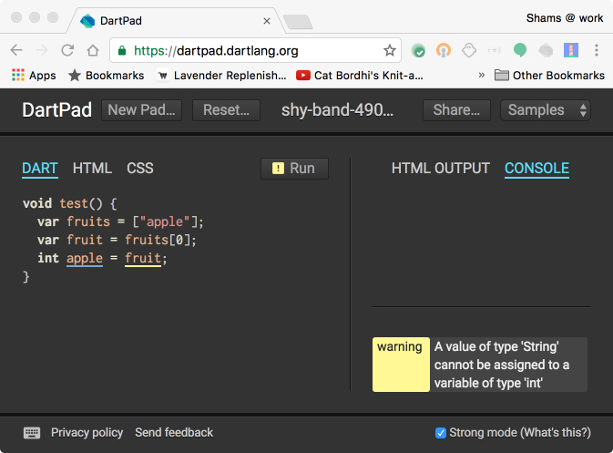
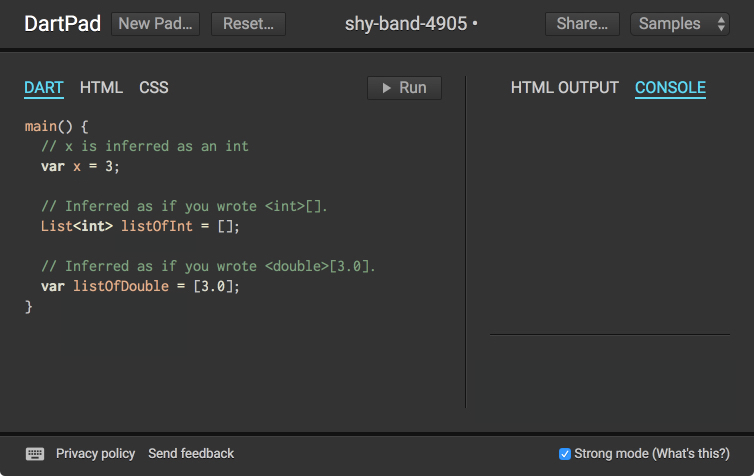


update-for-dart-2


This page collects some questions and answers about why and how to
write sound Dart code. Be sure to also check out the
[Strong Mode Dart](/guides/language/sound-dart) to learn more.

## Questions

<ul>
<li><a href="#what-is-strong-mode">What is "strong mode"? Is it the same as “sound Dart”?</a></li>
<li><a href="#why-strong-mode">Why did the Dart team build strong mode?</a></li>
<li><a href="#how-does-it-benefit-me">How does strong mode benefit me, the developer?</a></li>
<li><a href="#how-does-it-benefit-users">How does strong mode benefit my users?</a></li>
<li><a href="#how-is-it-different-than-checked-mode">What is the difference between strong mode and checked mode?</a></li>
<li><a href="#where-is-the-spec">Is strong mode specified? If so, where is the spec?</a></li>
<li><a href="#is-strong-mode-done">Is strong mode "done" or are there still changes to come?</a></li>
<li><a href="#how-did-dart-change">How did strong mode change the Dart language?</a></li>
<li><a href="#can-i-use-it-today">Can I use strong mode today?</a></li>
<li><a href="#does-it-affect-runtime-behavior">Does strong mode affect the runtime behavior of my code?</a></li>
<li><a href="#can-i-use-type-inference">Does strong mode include type inference?</a></li>
<li><a href="#is-it-a-sound-type-system">Is strong mode a "sound type system"?</a></li>
<li><a href="#does-analyzer-know-strong-mode">Does the analyzer know anything about strong mode?</a></li>
<li><a href="#does-dart2js-use-it">Does dart2js know anything about strong mode?</a></li>
<li><a href="#does-dart-vm-use-it">Does the Dart VM know anything about strong mode?</a></li>
<li><a href="#does-ddc-use-it">Does dartdevc know anything about strong mode?</a></li>
<li><a href="#is-typing-optional">Is Dart still optionally typed?</a></li>
<li><a href="#how-much-work">How much work is it to switch to strong mode?</a></li>
<li><a href="#can-i-mix-code">Can some of my code in my app/library be strong mode, and other code be not-strong-mode?</a></li>
<li><a href="#are-core-libraries-compliant">Are the Dart core libraries compliant with strong mode?</a></li>
<li><a href="#are-dart-packages-compliant">Are the packages produced by the Dart team compliant with strong mode?</a></li>
<li><a href="#what-if-packages-not-compliant">What happens if I write strong mode code, but I use packages that are not compliant with strong mode?</a></li>
<li><a href="#is-it-darts-new-type-system">Is strong mode Dart's new type system?</a></li>
<li><a href="#will-dart-become-cumbersome">Is Dart going to turn into a verbose, cumbersome language where I have to put types everywhere?</a></li>
<li><a href="#is-it-optional">I liked Dart before. Can I still write Dart code the way I always did?</a></li>
</ul>

### What is "strong mode"? Is it the same as “sound Dart”?

“Sound Dart”, “strong mode Dart”, and “type safe Dart” are sometimes
used interchangeably. Strong mode is a sound static
type system that uses a combination of static and runtime checks to
ensure your code is type safe&mdash;that you can never see a value
whose runtime type does not match its static type.

Strong mode is Dart’s implementation of a sound type system.
With strong mode enabled (in an implementation that has both
the static and runtime checks), Dart is a type safe language
ensuring that static type annotations are actually
correct at runtime. Strong mode is an optional mode that you enable in
the Dart analyzer to enforce stronger static typing.
We encourage you to start using strong mode for your
libraries and apps now. For more information,
see [Strong Mode Dart](/guides/language/sound-dart).

The following image shows strong mode in action:

### Why did the Dart team build strong mode?

Our developers have told us that they prefer more feedback from
their type system, to help them manage larger code bases and better
understand their code.
Also, new tools in development for the Dart language, such as the
Dart dev compiler
([dartdevc,]({{site.webdev}}/tools/dartdevc) also known as _DDC_),
rely on ahead-of-time (AOT) compilation.
AOT compiling benefits significantly from strong type
checking that can be performed at compile time. Strong mode enables
tools that provide a better development experience.

### How does strong mode benefit me, the developer?

Strong mode helps you find more bugs at compile time, rather than runtime.
Also, refactoring tools and code completion work better with strong mode.

### How does strong mode benefit my users?

It ensures that you catch more bugs before you ship!
In the future, sound Dart will allow Dart compilers to generate smaller,
faster code.

### What is the difference between strong mode and checked mode?

Checked mode performs limited type checking but doesn’t guarantee that
an expression evaluates to a specific type at runtime.
Strong mode performs stronger type checking. For more information, see
[Strong mode vs. checked mode](/guides/language/sound-dart#strong-mode-vs-checked-mode).




update-for-dart-2


### Is strong mode specified? If so, where is the spec?

The strong mode spec has not yet been published. However,
[Strong Mode Dart](/guides/language/sound-dart) has an overview
with links to where you can find more information.

### Is strong mode "done" or are there still changes to come?

There may be further changes, but the bulk of the work for strong mode is
done. For example, generic methods have been added to Dart to make it
easier to write sound code. We try to keep changes to a minimum,
particularly breaking changes, and to let developers know well in advance.
For more information, see
[Using generic methods](/guides/language/language-tour#using-generic-methods)
in the [language tour](/guides/language/language-tour).

### How did strong mode change the Dart language?

Only a few rules have been added to make Dart a sound language.
Rules for substituting a type with its subtype or supertype are slightly
different. Rules for using the proper return type and parameter
types when overriding methods have been added. See
[Sound type system](sound-dart#sound-type-system)
for an explanation of these changes.

### Can I use strong mode today?

Yes!  We encourage you to start migrating your code now to take advantage of
the new type system that finds errors at compile time (rather than letting
your users discover them). You may even find bugs that have been lurking in
your code. For more information, see
[How to enable strong mode](sound-dart#how-to-enable-strong-mode).

### Does strong mode affect the runtime behavior of my code?

Strong mode hasn’t affected the runtime behavior for the Dart VM or dart2js.
Strong mode may affect the runtime behavior in
[dartdevc]({{site.webdev}}/tools/dartdevc)
if it inserts runtime type checks to deal with the remaining dynamism in the
language. For more information, see
[Runtime checks](/guides/language/sound-dart#runtime-checks) and
[Strong Mode in the Dart Dev Compiler](https://chromium.googlesource.com/external/github.com/dart-lang/dev_compiler/+/refs/heads/master/doc/RUNTIME_SAFETY.md).

### Does strong mode include type inference?

Yes. The analyzer infers types whenever possible. For more information,
see [Type inference](sound-dart#type-inference).

### Is strong mode a "sound type system"?

Not exactly. Strong mode contributes to making Dart a sound language.
A sound type system guarantees that the types specified in the
source code are the types that show up at runtime. In Dart 1.x,
the only compiler that includes runtime checks for type safety is
[dartdevc]({{site.webdev}}/tools/dartdevc), but more tooling support is coming.
For more information, see
[What constitutes strong mode](/guides/language/sound-dart#what-constitutes-strong-mode).

### Does the analyzer know anything about strong mode?

Yes. The Dart analyzer performs type inference and enforces strong mode.

### Does dart2js know anything about strong mode?

Not yet. Currently, [dartdevc]({{site.webdev}}/tools/dartdevc)
is the only compiler that uses strong mode,
but support will be coming to other tools.

### Does the Dart VM know anything about strong mode?

Not yet. See the answer to the previous question.

### Does dartdevc know anything about strong mode?

Yes, the Dart development compiler ([_dartdevc_]({{site.webdev}}/tools/dartdevc))
requires strong mode compliance to perform ahead-of-time compiling.
The dartdevc compiler is part of the improved tooling experience,
including incremental compiles, that is under development.

### Is Dart still optionally typed?
Typing is optional in Dart 1.x,
so you can continue to write Dart code as before.
However, Dart 2 won't be optionally typed. We encourage you
to start migrating your code now to take advantage of the new type system that
finds errors at compile time. It will also make the transition to Dart 2 go
much more smoothly. For more information, see [The benefits of
soundness](/guides/language/sound-dart#the-benefits-of-soundness)
and [Dart 2 Updates.](/dart-2.0)

### How much work is it to switch to strong mode?

It depends. A lot of well written code is already strong mode clean
without changes. When changes are needed, they often involve adding
annotations to Maps and Lists.
Sometimes, sound code is a matter of making good use of generic methods.
To see a list of common errors and warnings you might see when
migrating your code to sound Dart, see
[Strong Mode Dart: Fixing Common Problems](/guides/language/sound-problems)

### Can some of my code in my app/library be strong mode, and other code be not-strong-mode?

It depends. In Dart 1.x, you can [exclude files from static
analysis](/guides/language/analysis-options#excluding-files), but
if you're using dartdevc, the code must be entirely strong mode clean.
In Dart 2, all of your code must be strong mode clean.

### Are the Dart core libraries compliant with strong mode?

Yes, since Dart 1.19 (September 2016).

### Are the packages produced by the Dart team compliant with strong mode?

Many packages have been updated to be strong mode compliant and more
are in process. Please file an issue against any packages you use
that aren't yet strong mode compliant.

### What happens if I write strong mode code, but I use packages that are not compliant with strong mode?

In Dart 1.x, other packages are excluded from static analysis by default.
You have to specify `--show-package-warnings` to see errors in other packages.
As for executing code, the dart2js and Dart VM tools don’t currently
support strong mode so, yes, you can mix and match.
The dartdevc tool requires strong mode compliance and
won’t compile code that is unsound.
In Dart 2, all code must be strong mode clean.

### Is strong mode Dart's new type system?

Strong mode is part of the implementation of Dart’s new type system, which is
currently under development. For more information, see [What constitutes strong
mode](/guides/language/sound-dart#what-constitutes-strong-mode).

### Is Dart going to turn into a verbose, cumbersome language where I have to put types everywhere?

No! Strong mode Dart continues to allow `var` and `dynamic` with type
inference in many places. Whenever possible, the analyzer infers a type.
When the analyzer can’t infer a type,
it generates an error and the type must be explicitly defined.

The following image shows examples of type inference in strong mode clean code:

### I liked Dart before. Can I still write Dart code the way I always did?

Only for awhile. Types are no longer optional in Dart 2, so we
recommend migrating your code now. For help on getting
ready for Dart 2, see [Dart 2 Updates](/dart-2.0).
For more information, see [A stronger Dart for
everyone](http://news.dartlang.org/2017/06/a-stronger-dart-for-everyone.html).

Even with strong mode enabled, Dart remains the same concise and familiar
language that you've always loved.
