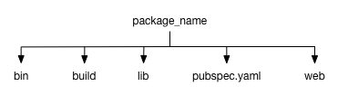
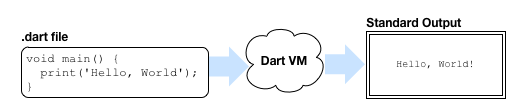
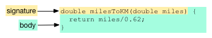
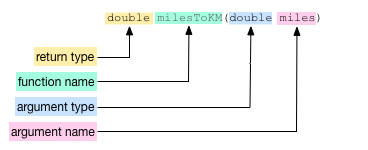

### Get Dart. Run an app.

#### <a id="whats-the-point" class="anchor" href="#whats-the-point" aria-hidden="true"></a>What's the point?

* The Dart SDK has development tools and libraries.
* Use an IDE (such as WebStorm) or code editor to create your app.
* All Dart apps have a main() function.
* Dart supports top-level functions.

This tutorial gets you ready
to begin writing Dart apps in an editor or IDE.
Here you will download the Dart software and
create and run a small application.

This tutorial uses the `hello_world` and `simple` examples.
You can get these by
[downloading the tutorial examples](https://github.com/dart-lang/dart-tutorials-samples/archive/master.zip)
from GitHub.

## Download Dart and an IDE {#download-dart}

Once you are ready to move beyond DartPad and create Dart apps in
a real world environment, you need to download some software.

At the very least, you need the Dart SDK, which contains all of
the tools and libraries that you need for basic Dart development.
You may also want an IDE or code editor; this tutorial uses WebStorm.

* [Get the Dart SDK](/install/)
* Recommended: [Get WebStorm]({{site.webdev}}/tools/webstorm)

## What did you get? {#what-did-you-get}

When you download the **Dart SDK**, you get a directory
that contains tools (under `bin`) and libraries (under `lib`),
along with supporting files.
The location of the directory (we'll call it the _&lt;sdk-install-dir&gt;_)
depends on your platform and how you downloaded the SDK.

Under _&lt;sdk-install-dir&gt;_/lib are Dart libraries, such as dart:core,
dart:html, and dart:io, that define APIs useful to most apps.
The _&lt;sdk-install-dir&gt;_/bin directory contains several useful
command-line tools, such as the **pub** package manager,
the Dart-to-JavaScript compiler,
and the command-line version of the Dart VM.

**WebStorm** has a pre-installed Dart plugin,
but it requires a bit of configuration,
as we'll describe later.
If you prefer to use another IDE or code editor,
you might want to download and install a Dart plugin,
if available.
See the [tools page](/tools/) for a list of plugins.

## About Dart applications {#what-is-app}

There are two kinds of Dart applications:
command-line applications and web applications.
A command-line application is a standalone program
that you run in the Dart VM from the command line in a terminal window.
Web applications are hosted on a web page and run in a browser
(either directly in a browser that supports Dart
or by compiling to JavaScript).

The most minimal Dart application has

* one Dart source file&mdash;a
  file with the .dart suffix that contains Dart code.
* one top-level main() function.
  This is the entry point for your application.

As long as this simple Dart app can be run from the
command line (and does not rely on the browser),
you can run it using `dart`, the Dart VM tool.
For example:


dart main.dart


**An app with any level of complexity should also
include a pubspec file.** The pubspec.yaml file contains
the name of the app and (optionally) a description.

For example:


name: hello_world
description: A sample command-line application.


### Pub package manager

The [`pub`](/tools/pub) tool allows you to manage Dart packages.
Pub also includes commands for creating, developing, running, and deploying
Dart applications. Behind the scenes, [`pub run`](/tools/pub/cmd/pub-run.html),
for example, uses the `dart` tool to run a command-line application.

Pub uses the metadata in the `pubspec.yaml` file to determine
your app's dependencies and any special setup that your app requires.
Pub assumes that the files and directories in a Dart application are
laid out in a particular way. The following diagram shows some of the
conventions used by pub. Not all of these directories are required.

`bin`
: The main files for a command-line application. One of the
  files must include a top-level main() function.

`lib`
: Additional code to be used by your application.

`pubspec.yaml`
: The app's metadata, including information about which
  packages the app depends on and which versions of those
  packages are required.

You can invoke pub commands from the command line or from the WebStorm UI.

### Command-line applications

Dart command-line applications
run standalone from the command line.
Command-line apps are often used
to provide server-side support to a web app,
but they can also be scripts.

The Dart VM runs Dart code directly without intermediate compilation.

## Create a command-line app {#create-cmd-line}

<ol>
<li markdown="1">
Launch WebStorm. This brings up a "Welcome to Webstorm" dialog.
</li>

<li markdown="1">
If this is the first time you have run WebStorm, you will
need to set the path to the SDK.
You can find the instructions at
[Configuring Dart support]({{site.webdev}}/tools/webstorm#configuring-dart-support).
</li>

<li markdown="1">
Choose **Create New Project**.
A dialog appears asking you to fill out a simple form.
</li>

<li markdown="1">
Select **Dart** from the list on the left.
</li>

<li markdown="1">
Replace the `untitled` portion of the string with `hello_world`.
This name is used for the app's directory name and package name.
By convention, these names are lowercase, with words
separated by underscores (`_`).
</li>

<li markdown="1">
Make sure that **Generate sample content** is checked.
</li>

<li markdown="1">
Select **Console Application** from the list.
</li>

<li markdown="1">
Click **Create**.
</li>
</ol>

WebStorm creates a `hello_world` directory for the application
and boilerplate files for a small command-line app.
It then runs `pub get` to download the packages that the app depends on.

<aside class="alert alert-info" markdown="1">
**If you don't have WebStorm:**
You can create the command-line app's files
using the **console-full** generator from
[Stagehand.](http://stagehand.pub/)
Then run `pub get`.
</aside>

Some of the files and directories in the hello_world application
include the following:

.pub
: Support files used by the pub tool. You can ignore this.

bin
: Contains the source files for the application.
  Expand `bin` to see `main.dart`, which is the main
  Dart file for this example.

pubspec.yaml
: Declares which packages your application needs.

pubspec.lock
: A generated file that specifies the version numbers
  of the packages on which the application depends.

lib
: Contains library code. Expand `lib` to see
  `hello_world.dart`, a library file with
  a simple calculate() method.

.packages, packages
: Tells the Dart tools where to get the packages that your
  app uses. These files are created by the `pub get` command.
  You can ignore these.

Double-clicking any filename displays the contents of that file
in the pane to the right.

The messages pane at the bottom contains the results of calling
`pub get`, which fetches the packages used by the app.

When executed, the program prints
"Hello world: 42!" to the standard output stream,
using the print() function provided by the dart:core library.
The functions and objects defined in the dart:core library
are automatically available to all Dart applications.

## Run a command-line app {#run-cmd-line}

In WebStorm, you can run the app in any of the following ways:

* Click the Run button (  ) in the upper right corner.
* Click the Run button to the left of the messages pane.
* Right-click main.dart in the files pane and select **Run 'main.dart'**
  from the pop-up menu.

WebStorm shows the output at the bottom in a pane titled
**Run main.dart**.

<aside class="alert alert-info" markdown="1">
**If you don't have WebStorm:**
You can run the app from the command line using
`pub run bin/main.dart`.
</aside>

## About main() and other top-level functions {#top-level-functions}

Dart lets you define _top-level_ functions,
that is, functions that are not encapsulated within a class or object.
All apps have at least one top-level function,
namely the main() function.

The app you've seen in this tutorial has other top-level functions.
The Hello World example calls print(),
a top-level function defined in dart:core.

A function declaration
has two parts: a _signature_ and a _body_.

The signature sets the function name,
the data type of its return value,
and the number and type of its input arguments.

The body is the code that defines the function's behavior.
It usually appears between curly braces ({_code_}).
If the body is a single expression, then you
can skip the braces and use the => shorthand:


double milesToKM(double miles) => miles/0.62;


The milesToKM() function performs a simple arithmetic calculation
and returns the result.

This function takes a single argument.
Functions can take multiple arguments,
in which case the arguments are set apart by commas.

## About file naming conventions {#file-names}

When creating an application with WebStorm,
you are asked to provide an application name.
By convention, application names
(and thus, the related files and directories) are lowercase,
with words separated by underscores (`_`).

## Other resources

<ul>
  <li>
    The <a href="{{site.webdev}}/tools/webstorm">WebStorm</a> page
    provides more information about this tool.
  </li>
  <li>
    The <a href="{{site.dartlang}}/tools/pub/">pub</a>
    pages contain more information
    about Dart's package and asset manager.
  </li>
</ul>

## What next?

* Get the code for all of the Dart tutorials samples.
  <a href="https://github.com/dart-lang/dart-tutorials-samples/archive/master.zip">
  Download the ZIP file</a>, unzip it,
  and open `dart-tutorials-samples-master` in WebStorm.

* The next tutorial,
  [Write Command-Line Apps](cmdline),
  describes how to build command-line applications.

