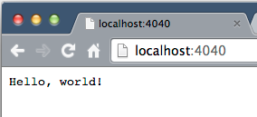
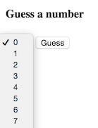
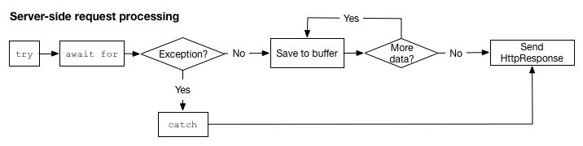
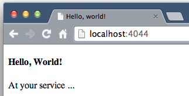
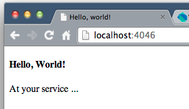

### Communicate over the internet

#### <a id="whats-the-point" class="anchor" href="#whats-the-point" aria-hidden="true"></a>What's the point?

* Knowledge of Futures and Streams is a prerequisite.
* The HTTP protocol allows clients and servers to communicate.
* The dart:io package has classes for writing HTTP programs.
* Servers listen for requests on a host and port.
* Clients send requests using an HTTP method request.
* The http_server package provides higher-level building blocks.

<aside class="alert alert-info" markdown="1">
<strong>Prerequisite:</strong>

* HTTP servers and clients rely heavily on
<a href="{{site.dart_api}}/dart-async/Future-class.html" target="_blank">Future</a>s
and
<a href="{{site.dart_api}}/dart-async/Stream-class.html"
   target="_blank">Stream</a>s,
which are not explained in this tutorial.
Refer to [Asynchronous Programming: Futures](/tutorials/language/futures)
and
[Asynchronous Programming: Streams](/tutorials/language/streams)
for information about using these classes.
</aside>

HTTP (Hypertext Transfer Protocol) is a communication protocol used
to send data from one program to another over the internet.
At one end of the data transfer is a server
and at the other end is a client.
The client is often browser-based
(either a user typing in a browser or a script running in a browser),
but might also be a standalone program.

The server _binds_ to a host and port (it
makes an exclusive connection to an IP address and
a port number).
Then the server listens for requests.
Because of Dart's asynchronous nature,
the server can handle many requests at a single time,
as follows:

* Server listens
* Client connects
* Server accepts and receives request (and continues to listen)
* Server can continue to accept other requests
* Server writes response of request or several, possibly interleaved, requests
* Server finally ends (closes) the response(s).

In Dart, the
<a href="{{site.dart_api}}/dart-io/dart-io-library.html" target="_blank">dart:io</a>
library contains
the classes and functions you need to write HTTP
clients and servers.
In addition, the
<a href="https://pub.dartlang.org/packages/http_server"
   target="_blank">http_server</a> package
contains some higher-level classes that make it easier to write
clients and servers.

<aside class="alert alert-info" markdown="1">
<strong>Important:</strong>
_Browser-based programs **cannot** use the dart:io library._

The APIs in the dart:io library
work _only_ with standalone, command-line programs.
They do not work in the browser.
To make HTTP requests from a browser-based client
refer to the
<a href="{{site.dart_api}}/dart-html/HttpRequest-class.html"
   target="_blank">dart:html HttpRequest</a> class.
</aside>

This tutorial provides several examples that show how easy
it is to write Dart HTTP servers and clients.
Beginning with the hello world of servers,
you learn how to write the code for a server
from binding and listening to responding to requests.
You also learn about the client side: making different
kinds of requests (GET and POST),
writing browser-based and command-line clients.

## Get the source code

<ul>
  <li>
    Get the Dart Tutorials
    <a href="https://github.com/dart-lang/dart-tutorials-samples/archive/master.zip">
      example code.
    </a>
  </li>

  <li markdown="1">
View the `httpserver` directory, which contains
the sources you need for this tutorial.
  </li>
</ul>

## Run the hello world server {#run-hello-world}

_Example file for this section:
<a href="https://github.com/dart-lang/dart-tutorials-samples/blob/master/httpserver/bin/hello_world_server.dart"
   target="_target">hello_world_server.dart</a>._

Let's begin with a small server that responds to all requests
with the string `Hello, world!`

<ul>

  <li markdown="1">
At the command line, run the `hello_world_server.dart` script.
You will see the following:


$ cd httpserver/bin
$ dart hello_world_server.dart
listening on localhost, port 4040

  </li>

  <li markdown="1">
Then, in any browser, enter localhost:4040.
The browser displays `Hello, world!`

  </li>
</ul>

In this case, the server is a Dart program
and the client is the browser you used.
However, you can write client programs in Dart&mdash;either
a browser-based client script, or a standalone program.

### A quick glance at the code

In the code for the hello world server,
an HTTP server binds to a host and port,
listens for HTTP requests, and writes a response.
Note that the program imports
the `dart:io` library, which contains the HTTP-related
classes both for server-side programs and for
client-side programs (but not for web apps).


[[highlight]]import 'dart:io';[[/highlight]]

main() async {
  var requestServer =
      await HttpServer.bind(InternetAddress.LOOPBACK_IP_V4, 4040);
  print('listening on localhost, port ${requestServer.port}');

  await for (HttpRequest request in requestServer) {
    request.response..write('Hello, world!')
                    ..close();
  }
}


hello_world_server.dart
 

The next few sections cover server-side binding,
making a client-side GET request,
listening, and responding.

## Binding a server to a host and port {#binding}

_Example for this section: hello_world_server.dart._

The first line of code in `main()`
uses `HttpServer.bind()` to create an
<a href="{{site.dart_api}}/dart-io/HttpServer-class.html" target="_blank">HttpServer</a>
object and bind it to a host and port.


var [[highlight]]requestServer[[/highlight]] =
    await HttpServer.bind([[highlight]]InternetAddress.LOOPBACK_IP_V4, 4040[[/highlight]]);
...


hello_world_server.dart
 

The code uses `await` to call the `bind` method asynchronously.
When the bind is successful, the new HttpServer object is assigned
to `requestServer`.

### Hostname
The first parameter of `bind()` specifies the hostname.
You can specify a particular hostname or IP address as a String.
Alternatively, you can specify the host using these predefined values
provided by the
<a href="{{site.dart_api}}.dart-io/InternetAddress-class.html"
   target="_blank">InternetAddress</a> class:

| Value | Use case |
|---|---|
| LOOPBACK_IP_V4 _or_ LOOPBACK_IP_V6 | The server listens for client activity on the loopback address, which is effectively localhost. Uses either version 4 or 6 of the IP protocol. These are used primarily for testing. We recommend that you use these values instead of `localhost` or `127.0.0.1`. |
| ANY_IP_V4 _or_ ANY_IP_V6 | The server listens for client activity on the specified port on any IP address. Uses either version 4 or 6 of the IP protocol. |
{: .table}

By default, when using a V6 internet address,
a V4 listener is used as well.

### Port

The second parameter to `bind()` is an integer
that specifies the port.
The port uniquely identifies a service on the host computer.
Port numbers below 1024 are reserved (except for 0)
for standard services.
For example, FTP data transfer typically runs on port 20,
quote of the day on port 17, and HTTP on port 80.
Your program should use port numbers from 1024 and higher.
If the port is already in use,
the connection for your server will be refused.

### Listening for requests

The server begins listening for HTTP requests using `await for`.
For each request received, the highlighted code is executed for that
<a href="{{site.dart_api}}/dart-io/HttpServer-class.html"
   target="_blank">HttpRequest</a>
object.


...
await for (HttpRequest request in requestServer) {
  [[highlight]]request.response..write('Hello, world!')[[/highlight]]
                  [[highlight]]..close();[[/highlight]]
}
...


hello_world_server.dart
 

You'll learn more about what the HttpRequest object contains
and how to write the response in the section
[Listening for and handling requests](#httprequest-object).
But first, let's look at one way a client generates a request.

## Using HTML forms to make GET requests {#using-forms-to-make-get-requests}

_Example files for this section:
<a href="https://github.com/dart-lang/dart-tutorials-samples/blob/master/httpserver/bin/number_thinker.dart"
   target="_blank">number_thinker.dart</a> and
<a href="https://github.com/dart-lang/dart-tutorials-samples/blob/master/httpserver/web/make_a_guess.html"
   target="_blank">make_a_guess.html</a>._

This section features a command-line server that
randomly chooses a number between 0 and 9.
The client is a basic HTML web-page, `make_a_guess.html`,
that you can use to guess the number.

<strong>Try it!</strong>

<ol>
  <li markdown="1">
  **Run the number thinker server**

  At the command line, run the `number_thinker.dart` server.
  You should see something similar to the following:


$ cd httpserver/bin
$ dart number_thinker.dart
I'm thinking of a number: 6


  </li>

  <li markdown="1">
  **Launch the web server**

  Run `pub serve` from the top directory of the app.
  </li>

  <li markdown="1">
  **Open the HTML page**

  In a browser, go to localhost:8080/make_a_guess.html.

  </li>
  <li markdown="1">
  **Make a guess**

  Choose a number and press the **Guess** button.

  </li>
</ol>

No Dart code is involved in the client.
The client request is made from the browser
to the Dart server through an HTML form
within make_a_guess.html,
which provides an automatic way to formulate and send client HTTP requests.
The form contains the pull-down list and the button.
The form also specifies the URL, which includes the port number,
and the kind of request (the _request method_).
It might also include elements that build a query string.

Here's the HTML code for the form in make_a_guess.html:


[[note]]1[[/note]] <form [[highlight]]action="http://localhost:4041"[[/highlight]]
[[note]]2[[/note]]       [[highlight]]method="GET"[[/highlight]]>

[[note]]3[[/note]]   <select [[highlight]]name="q"[[/highlight]]>
        <option value="0">0</option>
        <option value="1">1</option>
        <option value="2">2</option>
        ...
        <option value="9">9</option>
      </select>
[[note]]4[[/note]]   <input [[highlight]]type="submit"[[/highlight]] value="Guess">
    </form>


make_a_guess.html
 

1
URL to send the request to.

2
The kind of request, here a `GET` request. Other common
kinds of requests include POST, PUT, and DELETE.

3
Any element within the form that has a name becomes
a parameter in the query string.

4
When pressed, the submit button formulates
the request based on the content of the form and sends it.

### A RESTful GET request

REST (REpresentational State Transfer) is a set of principles
for designing Web services.
Well-behaved HTTP clients and servers observe the REST principles
defined for GET requests.

A GET request:

* only retrieves data
* doesn't change the state of the server
* has length limits
* can send query strings in the URL of the request

The client in this example makes a REST-compliant GET request.

## Listening for and handling requests {#httprequest-object}

_Example files for this section:
number_thinker.dart and make_a_guess.html._

Now that you've seen the browser-based client for this example,
let's take a look at the Dart code for the number thinker server,
starting with `main()`.

Once again the server binds to a host and port.
Here, the top-level `handleRequest()` method is called for each
request received. Because HttpServer implements
<a href="{{site.dart_api}}/dart-async/Stream-class.html"
   target="_blank">Stream</a>,
you can use `await for` to process the requests.


import 'dart:io';
import 'dart:math' show Random;

int myNumber = new Random().nextInt(10);

main() async {
  print("I'm thinking of a number: $myNumber");

  HttpServer requestServer =
      await HttpServer.bind(InternetAddress.LOOPBACK_IP_V4, 4041);
  await for (var request in requestServer) {
    [[highlight]]handleRequest[[/highlight]](request);
  }
}
...


number_thinker.dart
 

When a `GET` request arrives, the `handleRequest()` method calls
`handleGet()` to process the request.


void handleRequest(HttpRequest request) {
  try {
    if (request.method == 'GET') {
      [[highlight]]handleGet[[/highlight]](request);
    } else {
      ...
    }
  } catch (e) {
    print('Exception in handleRequest: $e');
  }
  print('Request handled.');
}


number_thinker.dart
 

An HttpRequest object has many properties that provide
information about the request.
The following table lists some useful properties:

| Property | Information |
|---|---|
| `method` | A String: 'GET', 'POST', 'PUT', and so on. |
| `uri` | A  <a href="{{site.dart_api}}/dart-core/Uri-class.html" target="_blank">Uri</a> object: scheme, host, port, query string, and other information about the requested resource. |
| `response` | An <a href="{{site.dart_api}}/dart-io/HttpServer-class.html" target="_blank">HttpResponse</a> object: where the server writes its response. |
| `headers` | An <a href="{{site.dart_api}}/dart-io/HttpHeaders-class.html" target="_blank">HttpHeaders</a> object: the headers for the request, including <a href="{{site.dart_api}}/dart-io/ContentType-class.html" target="_blank">ContentType</a>, content length, date, and so on. |
{: .table}

### Using the method property

The code below from the number thinker example uses the HttpRequest `method`
property to determine what kind of request has been received.
This server handles only GET requests.


if (request.method == 'GET') {
  [[highlight]]handleGet[[/highlight]](request);
} else {
  request.response..statusCode = HttpStatus.METHOD_NOT_ALLOWED
                  ..write('Unsupported request: ${request.method}.')
                  ..close();
}


number_thinker.dart
 

### Using the uri property

Typing a URL into a browser generates a GET request,
which simply requests data from the specified resource.
It can send a minimal amount of data along with the request
through a query string attached to the URI.


void handleGet(HttpRequest request) {
  var guess = [[highlight]]request.uri[[/highlight]].queryParameters['q'];
  ...
}


number_thinker.dart
 

Use the `uri` property from the HttpRequest object to get a
<a href="{{site.dart_api}}/dart-core/Uri-class.html" target="_blank">Uri</a> object
that contains the information about the URL typed by the user.
The `queryParameters` property of the Uri object is a Map containing
the components of the query string.
Refer to the desired parameter by name.
This example uses `q` to identify the guessed number.

### Setting the status code for the response

The server should set the status code to indicate the success or
failure of the request. Earlier you saw the number thinker set
the status code to `METHOD_NOT_ALLOWED` to reject non-GET requests.
Later in the code,
to indicate that the request was successful and the response is complete,
the number thinker server sets the HttpResponse status code to `HttpStatus.OK`.


void handleGet(HttpRequest request) {
  var guess = request.uri.queryParameters['q'];
  [[highlight]]request.response.statusCode = HttpStatus.OK[[/highlight]];
  ...
}


number_thinker.dart
 

`HttpStatus.OK` and `HttpStatus.METHOD_NOT_ALLOWED` are
two of many predefined status codes in the
<a href="{{site.dart_api}}/dart-io/HttpStatus-class.html"
   target="_blank">HttpStatus</a> class.
Another useful predefined status code is
`HttpStatus.NOT_FOUND` (your classic 404).

In addition to `statusCode`,
the HttpResponse object has other useful properties:

| Property | Information |
|---|---|
| `contentLength` | The length of the response. -1 means the length is not known in advance. |
| `cookies` | A List of <a href="{{site.dart_api}}/dart-io/Cookie-class.html" target="_blank">Cookie</a>s to set in the client. |
| `encoding` | The <a href="{{site.dart_api}}/dart-convert/Encoding-class.html" target="_blank">Encoding</a> used when writing strings, like JSON and UTF-8. |
| `headers` | The response headers, an <a href="{{site.dart_api}}/dart-io/HttpHeaders-class.html" target="_blank">HttpHeaders</a> object. |
{: .table}

### Writing the response to the HttpResponse object

Every HttpRequest object has a corresponding HttpResponse object.
The server sends data back to the client through the response object.

Use one of the HttpResponse write methods
(`write()`, `writeln()`, `writeAll()`, or `writeCharCodes()`)
to write the response data to the HttpResponse object.
Or connect the HttpResponse object to a stream via `addStream`
and write to the stream.
Close the object when the response is complete.
Closing the HttpResponse object
sends the data back to the client.


void handleGet(HttpRequest request) {
  ...
  if (guess == myNumber.toString()) {
    [[highlight]]request.response..writeln('true')[[/highlight]]
                    [[highlight]]..writeln("I'm thinking of another number.")[[/highlight]]
                    [[highlight]]..close();[[/highlight]]
    ...
  }
}


number_thinker.dart
 

## Making a POST request from a standalone client {#making-post}

_Example files for this section:
<a href="https://github.com/dart-lang/dart-tutorials-samples/blob/master/httpserver/bin/basic_writer_server.dart"
   target="_blank">basic_writer_server.dart</a>
and
<a href="https://github.com/dart-lang/dart-tutorials-samples/blob/master/httpserver/bin/basic_writer_client.dart"
   target="_blank">basic_writer_client.dart</a>._

In the hello world and number thinker examples,
the browser generated simple GET requests.
For more complex GET requests and other kinds of requests, such
as POST, PUT, or DELETE,
you need to write a client program, of which there are two kinds:

* A standalone client program, which uses the
  <a href="{{site.dart_api}}/dart-io/HttpClient-class.html" target="_blank">HttpClient</a>
  class from `dart:io`.

* A browser-based client, which uses API from
  <a href="{{site.dart_api}}/dart-html/dart-html-library.html" target="_blank">dart:html</a>.
  This tutorial does not cover browser-based clients.
  To look at code for a browser-based client and
  related server, see
  <a href="https://github.com/dart-lang/dart-tutorials-samples/blob/master/httpserver/web/note_client.dart" target="_blank">note_client.dart</a>,
  <a href="https://github.com/dart-lang/dart-tutorials-samples/blob/master/httpserver/bin/note_server.dart" target="_blank">note_server.dart</a>,
  and <a href="https://github.com/dart-lang/dart-tutorials-samples/blob/master/httpserver/web/note_taker.html" target="_blank">note_taker.html</a>.

  Let's look at a standalone client, `basic_writer_client.dart`,
  and its server `basic_writer_server.dart`.
  The client makes a POST request
  to save JSON data to a server-side file.
  The server accepts the request and saves the file.

**Try it!**

Run the server and client on the command line.

<ol>
  <li markdown="1">
First the server:


$ cd httpserver/bin
$ dart basic_writer_server.dart

  </li>

  <li markdown="1">
Then, run the client in a new window:


$ cd httpserver/bin
$ dart basic_writer_client.dart
Wrote data for Han Solo.

  </li>

  <li markdown="1">
The server writes the data to `file.txt`:


{"name":"Han Solo","job":"reluctant hero","BFF":"Chewbacca","ship":"Millennium Falcon","weakness":"smuggling debts"}

  </li>
</ol>

The client creates an HttpClient object and uses the
`post()` method to make the request.
Making a request involves two Futures:

* The `post()` method establishes a network
connection to the server and completes with the first Future,
which returns an HttpClientRequest object.

* The client composes the request object and closes it.
The `close()` method sends the request to the server
and returns the second Future, which completes with
an HttpClientResponse object.


   import 'dart:io';
   import 'dart:convert' show UTF8, JSON;

   main() async {
     Map jsonData = {
       'name':     'Han Solo',
       'job':      'reluctant hero',
       'BFF':      'Chewbacca',
       'ship':     'Millennium Falcon',
       'weakness': 'smuggling debts'
     };

[[note]]1[[/note]]  [[highlight]]var request = await[[/highlight]] new HttpClient().post(
[[note]]2[[/note]]      [[highlight]]InternetAddress.LOOPBACK_IP_V4.host, 4049, '/file.txt');[[/highlight]]
[[note]]3[[/note]]  [[highlight]]request.headers.contentType = ContentType.JSON;[[/highlight]]
[[note]]4[[/note]]  [[highlight]]request.write(JSON.encode(jsonData));[[/highlight]]
[[note]]5[[/note]]  [[highlight]]HttpClientResponse response = await request.close()[[/highlight]];
[[note]]6[[/note]]  await for (var contents in response.transform([[highlight]]UTF8.decoder[[/highlight]])) {
       print(contents);
    }
  }


basic_writer_client.dart
 

1
When the `post()` connection succeeds (and execution resumes after
the await expression), the returned
<a href="{{site.dart_api}}/dart-io/HttpClientRequest-class.html" target="_blank">HttpClientRequest</a>
object is assigned to the `request` variable.

2
The `post()` method requires the host, port, and the path to the requested
resource.
In addition to `post()`, the HttpClient class provides functions
for making other kinds of
requests, including `postUrl()`, `get()`, and `open()`.

3
An HttpClientRequest object has an HttpHeaders object,
which contains the request headers.
For some headers,
like `contentType`,
HttpHeaders has a property specific to that header.
For other headers, use the `set()` method to
put the header in the HttpHeaders object.

4
The client writes data to the request object using `write()`.
The encoding, JSON in this example,
matches the type specified in the ContentType header.

5
The `close()` method sends the request to the server and, when complete,
returns an
<a href="{{site.dart_api}}/dart-io/HttpClientResponse-class.html"
   target="_blank">HttpClientResponse</a> object
that's assigned to the `reponse` variable.

6
The response from the server is encoded in UTF-8.
Use a transformer defined in the `dart:convert` library
to convert the data into regular Dart string format.

### A RESTful POST request

Similar to GET requests, REST provides guidelines for POST requests.

A POST request:

* creates a resource (in this example, a file)
* uses a URI that has a structure similiar to file and directory pathnames;
for example, the URI has no query string
* transfers data as JSON or XML
* has no state and does not change the state of the server
* has no length limits

<strong>Bonus code:</strong>
If you would like to see some client code that
makes GET requests,
check out the code for
<a href="https://github.com/dart-lang/dart-tutorials-samples/blob/master/httpserver/bin/number_guesser.dart" target="_blank">number_guesser.dart</a>.
It's a standalone client for the number thinker server
that makes periodic guesses until it guesses correctly.

## Handling a POST request in a server {#handling-post}

_Example files for this section:
basic_writer_server.dart and basic_writer_client.dart._

An HttpRequest object is a stream of byte lists (`Stream<List<int>>`).
To get the data sent from the client,
listen for data on the HttpRequest object.

If the request from the client contains a large amount of
data, the data might arrive in multiple chunks. You can use the
join() method in Stream to concatenate the string values of those chunks.

The `basic_writer_server.dart` file implements
a server that follows this pattern.


  import 'dart:io';
  import 'dart:convert';

  main() async {
    var server =
        await HttpServer.bind(InternetAddress.LOOPBACK_IP_V4, 4049);
    await for (var req in server) {
      ContentType contentType = req.headers.contentType;

      if (req.method == 'POST' &&
[[note]]1[[/note]]       [[highlight]]contentType != null &&[[/highlight]]
          [[highlight]]contentType.mimeType == 'application/json'[[/highlight]]) {
        try {
[[note]]2[[/note]]       [[highlight]]var jsonString = await req.transform(UTF8.decoder).join();[[/highlight]]

          // Write to a file, get the file name from the URI.
[[note]]3[[/note]]       var filename = [[highlight]]req.uri.pathSegments.last;[[/highlight]]
          await new File(filename).writeAsString(jsonString,
              mode: FileMode.WRITE);
[[note]]4[[/note]]       Map jsonData = [[highlight]]JSON.decode(jsonString);[[/highlight]]
          req.response..statusCode = HttpStatus.OK
                      ..write('Wrote data for ${jsonData['name']}.')
                      ..close();
        } catch (e) {
          req.response..statusCode = HttpStatus.INTERNAL_SERVER_ERROR
                      ..write("Exception during file I/O: $e.")
                      ..close();
        }
      } else {
        req.response..statusCode = HttpStatus.METHOD_NOT_ALLOWED
                    ..write("Unsupported request: ${req.method}.")
                    ..close();
      }
    }
  }


basic_writer_server.dart
 

1
The request object has an HttpHeaders object.
Recall that the client set the `contentType` header to JSON (application/json).
This server rejects requests that are not JSON-encoded.

2
A POST request has no limit on the amount of data it can send
and the data might be sent in multiple chunks.
Furthermore, JSON is UTF-8, and UTF-8 characters can be encoded over
multiple bytes.
The join() method puts the chunks together.

3
The URL for the request is `localhost:4049/file.txt`.
The code `req.uri.pathSegments.last` extracts the file name
from the URI: `file.txt`.

4
The data sent by the client is JSON formatted.
The server decodes it using the JSON codec available in the
<a href="{{site.dart_api}}/dart-convert/dart-convert-library.html" target="_blank">dart:convert</a>
library.

#### A note about CORS headers

If you want to serve clients that are running on a different origin
(a different host or port), you need to add CORS headers.
The following code,
take from note_server.dart,
allows POST and OPTIONS requests from any origin.
Use CORS headers with caution,
because they can open your network up to security risks.


void addCorsHeaders(HttpResponse response) {
  response.headers.add('Access-Control-Allow-Origin', '*');
  response.headers.add(
      'Access-Control-Allow-Methods', 'POST, OPTIONS');
  response.headers.add('Access-Control-Allow-Headers',
      'Origin, X-Requested-With, Content-Type, Accept');
}


note_server.dart
 

For more information, refer to Wikipedia's article
[Cross-origin resource sharing](http://en.wikipedia.org/wiki/Cross-origin_resource_sharing).

## Using the http_server package {#using-http-server-package}

_Example files for this section:
<a href="https://github.com/dart-lang/dart-tutorials-samples/blob/master/httpserver/bin/mini_file_server.dart"
   target="_blank">mini_file_server.dart</a> and
<a href="https://github.com/dart-lang/dart-tutorials-samples/blob/master/httpserver/bin/static_file_server.dart"
   target="_blank">static_file_server.dart</a>._

For some higher-level building blocks,
we recommend that you try the
[http_server](https://pub.dartlang.org/packages/http_server)
pub package,
which contains a set of classes that,
together with the HttpServer class in the `dart:io` library,
make it easier to implement HTTP servers.

In this section, we compare a server written
using API only from dart:io to a server
with the same functionality
written using dart:io together with http_server.

You can find the first server in `mini_file_server.dart`.
It responds to all requests by returning the contents of the
`index.html` file in the same directory as its source.

**Try it!**

<ol>
  <li markdown="1">
Run the server on the command line:


$ cd httpserver/bin
$ dart mini_file_server.dart

  </li>

  <li markdown="1">
Type localhost:4044 into the browser. The server displays an HTML file:

  </li>
</ol>

Here's the code for mini file server:


import 'dart:io';

main() async {
  var server;

  try {
    server =
        await HttpServer.bind(InternetAddress.LOOPBACK_IP_V4, 4044);
  } catch (e) {
    print("Couldn't bind to port 4044: $e");
    exit(-1);
  }

  await for (HttpRequest req in server) {
    var file = new File('index.html');
    if (await file.exists()) {
      print("Serving index.html.");
      req.response.headers.contentType = ContentType.HTML;
      try {
        await file.openRead().pipe(req.response);
      } catch (e) {
        print("Couldn't read file: $e");
        exit(-1);
      }
    } else {
      print("Can't open index.html.");
      req.response..statusCode = HttpStatus.NOT_FOUND
                  ..close();
    }
  }
}


mini_file_server.dart
 

This code determines whether the file exists,
and if it does, opens the file and pipes the contents
to the HttpResponse object.

The second server,
whose code you can find in
<a href="https://github.com/dart-lang/dart-tutorials-samples/blob/master/httpserver/bin/basic_file_server.dart"
   target="_blank">basic_file_server.dart</a>,
uses the `http_server` package.

**Try it!**

<ol>
  <li markdown="1">
Run the server on the command line:


$ cd httpserver/bin
$ dart basic_file_server.dart

  </li>

  <li markdown="1">
Type localhost:4046 into the browser.
The server displays the same index.html file as the previous:

  </li>
</ol>

In this server, the code for handling the request is much shorter,
because the
<a href="https://www.dartdocs.org/documentation/http_server/latest/http_server/VirtualDirectory-class.html"
   target="_blank">VirtualDirectory</a>
class handles the details of serving the file.


import 'dart:io';
import 'package:http_server/http_server.dart';

main() async {
  VirtualDirectory staticFiles = new VirtualDirectory('.');

  var serverRequests =
      await HttpServer.bind(InternetAddress.LOOPBACK_IP_V4, 4046);
  await for (var request in serverRequests) {
    [[highlight]]staticFiles.serveFile(new File('index.html'), request);[[/highlight]]
  }
}


basic_file_server.dart
 

Here, the requested resource, index.html, is served by
the `serveFile()` method in the VirtualDirectory class.
You don't need to write code to open a file and pipe its contents
to the request.

Another file server, `static_file_server.dart`,
also uses the http_server package.
This server serves any file from the server's directory
or subdirectory.

Run `static_file_server.dart`,
and test it with the URL localhost:4048/file.txt.
Change `file.txt` to other filenames within the directory.

Here is the code for `static_file_server.dart`.


  import 'dart:io';
  import 'package:http_server/http_server.dart';
  import 'package:path/path.dart';

  main() async {
    var pathToBuild = join(dirname(Platform.script.toFilePath()));

    var staticFiles = new VirtualDirectory(pathToBuild);
[[note]]1[[/note]] staticFiles.allowDirectoryListing = true;
[[note]]2[[/note]] staticFiles.directoryHandler = (dir, request) {
      var indexUri = new Uri.file(dir.path).resolve('index.html');
[[note]]3[[/note]]   staticFiles.serveFile(new File(indexUri.toFilePath()), request);
    };

    var server =
        await HttpServer.bind(InternetAddress.LOOPBACK_IP_V4, 4048);
    print('Listening on port 4048');
[[note]]4[[/note]] await server.forEach(staticFiles.serveRequest);
  }


static_file_server.dart
 

1
Allows clients to request files within the server's directory.

2
An anonymous function that handles requests for the directory itself,
that is, the URL contains no filename.
The function redirects these requests to `index.html`.

3
The `serveFile` method serves a file.
In this example, it serves `index.html` for directory requests.

4
The `serveRequest` method provided by the VirtualDirectory
class handles requests that specify a file.

## Using https with bindSecure() {#using-https}

_Example for this section:
<a href="https://github.com/dart-lang/dart-tutorials-samples/blob/master/httpserver/bin/hello_world_server_secure.dart"
   target="_blank">hello_world_server_secure.dart</a>._

You might have noticed that the HttpServer class defines a
method called `bindSecure()`, which provides a secure connection
using HTTPS (Hyper Text Transfer Protocol with Secure Sockets Layer).
To use the bindSecure() method, you need a certificate,
which is provided by a Certificate Authority (CA).
For more information about certificates refer to
[What is SSL and what are Certificates?](http://www.tldp.org/HOWTO/SSL-Certificates-HOWTO/x64.html)

For illustrative purposes only,
the following server, `hello_world_server_secure.dart`,
calls `bindSecure()` using
a certificate created by the Dart team for testing.
You **must** provide your own certificates for your servers.


   import 'dart:io';

   main() async {
     var certificateChain =
         Platform.script.resolve('server_chain.pem').toFilePath();
     var serverKey =
         Platform.script.resolve('server_key.pem').toFilePath();
[[note]]1[[/note]]  [[highlight]]var serverContext = new SecurityContext();[[/highlight]]
[[note]]2[[/note]]  [[highlight]]serverContext.useCertificateChain(certificateChain);[[/highlight]]
[[note]]3[[/note]]  [[highlight]]serverContext.usePrivateKey(serverKey, password: 'dartdart');[[/highlight]]

[[note]]4[[/note]]  var requests = await HttpServer.bindSecure('localhost', 4047, [[highlight]]serverContext[[/highlight]]);
     print('listening');
     await for (HttpRequest request in requests) {
       request.response..write('Hello, world!')
                       ..close();
     }
   }


hello_world_server_secure.dart
 

1
Optional settings for a secure network connection are specified in a SecurityContext object.  There is a default object, SecurityContext.defaultContext, that includes trusted root certificates for well-known certificate authorities.

2
A file containing the chain of certificates from the server certificate up to the root of the signing authority, in [PEM format](http://how2ssl.com/articles/working_with_pem_files/).

3
A file containing the (encrypted) server certificate private key, in [PEM format](http://how2ssl.com/articles/working_with_pem_files/)

4
The context argument is required on servers, optional for clients. If it is omitted, then the default context
with built-in trusted roots is used.

## Other resources {#other-resources}

Visit these API docs
for further details about the classes and libraries discussed in this tutorial.

| Dart class | Purpose |
|---|---|
| <a href="{{site.dart_api}}/dart-io/HttpServer-class.html" target="_blank">HttpServer</a> | An HTTP server |
| <a href="{{site.dart_api}}/dart-io/HttpClient-class.html" target="_blank">HttpClient</a> | An HTTP client|
| <a href="{{site.dart_api}}/dart-io/HttpRequest-class.html" target="_blank">HttpRequest</a> | A server-side request object |
| <a href="{{site.dart_api}}/dart-io/HttpResponse-class.html" target="_blank">HttpResponse</a> | A server-side response object |
| <a href="{{site.dart_api}}/dart-io/HttpClientRequest-class.html" target="_blank">HttpClientRequest</a> | A client-side request object |
| <a href="{{site.dart_api}}/dart-io/HttpClientResponse-class.html" target="_blank">HttpClientResponse</a> | A client-side response object |
| <a href="{{site.dart_api}}/dart-io/HttpHeaders-class.html" target="_blank">HttpHeaders</a> | The headers for a request |
| <a href="{{site.dart_api}}/dart-io/HttpStatus-class.html" target="_blank">HttpStatus</a> | The status of the response |
| <a href="{{site.dart_api}}/dart-io/InternetAddress-class.html" target="_blank">InternetAddress</a> | An internet address |
| <a href="{{site.dart_api}}/dart-io/SecurityContext-class.html" target="_blank">SecurityContext</a> | Contains certificates, keys, and trust information for a secure connection |
| <a href="https://pub.dartlang.org/packages/http_server" target="_blank">http_server</a> package | A package with higher-level HTTP classes |
{: .table}

## What next? {#what-next}

* If you haven't yet tried the server-side code lab,
  try [writing a server app](https://dart-lang.github.io/server/codelab/).

* [Servers with Dart](https://dart-lang.github.io/server/)
  links to resources for writing standalone Dart applications,
  including servers.
