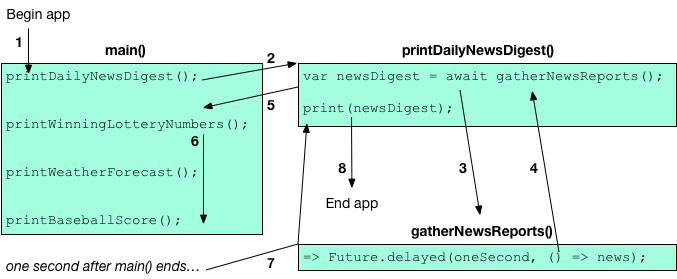

<?code-excerpt replace="/\b_(gather|print)/$1/g; /Async\w*\(\)/()/g"?>
<?code-excerpt plaster="none"?>


[PENDING: This page might be replaced by the Futures codelab.]


<div class="mini-toc" markdown="1">
  <h4>What's the point?</h4>

  * Dart code runs in a single "thread" of execution.
  * Code that blocks the thread of execution can make your program freeze.
  * `Future` objects (_futures_) represent the results of
    _asynchronous operations_ — processing or I/O to be completed later.
  * To suspend execution until a future completes,
    use `await` in an async function.
  * To catch errors, use try-catch expressions in async functions.
  * To run code concurrently, create an _isolate_
    (or for a web app, a _worker_).
</div>

Dart code runs in a single "thread" of execution.
If Dart code blocks — for example, by performing a
long-running calculation or waiting for I/O — the entire program freezes.

Asynchronous operations let your program complete other work while
waiting for an operation to finish.
Dart uses `Future` objects (futures) to represent the results of
asynchronous operations.
To work with futures,
you can use either `async` and `await` or the `Future` API.

<aside class="alert alert-info" markdown="1">
  **Note:**
  All Dart code runs in the context of an _isolate_ that
  owns all of the memory that the Dart code uses.
  While Dart code is executing, no other code in the same isolate can run.

  <br>
  If you want multiple parts of Dart code to run concurrently,
  you can run them in separate isolates.
  (Web apps use workers instead of isolates.)
  Multiple isolates run at the same time, usually each on its own CPU core.
  Isolates don't share memory, and the only way they can interact
  is by sending messages to each other.
  For more information, see the documentation for
  [isolates][isolate] or [web workers.][worker]
</aside>

## Introduction

Let's look at some code that might cause a program to freeze:

<?code-excerpt "misc/lib/tutorial/daily_news.dart (sync)" replace="/Sync(\(\))/$1/g"?>

// Synchronous code
void printDailyNewsDigest() {
  var newsDigest = gatherNewsReports(); // Can take a while.
  print(newsDigest);
}

main() {
  printDailyNewsDigest();
  printWinningLotteryNumbers();
  printWeatherForecast();
  printBaseballScore();
}


Our program gathers the news of the day, prints it, and then prints a bunch of
other items of interest to the user:

<?code-excerpt "misc/test/tutorial/futures_test.dart (sync-output)" replace="/const.*?'+//g; /'+;//g"?>
```nocode
<gathered news goes here>
Winning lotto numbers: [23, 63, 87, 26, 2]
Tomorrow's forecast: 70F, sunny.
Baseball score: Red Sox 10, Yankees 0
```

Our code is problematic: since `gatherNewsReports()` blocks, the remaining
code runs only after `gatherNewsReports()` returns with the contents of the
file, _however long that takes_. If reading the file takes a long time,
the user has to wait, wondering if they won the lottery, what tomorrow's
weather will be, and who won today's game.

To help keep the application responsive, Dart library authors use an
asynchronous model when defining functions that do potentially expensive work.
Such functions return their value using a future.

## What is a future? {#what-is-a-future}

A future is a [`Future<T>`][Future] object, which
represents an asynchronous operation that produces a result of type `T`.
If the result isn't a usable value, then the future's type is `Future<void>`.
When a function that returns a future is invoked, two things happen:

1. The function queues up work to be done and returns an uncompleted `Future`
   object.
1. Later, when the operation is finished, the `Future` object
   completes with a value or with an error.

When writing code that depends on a future, you have two options:

* Use `async` and `await`
* Use the `Future` API

## Async and await {#async-await}

The `async` and `await` keywords are part of the Dart language's [asynchrony
support](/guides/language/language-tour#asynchrony-support). They allow you
to write asynchronous code that looks like synchronous code and doesn't use
the `Future` API. An _async function_ is one that has the `async` keyword
before its body. The `await` keyword works only in async functions.



The following app simulates reading the news by using `async` and `await`
to read the contents of a file on this site.
Click run  to start the app.
Or open a
[DartPad window containing the app,]({{site.custom.dartpad.direct-link}}/477fb799d21401f46f8c04462fd249c4){: target="_blank"}
run the app, and click CONSOLE to see the app's output.


<?code-excerpt "misc/lib/tutorial/daily_news.dart (main-async)" replace="/Duration (oneSecond)/const $1/g"?>

// Copyright (c) 2013, the Dart project authors.  Please see the AUTHORS file
// for details. All rights reserved. Use of this source code is governed by a
// BSD-style license that can be found in the LICENSE file.
Future<void> printDailyNewsDigest() async {
  var newsDigest = await gatherNewsReports();
  print(newsDigest);
}

main() {
  printDailyNewsDigest();
  printWinningLotteryNumbers();
  printWeatherForecast();
  printBaseballScore();
}

printWinningLotteryNumbers() {
  print('Winning lotto numbers: [23, 63, 87, 26, 2]');
}

printWeatherForecast() {
  print("Tomorrow's forecast: 70F, sunny.");
}

printBaseballScore() {
  print('Baseball score: Red Sox 10, Yankees 0');
}

const news = '<gathered news goes here>';
const oneSecond = Duration(seconds: 1);

// Imagine that this function is more complex and slow. :)
Future<String> gatherNewsReports() =>
    Future.delayed(oneSecond, () => news);

// Alternatively, you can get news from a server using features
// from either dart:io or dart:html. For example:
//
// import 'dart:html';
//
// Future<String> gatherNewsReportsFromServer() => HttpRequest.getString(
//      'https://www.dartlang.org/f/dailyNewsDigest.txt',
//    );



<iframe
src="{{site.custom.dartpad.embed-inline-prefix}}?id=477fb799d21401f46f8c04462fd249c4&horizontalRatio=99&verticalRatio=73"
    width="100%"
    height="500px"
    style="border: 1px solid #ccc;">
</iframe>

Notice that `printDailyNewsDigest()` is the first function called, but the news
is the last thing to print, even though the file contains only a single
line. This is because the code that reads and prints the file is running
asynchronously.

In this example, the `printDailyNewsDigest()` function calls
`gatherNewsReports()`, which is non-blocking.  Calling `gatherNewsReports()`
queues up the work to be done but doesn't stop the rest of the code from
executing. The program prints the lottery numbers, the forecast, and the
baseball score; when `gatherNewsReports()` finishes gathering news, the
program prints.  If `gatherNewsReports()` takes a little while to complete its
work, no great harm is done: the user gets to read other things before the
daily news digest is printed.

Note the return types. The return type of `gatherNewsReports()` is
`Future<String>`, which means that it returns a future that completes with
a string value. The `printDailyNewsDigest()` function, which doesn't
return a value, has the return type `Future<void>`.

The following diagram shows the flow of execution through the code.  Each
number corresponds to a step below.



1. The app begins executing.
1. The `main()` function calls the async function `printDailyNewsDigest()`,
   which begins executing synchronously.
1. `printDailyNewsDigest()` uses `await` to call the function
   `gatherNewsReports()`, which begins executing.
1. The `gatherNewsReports()` function returns an uncompleted
   future (an instance of `Future<String>`).
1. Because `printDailyNewsDigest()` is an async function and is
   awaiting a value, it pauses its execution and returns an uncompleted
   future (in this case, an instance of `Future<void>`)
   to its caller (`main()`).
1. The remaining print functions execute. Because they're synchronous, each
   function executes fully before moving on to the next print function. For
   example, the winning lottery numbers are all printed before the weather
   forecast is printed.
1. When `main()` has finished executing, the asynchronous functions can resume
   execution. First, the future returned by `gatherNewsReports()` completes.
   Then `printDailyNewsDigest()` continues executing, printing the news.
1. When the `printDailyNewsDigest()` function body finishes executing,
   the future that it originally returned completes, and the app exits.

Note that an async function starts executing right away (synchronously).
The function suspends execution and returns an uncompleted future
when it reaches the first occurrence of any of the following:

* The function's first `await` expression (after the function
  gets the uncompleted future from that expression).
* Any `return` statement in the function.
* The end of the function body.


### Handling errors {#handling-errors-async}

If a `Future`-returning function completes with an error, you probably want to
capture that error. Async functions can handle errors using try-catch:

<?code-excerpt "misc/lib/tutorial/daily_news.dart (try-catch)"?>

Future<void> printDailyNewsDigest() async {
  try {
    var newsDigest = await gatherNewsReports();
    print(newsDigest);
  } catch (e) {
    // Handle error...
  }
}


The try-catch code behaves in the same way with asynchronous code as it does
with synchronous code: if the code within the `try` block throws an exception,
the code inside the `catch` clause executes.


[PENDING: say something about finally?]


### Sequential processing {#sequential-processing-async}

You can use multiple `await` expressions to ensure that each statement
completes before executing the next statement:

<?code-excerpt "misc/lib/tutorial/misc.dart (multiple-await)"?>

// Sequential processing using async and await.
main() async {
  await expensiveA();
  await expensiveB();
  doSomethingWith(await expensiveC());
}


The `expensiveB()` function doesn't execute until `expensiveA()` has
finished, and so on.



[PENDING: Move this to the error handling page?]

## The Future API

Before `async` and `await` were added in Dart 1.9,
you had to use the `Future` API.
You might still see the `Future` API used in older code and in code that needs
more functionality than async-await offers.

To write asynchronous code using the `Future` API, you use the `then()` method
to register a callback.  This callback fires when the `Future` completes.

The following app simulates reading the news by using the `Future` API to read
the contents of a file on this site.
Click run  to start the app.
Or open a
[DartPad window containing the app,]({{site.custom.dartpad.direct-link}}/5ceabe371903b6672026bd3fb30cdf5b){: target="_blank"}
run the app, and click CONSOLE to see the app's output.


<?code-excerpt "misc/lib/tutorial/daily_news.dart (main-future-api)" replace="/Duration (oneSecond)/const $1/g"?>

// Copyright (c) 2013, the Dart project authors.  Please see the AUTHORS file
// for details. All rights reserved. Use of this source code is governed by a
// BSD-style license that can be found in the LICENSE file.
Future<void> printDailyNewsDigest() {
  final future = gatherNewsReports();
  return future.then(print);
  // You don't *have* to return the future here.
  // But if you don't, callers can't await it.
}

main() {
  printDailyNewsDigest();
  printWinningLotteryNumbers();
  printWeatherForecast();
  printBaseballScore();
}

printWinningLotteryNumbers() {
  print('Winning lotto numbers: [23, 63, 87, 26, 2]');
}

printWeatherForecast() {
  print("Tomorrow's forecast: 70F, sunny.");
}

printBaseballScore() {
  print('Baseball score: Red Sox 10, Yankees 0');
}

const news = '<gathered news goes here>';
const oneSecond = Duration(seconds: 1);

// Imagine that this function is more complex and slow. :)
Future<String> gatherNewsReports() =>
    Future.delayed(oneSecond, () => news);

// Alternatively, you can get news from a server using features
// from either dart:io or dart:html. For example:
//
// import 'dart:html';
//
// Future<String> gatherNewsReportsFromServer() => HttpRequest.getString(
//      'https://www.dartlang.org/f/dailyNewsDigest.txt',
//    );



<iframe
src="{{site.custom.dartpad.embed-inline-prefix}}?id=5ceabe371903b6672026bd3fb30cdf5b&horizontalRatio=99&verticalRatio=73"
    width="100%"
    height="500px"
    style="border: 1px solid #ccc;">
</iframe>

Notice that `printDailyNewsDigest()` is the first function called, but the news
is the last thing to print, even though the file contains only a single
line. This is because the code that reads the file is running asynchronously.

This app executes as follows:

1. The app begins executing.
1. The main function calls the `printDailyNewsDigest()` function, which does
   not return immediately, but calls `gatherNewsReports()`.
1. `gatherNewsReports()` starts gathering news and returns a `Future`.
1. `printDailyNewsDigest()` uses `then()` to specify a response to the
   `Future`. Calling `then()` returns a new `Future` that will complete with the
   value returned by `then()`'s callback.
1. The remaining print functions execute. Because they're synchronous, each
   function executes fully before moving on to the next print function. For
   example, the winning lottery numbers are all printed before the weather
   forecast is printed.
1. When all of the news has arrived, the `Future` returned by
   `gatherNewsReports()` completes with a string containing the gathered news.
1. The code specified by `then()` in `printDailyNewsDigest()` runs, printing
   the news.
1. The app exits.

<aside class="alert alert-info" markdown="1">
  **Note:**
  In the `printDailyNewsDigest()` function, the code `future.then(print)`
  is equivalent to the following:<br>
  `future.then((newsDigest) => print(newsDigest))`

TODO: When https://github.com/dart-lang/site-www/issues/1158 is fixed,
link to the descriptions of lambdas and tear-offs.

<?code-excerpt "misc/lib/tutorial/daily_news.dart (main-future-api-dont-pass-print)"?>

future.then((newsDigest) => print(newsDigest))


</aside>

Alternatively, the code inside `then()` can use curly braces:

<?code-excerpt "misc/lib/tutorial/daily_news.dart (main-future-api-using-braces)"?>

Future<void> printDailyNewsDigest() {
  final future = gatherNewsReports();
  return future.then((newsDigest) {
    print(newsDigest);
    // Do something else...
  });
}


You need to provide an argument to `then()`'s callback,
even if the `Future` is of type `Future<void>`.
By convention, an unused argument is named `_` (underscore).

<?code-excerpt "misc/lib/tutorial/daily_news.dart (main-future-api-then-no-arg)"?>
```dart
final future = printDailyNewsDigest();
return future.then((_) {
  // Code that doesn't use the `_` parameter...
  print('All reports printed.');
});
```


### Handling errors {#handling-errors-future-api}

With the `Future` API, you can capture an error using `catchError()`:

<?code-excerpt "misc/lib/tutorial/daily_news.dart (future-api-try-catch)"?>

Future<void> printDailyNewsDigest() =>
    gatherNewsReports().then(print).catchError(handleError);


If the news stream isn't available for reading, the
code above executes as follows:

1. The future returned by `gatherNewsReports()` completes with an error.
1. The future returned by `then()` completes with an error;
   `print()` isn't called.
1. The callback for `catchError()` (`handleError()`) handles the error,
   the future returned by `catchError()` completes normally,
   and the error does not propagate.

<aside class="alert alert-info" markdown="1">
  Chaining `catchError()` to `then()` is a common pattern
  when using the `Future` API.
  **Consider this pairing the `Future` API's equivalent of try-catch blocks.**
</aside>

Like `then()`, `catchError()` returns a new `Future` that completes with the
return value of its callback.

For more details and examples, read [Futures and Error Handling][].

### Calling multiple functions that return futures {#calling-multiple-funcs}

Consider three functions, `expensiveA()`, `expensiveB()`, and `expensiveC()`,
that return `Future` objects.  You can invoke them sequentially (one function starts
when a previous one completes), or you can kick off all of them at the same
time and do something once all the values return. The `Future` interface is
fluid enough to deal with both use cases.

#### Chaining function calls using then()

When `Future`-returning functions need to run in order, use chained `then()`
calls:

<?code-excerpt "misc/lib/tutorial/misc.dart (chaining)"?>

expensiveA()
    .then((aValue) => expensiveB())
    .then((bValue) => expensiveC())
    .then((cValue) => doSomethingWith(cValue));


Nested callbacks also work, but they're harder to read and not as Dart-y.

#### Waiting on multiple futures to complete using Future.wait()

If the order of execution of the functions is not important, you can use
`Future.wait()`.

When you pass `Future.wait()` a list of futures,
it immediately returns a `Future`. That future doesn't complete until
all of the given futures have completed.
Then it completes with a list containing the values produced by
each future in the original list.

<?code-excerpt "misc/lib/tutorial/misc.dart (Future-wait)"?>

Future.wait([expensiveA(), expensiveB(), expensiveC()])
    .then((List responses) => chooseBestResponse(responses, moreInfo))
    .catchError(handleError);


If any of the invoked functions completes with an error, the `Future` returned
by `Future.wait()` also completes with an error. Use `catchError()` to handle
the error.



## Other resources {#other-resources}

Read the following documentation for more details on using futures and
asynchronous programming in Dart:

* [Asynchrony support](/guides/language/language-tour#asynchrony-support),
  a section in the [language tour](/guides/language/language-tour).
* API reference documentation for
  [futures,][Future]
  [isolates,][isolate] and
  [web workers.][worker]

## What next? {#what-next}

* Read the [streams tutorial](streams), which shows you
  how to work with an event stream.

[Future]: {{site.dart_api}}/{{site.data.pkg-vers.SDK.channel}}/dart-async/Future-class.html
[Futures and Error Handling]: /guides/libraries/futures-error-handling
[isolate]: {{site.dart_api}}/{{site.data.pkg-vers.SDK.channel}}/dart-isolate/dart-isolate-library.html
[worker]: {{site.dart_api}}/{{site.data.pkg-vers.SDK.channel}}/dart-html/Worker-class.html
