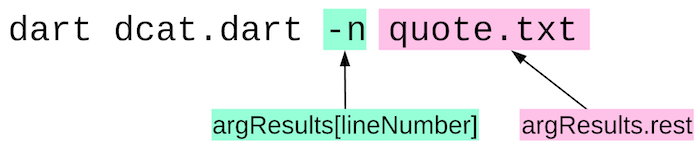

<div class="mini-toc" markdown="1">
  <h4>What's the point?</h4>

  * Command-line applications need to do input and output.
  * The dart:io library provides I/O functionality.
  * The args package helps define and parse command-line arguments.
  * A Future represents a value that will be available at some time in the future.
  * Streams provide a series of asynchronous data events.
  * Most input and output requires the use of streams.
</div>

<aside class="alert alert-info" markdown="1">
<strong>Prerequisite:</strong>
This tutorial uses the `async` and `await` language features, which rely on the
<a href="{{site.dart_api}}/{{site.data.pkg-vers.SDK.channel}}/dart-async/Future-class.html" target="_blank">Future</a>
and
<a href="{{site.dart_api}}/{{site.data.pkg-vers.SDK.channel}}/dart-async/Stream-class.html"
   target="_blank">Stream</a> classes for asynchronous support.
To learn more about these features, see the
[futures tutorial](/tutorials/language/futures) and the
[streams tutorial](/tutorials/language/streams).
</aside>

This tutorial teaches you how to build command-line apps
and shows you a few small command-line applications.
These programs use resources that most command-line applications need,
including the standard output, error, and input streams,
command-line arguments, files and directories, and more.


## Running an app with the standalone Dart VM

To run a command-line app, you need the Dart VM (`dart`),
which comes when you [install the Dart SDK](/get-dart).

The location of the SDK installation directory
(we'll call it _&lt;sdk-install-dir&gt;_) depends on your platform
and how you installed the SDK.
You can find `dart` in _&lt;sdk-install-dir&gt;_/bin.
By putting this directory in your PATH
you can refer to the `dart` command and other commands, such as
[dartanalyzer](/tools/dartanalyzer),
by name.

Let's run a small program.

<ol>
<li markdown="1">
Create a file called `helloworld.dart` that contains this code:


void main() {
  print('Hello, World!');
}

</li>

<li markdown="1">
In the directory that contains the file you just created, run the program:

```terminal
$ dart helloworld.dart
Hello, World!
```
</li>
</ol>

The Dart VM supports many options.
Use `dart --help` to see commonly used options.
Use `dart --verbose` to see all options.

## Review briefly the dcat example code

Take a quick look at the code for a small sample called `dcat`,
which displays the contents of any files listed on the command line.
This program uses various classes, functions, and properties
available to command-line apps.
This tutorial goes into detail about this app in the following sections.
For a brief look now, hover over the highlighted code below for explanations.

<pre class="prettyprint lang-dart">
import 'dart:io';
import 'dart:convert';

import 'package:args/args.dart';

const lineNumber = 'line-number';

ArgResults argResults;

void main(<a tabindex="0" role="button" class="highlight" data-toggle="popover" title="Command-line arguments" data-content="Command-line arguments are passed in by the system when the program starts.">List&lt;String&gt; arguments</a>) {
  exitCode = 0; //presume success
  final parser = new ArgParser()
      ..addFlag(lineNumber, negatable: false, abbr: 'n');

  <a tabindex="0" role="button" class="highlight" data-toggle="popover" title="Arguments parser" data-content="The ArgParser class provides help with parsing command-line arguments.">argResults = parser.parse(arguments);</a>
  List&lt;String&gt; paths = argResults.rest;

  dcat(paths, argResults[lineNumber]);
}

Future dcat(List&lt;String&gt; paths, bool showLineNumbers) <a tabindex="0" role="button" class="highlight" data-toggle="popover" title="Async function" data-content='An async function is marked with "async" and returns a Future.'>async</a> {
  if (paths.isEmpty) {
    // No files provided as arguments. Read from stdin and print each line.
    <a tabindex="0" role="button" class="highlight" data-toggle="popover" title="Using await" data-content='The "await" keyword, which works only in async functions, makes the program pause until the following expression completes.'>await</a> <a tabindex="0" role="button" class="highlight" data-toggle="popover" title="Standard I/O streams" data-content="This line reads from the standard input stream and pipes the data to the standard output stream.">stdin.pipe(stdout);</a>
  } else {
    for (var path in paths) {
      int lineNumber = 1;
      <a tabindex="0" role="button" class="highlight" data-toggle="popover" title="Create a File object" data-content="Use the File class to represent the file on the native file system.">Stream lines = new File(path)</a>
          <a tabindex="0" role="button" class="highlight" data-toggle="popover" title="Open a file for reading" data-content="Read the content from the file asynchronously.">.openRead()</a>
          <a tabindex="0" role="button" class="highlight" data-toggle="popover" title="Data converters" data-content="Convert data as it becomes available on the stream.">.transform(utf8.decoder)</a>
          .transform(const LineSplitter());
      <a tabindex="0" role="button" class="highlight" data-toggle="popover" title="Exception handling" data-content='Function calls that might generate an exception are placed in a "try" block.'>try</a> {
        <a tabindex="0" role="button" class="highlight" data-toggle="popover" title="Get data from the stream"
          data-content='Use "await for" to loop over the values as they become available on the stream. The program pauses while waiting for the next line.'
        >await for (var line in lines)</a> {
          if (showLineNumbers) {
            stdout.write('${lineNumber++} ');
          }
          stdout.writeln(line);
        }
      } <a tabindex="0" role="button" class="highlight" data-toggle="popover" title="Exception handling" data-content='Any errors encountered in the stream are handled in the "catch" block.'>catch</a> (_) {
        await _handleError(path);
      }
    }
  }
}

Future _handleError(String path) async {
  if (<a tabindex="0" role="button" class="highlight" data-toggle="popover" title="Test the path"
    data-content='You can get information about the file system on which your program is running. The "await" keyword causes error handling to pause until the path is available.'
  >await FileSystemEntity.isDirectory(path)</a>) {
    stderr.writeln('error: $path is a directory');
  } else {
    <a tabindex="0" role="button" class="highlight" data-toggle="popover" title="Exit code"
      data-content="A well-behaved command-line app sets an exit code to indicate whether the program was successful."
    >exitCode = 2;</a>
  }
}

</pre>

## Parsing command-line arguments

The [args]({{site.pub}}/packages/args) package
a software bundle that contains a library of Dart code, provides
parser support for transforming raw command-line arguments
into a set of options, flags, and additional values.
Import the library as follows:


import 'package:args/args.dart';


The args library contains two classes:

| Library | Description |
|---|---|
| <a href="{{site.pub-api}}/args/latest/args/ArgParser-class.html" target="_blank">ArgParser</a> | A class that parses command-line arguments |
| <a href="{{site.pub-api}}/args/latest/args/ArgResults-class.html" target="_blank">ArgResults</a> | The result of parsing command-line arguments using ArgParser. |
{: .table }

Let's take a look at the `dcat` sample,
which uses ArgParser and ArgResults to parse and store its command-line arguments.

<ol>
<li markdown="1">
Copy the sample file from the github repo:
<a href="https://raw.githubusercontent.com/dart-lang/dart-tutorials-samples/master/cmdline/bin/dcat.dart">dcat.dart.</a>
</li>

<li markdown="1">
Run the program from the command line as shown by the **boldface** text.

<pre>
$ <b>dart dcat.dart -n quotes.txt</b>
1 Be yourself. Everyone else is taken. -Oscar Wilde
2 Don't cry because it's over, smile because it happened. -Dr. Seuss
3 You only live once, but if you do it right, once is enough. -Mae West
...
</pre>

The program displays the contents of the source code file and
preceeds each line with a line number.
</li>

</ol>

The following diagram shows how the `dcat` command line used above
is parsed into the `ArgResults` object.



You can access flags and options by name,
treating the ArgResults object like a Map.
You can access other values with properties such as `rest`.

Here's the code from `dcat` that deals with command-line arguments:

<pre class="prettyprint lang-dart">
...
<a tabindex="0" role="button" class="highlight" data-toggle="popover" title="Parsed arguments" data-content="This object contains parsed options and flags.">ArgResults argResults;</a>

void main(<a tabindex="0" role="button" class="highlight" data-toggle="popover" title="Command-line arguments" data-content="The system passes command-line arguments into the program in a list of strings.">List&lt;String&gt; arguments</a>) {
  exitCode = 0; //presume success
  final parser = new ArgParser()
    <a tabindex="0" role="button" class="highlight" data-toggle="popover" title="Define a valid flag" data-content="Add a flag definition to the command-line argument parser. This code defines the flag -n, which when used displays line numbers.">..addFlag(lineNumber, negatable: false, abbr: 'n')</a>;

  argResults = parser.<a tabindex="0" role="button" class="highlight" data-toggle="popover" title="Parse the arguments" data-content="Parse the arguments that were passed into the main() function. The parser stops parsing if it finds an undefined option or flag.">parse(arguments)</a>;
  List&lt;String&gt; paths = <a tabindex="0" role="button" class="highlight" data-toggle="popover" title="Remaining arguments" data-content="To get the arguments that remain after parsing all of the valid options and flags, use the rest property.">argResults.rest</a>;

  dcat(paths, <a tabindex="0" role="button" class="highlight" data-toggle="popover" title="Refer to options and flags by name" data-content="You can refer to an option or flag by name treating the ArgResults object like a Map.">argResults[lineNumber])</a>;
}
...
</pre>

The
<a href="{{site.pub-api}}/args/latest/index.html" target="_blank">API docs</a>
for the args library
provide detailed information
to help you use ArgsParser and ArgResults classes.

## Reading and writing with stdin, stdout, and stderr

Like other languages,
Dart has standard output, standard error, and standard input streams.
The standard I/O streams are defined at the top level of the dart:io library,

| Stream | Description |
|---|---|
| <a href="{{site.dart_api}}/{{site.data.pkg-vers.SDK.channel}}/dart-io/stdout.html" target="_blank">stdout</a> | The standard output |
| <a href="{{site.dart_api}}/{{site.data.pkg-vers.SDK.channel}}/dart-io/stderr.html" target="_blank">stderr</a> | The standard error |
| <a href="{{site.dart_api}}/{{site.data.pkg-vers.SDK.channel}}/dart-io/stdin.html" target="_blank">stdin</a> | The standard input |
{: .table }

Import the dart:io library as follows:


import 'dart:io';


Only command-line applications, not web applications, can use the dart:io library.


### stdout

Here's the code from the `dcat` program that writes the line number to
the `stdout` (if the -n flag is set) followed by the line from the file.


if (showLineNumbers) {
  [!stdout.write('${lineNumber++} ');!]
}

[!stdout.writeln(line);!]


The `write()` and `writeln()` methods take an object of any type,
convert it to a string, and print it. The `writeln()` method
also prints a newline character.
`dcat` uses the `write()` method to print the line number so the
line number and the text appear on the same line.

You can also use the `writeAll()` method to print a list of objects,
or use `addStream()` to asynchronously print all of the elements from a stream.

`stdout` provides more functionality than the `print()` function.
For example, you can display the contents of a stream with `stdout`.
However, you must use `print()` instead of `stdout`
for programs that are converted to and run in JavaScript.

### stderr

Use `stderr` to write error messages to the console.
The standard error stream has the same methods as `stdout`,
and you use it in the same way.
Although both `stdout` and `stderr` print to the console,
their output is separate
and can be redirected or piped at the command line
or programmatically to different destinations.

This code from `dcat` prints an error message if the user
tries to list a directory.


if (await FileSystemEntity.isDirectory(path)) {
  [!stderr.writeln('error: $path is a directory');!]
} else {
  exitCode = 2;
}


### stdin

The standard input stream typically
reads data synchronously from the keyboard,
although it can read asynchronously
and it can get input piped in from the standard
output of another program.

Here's a small program that reads a single line from `stdin`:


import 'dart:io';

void main() {
  stdout.writeln('Type something');
  String input = stdin.readLineSync();
  stdout.writeln('You typed: $input');
}


The `readLineSync()` method reads text from the standard input stream,
blocking until the user types in text and presses return.
This little program prints out the typed text.

In the `dcat` program,
if the user does not provide a filename on the command line,
the program instead reads from stdin
using the `pipe()` method.
Because `pipe()` is asynchronous
(returning a Future, even though this code doesn't use that return value),
the code that calls it uses `await`.


await [!stdin!].pipe(stdout);


In this case,
the user types in lines of text and the program copies them to stdout.
The user signals the end of input by typing &lt;ctl-d&gt;.

```terminal
$ dart dcat.dart
The quick brown fox jumps over the lazy dog.
The quick brown fox jumps over the lazy dog.
```

## Getting info about a file

The
<a href="{{site.dart_api}}/{{site.data.pkg-vers.SDK.channel}}/dart-io/FileSystemEntity-class.html" target="_blank">FileSystemEntity</a>
class in the dart:io library provides properties and static methods
that help you inspect and manipulate the file system.

For example, if you have a path,
you can determine whether the path is a file, a directory, a link, or not found
by using the `type()` method from the `FileSystemEntity` class.
Because the `type()` method accesses the file system,
it performs the check asynchronously.

The following code from the `dcat` example uses `FileSystemEntity`
to determine if the path provided on the command line is a directory.
The Future returns a boolean that indicates if the path is a directory or not.
Because the check is asynchronous, the code calls `isDirectory()`
using `await`.


if (await [!FileSystemEntity.isDirectory(path)!]) {
  stderr.writeln('error: $path is a directory');
} else {
  exitCode = 2;
}


Other interesting methods in the `FileSystemEntity` class
include `isFile()`, `exists()`, `stat()`, `delete()`,
and `rename()`, all of which also use a Future to return a value.

FileSystemEntity is the superclass for the File, Directory, and Link classes.

## Reading a file

`dcat` opens each file listed on the command line
with the `openRead()` method, which returns a stream.
The `await for` block waits for the file to be read
asynchronously. The data prints to stdout when it
becomes available on the stream.


for (var path in paths) {
  int lineNumber = 1;
  Stream lines = new File(path)
      .openRead()
      .transform(utf8.decoder)
      .transform(const LineSplitter());
  try {
    [!await for (var line in lines) {!]
      [!if (showLineNumbers) {!]
        [!stdout.write('${lineNumber++} ');!]
      [!}!]
      [!stdout.writeln(line);!]
    }
  } catch (_) {
    await _handleError(path);
  }
}


The following shows the rest of the code, which uses two decoders that
transform the data before making it available in the `await for` block.
The UTF8 decoder converts the data into Dart strings.
`LineSplitter` splits the data at newlines.


for (var path in paths) {
  int lineNumber = 1;
  Stream lines = new File(path)
      .openRead()
      [!.transform(utf8.decoder)!]
      [!.transform(const LineSplitter());!]
  try {
    await for (var line in lines) {
      if (showLineNumbers) {
        stdout.write('${lineNumber++} ');
      }
      stdout.writeln(line);
    }
  } catch (_) {
    await _handleError(path);
  }
}


The dart:convert library contains these and other data converters,
including one for JSON.
To use these converters you need to import the dart:convert library:


import 'dart:convert';


## Writing a file

The easiest way to write text to a file is to create a
<a href="{{site.dart_api}}/{{site.data.pkg-vers.SDK.channel}}/dart-io/File-class.html" target="_blank">File</a>
object and use the `writeAsString()` method:


File quotesFile = new File('quotes.txt');
String stronger = 'That which does not kill us makes us stronger. -Nietzsche';

try {
  await quotesFile.writeAsString(stronger, mode: FileMode.append);
  print('Data written.');
} catch (e) {
  print('Oops!');
}


The `writeAsString()` method writes the data asynchronously.
It opens the file before writing and closes the file when done.
To append data to an existing file, you can use the optional
parameter `mode` and set its value to `FileMode.append`.
Otherwise, the mode is `FileMode.write` and the previous contents of the file,
if any, are overwritten.

If you want to write more data, you can open the file for writing.
The `openWrite()` method returns an IOSink (the same type as stdin and stderr).
You can continue to write to the file until done,
at which time, you must close the file.
The `close()` method is asynchronous and returns a Future.


IOSink quotes = new File('quotes.txt').openWrite(mode: FileMode.append);

quotes.write('A woman is like a tea bag; ');
quotes.write('you never know how strong it is until it\'s in hot water.');
quotes.writeln(' -Eleanor Roosevelt');
await quotes.close();
print('Done!');


## Getting environment information

Use the
<a href="{{site.dart_api}}/{{site.data.pkg-vers.SDK.channel}}/dart-io/Platform-class.html" target="_blank">Platform</a>
class
to get information about the machine and OS that the program is running on.
Note: Use the Platform class from the dart:io library,
not from the dart:html library.

`Platform.environment` provides a copy of the environment
variables in an immutable map. If you need a mutable map (modifiable copy) you
can use `Map.from(Platform.environment)`.


Map environmentVars = Platform.environment;

print('PWD = ${environmentVars["PWD"]}');
print('LOGNAME = ${environmentVars["LOGNAME"]}');
print('PATH = ${environmentVars["PATH"]}');


`Platform` provides other useful properties that give
information about the machine, OS, and currently
running program.
For example:

* `Platform.isMacOS()`
* `Platform.numberOfProcessors`
* `Platform.script.path`

## Setting exit codes

The dart:io library defines a top-level property,
`exitCode`, that you can change to set the exit code for
the current invocation of the Dart VM.
An exit code is a number passed from
the Dart program to the parent process
to indicate the success, failure, or other state of the
execution of the program.

The `dcat` program sets the exit code
in the `_handleError()` function to indicate that an error
occcurred during execution.


Future _handleError(String path) async {
  if (await FileSystemEntity.isDirectory(path)) {
    stderr.writeln('error: $path is a directory');
  } else {
    [!exitCode = 2;!]
  }
}


An exit code of 2 indicates that the program encountered an error.

An alternative to using `exitCode` is to use the top-level `exit()` function,
which sets the exit code and quits the program immediately.
For example, the `_handleError()` function could call `exit(2)`
instead of setting `exitCode` to 2,
but `exit()` would quit the program
and it might not process all of the files on the command line.

<aside class="alert alert-info" markdown="1">
Generally speaking, you are better off using the `exitCode` property,
which sets the exit code but allows the program to continue through to its
natural completion.
</aside>

Although you can use any number for an exit code,
by convention, the codes in the table below have the following meanings:

| Code | Meaning |
|---|---|
| 0 | Success |
| 1 | Warnings |
| 2 | Errors |
{: .table }

## Summary

This tutorial described some basic API found in these classes from the dart:io library:

| API | Description |
|---|---|
| <a href="{{site.dart_api}}/{{site.data.pkg-vers.SDK.channel}}/dart-io/IOSink-class.html" target="_blank">IOSink</a> | Helper class for objects that consume data from streams. |
| <a href="{{site.dart_api}}/{{site.data.pkg-vers.SDK.channel}}/dart-io/File-class.html" target="_blank">File</a> | Represents a file on the native file system |
| <a href="{{site.dart_api}}/{{site.data.pkg-vers.SDK.channel}}/dart-io/Directory-class.html" target="_blank">Directory</a> | Represents a directory on the native file system |
| <a href="{{site.dart_api}}/{{site.data.pkg-vers.SDK.channel}}/dart-io/FileSystemEntity-class.html" target="_blank">FileSystemEntity</a> | Superclass for File and Directory |
| <a href="{{site.dart_api}}/{{site.data.pkg-vers.SDK.channel}}/dart-io/Platform-class.html" target="_blank">Platform</a> | Provides information about the machine and operating system |
| <a href="{{site.dart_api}}/{{site.data.pkg-vers.SDK.channel}}/dart-io/stdout.html" target="_blank">stdout</a> | The standard output |
| <a href="{{site.dart_api}}/{{site.data.pkg-vers.SDK.channel}}/dart-io/stderr.html" target="_blank">stderr</a> | The standard error |
| <a href="{{site.dart_api}}/{{site.data.pkg-vers.SDK.channel}}/dart-io/stdin.html" target="_blank">stdin</a> | The standard input |
| <a href="{{site.dart_api}}/{{site.data.pkg-vers.SDK.channel}}/dart-io/exitCode.html" target="_blank">exitCode</a> | Sets the exit code |
| <a href="{{site.dart_api}}/{{site.data.pkg-vers.SDK.channel}}/dart-io/exit.html" target="_blank">exit()</a> | Sets the exit code and quits |
{: .table }

In addition, this tutorial covers two classes that help with command-line arguments:

| Class | Description |
|---|---|
| <a href="{{site.pub-api}}/args/latest/args/ArgParser-class.html" target="_blank">ArgParser</a> | A class that transforms a list of raw arguments and into a set of options, flags, and remaining values. |
| <a href="{{site.pub-api}}/args/latest/args/ArgResults-class.html" target="_blank">ArgResults</a> | The result of parsing raw command line arguments using ArgParser. |
{: .table }

## Other resources

Check out the [Servers with Dart](https://dart-lang.github.io/server/)
to find more resources related to writing command-line apps.

Refer to the API docs for
<a href="{{site.dart_api}}/{{site.data.pkg-vers.SDK.channel}}/dart-io/dart-io-library.html" target="_blank">dart:io,</a>
<a href="{{site.dart_api}}/{{site.data.pkg-vers.SDK.channel}}/dart-convert/dart-convert-library.html" target="_blank">dart:convert,</a>
and the
<a href="{{site.pub-api}}/args/latest/index.html" target="_blank">args</a>
package for more classes, functions, and properties.

## What next?

* If you're interested in server-side programming,
check out the next tutorial, which covers
[HTTP clients and servers](/tutorials/server/httpserver).
