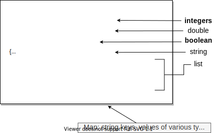

<?code-excerpt path-base="fetch_data"?>

<div class="mini-toc" markdown="1">
  <h4>What's the point?</h4>

  * Data on the web is often formatted in JSON.
  * JSON is text based and human readable.
  * The dart:convert library provides support for JSON.
  * Use HttpRequest to dynamically load data.
</div>

Web apps often use
[JSON](https://www.json.org)
(JavaScript Object Notation)
to pass data between clients and servers.
Data can be _serialized_ into a JSON string,
which is then passed between a client and server,
and revived as an object at its destination.
This tutorial shows you how to use functions in the
[dart:convert][]{: target="_blank" rel="noopener"}
library to produce and consume JSON data.
Because JSON data is typically loaded dynamically,
this tutorial also shows how a web app
can use an HTTP request to get data from an HTTP server.
For web apps,
HTTP requests are served by the browser in which the app is running,
and thus are subject to the browser's security restrictions.

{{site.alert.note}}
  This page uses embedded DartPads to display runnable examples.
  
{{site.alert.end}}


## About JSON

The JSON data format is easy for humans
to write and read because it is lightweight and text based.
With JSON, various data types
and simple data structures such as lists and maps
can be serialized and represented by strings.

**Try it!**
The following app
displays the JSON string for data of various types.
Click **Run** to start the app.
Then change the values of the input elements,
and check out the JSON format for each data type.

{{site.alert.note}}
  
{{site.alert.end}}

```dart:run-dartpad:mode-html:height-520px:ga_id-about_json
{$ begin main.dart $}
import 'dart:html';
import 'dart:convert';

// Input fields
final InputElement favoriteNumber =
    querySelector('#favoriteNumber') as InputElement;
final InputElement valueOfPi = querySelector('#valueOfPi') as InputElement;
final InputElement horoscope = querySelector('#horoscope') as InputElement;
final InputElement favOne = querySelector('#favOne') as InputElement;
final InputElement favTwo = querySelector('#favTwo') as InputElement;
final InputElement favThree = querySelector('#favThree') as InputElement;
final RadioButtonInputElement loveChocolate =
    querySelector('#loveChocolate') as RadioButtonInputElement;
final RadioButtonInputElement noLoveForChocolate =
    querySelector('#noLoveForChocolate') as RadioButtonInputElement;

// Result fields to display values as JSON
final TextAreaElement intAsJson =
    querySelector('#intAsJson') as TextAreaElement;
final TextAreaElement doubleAsJson =
    querySelector('#doubleAsJson') as TextAreaElement;
final TextAreaElement stringAsJson =
    querySelector('#stringAsJson') as TextAreaElement;
final TextAreaElement listAsJson =
    querySelector('#listAsJson') as TextAreaElement;
final TextAreaElement boolAsJson =
    querySelector('#boolAsJson') as TextAreaElement;
final TextAreaElement mapAsJson =
    querySelector('#mapAsJson') as TextAreaElement;

void main() {
  // Set up the listeners.
  favoriteNumber.onKeyUp.listen(_showJson);
  valueOfPi.onKeyUp.listen(_showJson);
  loveChocolate.onClick.listen(_showJson);
  noLoveForChocolate.onClick.listen(_showJson);
  horoscope.onKeyUp.listen(_showJson);
  favOne.onKeyUp.listen(_showJson);
  favTwo.onKeyUp.listen(_showJson);
  favThree.onKeyUp.listen(_showJson);

  _populateFromJson();
  _showJson();
}

// Pre-fill the form with some default values.
void _populateFromJson() {
  const jsonDataAsString = '''{
    "favoriteNumber": 73,
    "valueOfPi": 3.141592,
    "chocolate": true,
    "horoscope": "Cancer",
    "favoriteThings": ["monkeys", "parrots", "lattes"]
  }''';

  Map<String, dynamic> jsonData =
      json.decode(jsonDataAsString) as Map<String, dynamic>;

  favoriteNumber.value = jsonData['favoriteNumber'].toString();
  valueOfPi.value = jsonData['valueOfPi'].toString();
  horoscope.value = jsonData['horoscope'].toString();
  final favoriteThings = jsonData['favoriteThings'] as List<dynamic>;
  favOne.value = favoriteThings[0] as String;
  favTwo.value = favoriteThings[1] as String;
  favThree.value = favoriteThings[2] as String;

  final chocolateRadioButton =
      jsonData['chocolate'] == false ? noLoveForChocolate : loveChocolate;
  chocolateRadioButton.checked = true;
}

/// Display all values as JSON.
void _showJson([Event? _]) {
  // Grab the data that will be converted to JSON.
  final favNum = int.tryParse(favoriteNumber.value ?? '');
  final pi = double.tryParse(valueOfPi.value ?? '');
  final chocolate = loveChocolate.checked;
  final sign = horoscope.value;
  final favoriteThings = <String>[
    favOne.value ?? '',
    favTwo.value ?? '',
    favThree.value ?? '',
  ];

  final formData = {
    'favoriteNumber': favNum,
    'valueOfPi': pi,
    'chocolate': chocolate,
    'horoscope': sign,
    'favoriteThings': favoriteThings
  };

  // Convert to JSON and display results.
  intAsJson.text = json.encode(favNum);
  doubleAsJson.text = json.encode(pi);
  boolAsJson.text = json.encode(chocolate);
  stringAsJson.text = json.encode(sign);
  listAsJson.text = json.encode(favoriteThings);
  mapAsJson.text = json.encode(formData);
}
{$ end main.dart $}
{$ begin index.html $}
<h1>It's All About You</h1>

<table>
  <thead>
  <tr>        <th> </th>
    <th>Enter value</th>
    <th>Data type</th>
    <th>JSON string</th>
  </tr>
  </thead>

  <tbody>
  <tr>
    <td align="right">Favorite number:</td>
    <td><input type="text" id="favoriteNumber"></td>
    <td>integer</td>
    <td><textarea class="result" id="intAsJson" readonly></textarea></td>
  </tr>

  <tr>
    <td align="right">Do you know pi?</td>
    <td><input type="text" id="valueOfPi"></td>
    <td>double</td>
    <td><textarea class="result" id="doubleAsJson" readonly></textarea></td>
  </tr>

  <tr>
    <td align="right">What's your sign?</td>
    <td><input type="text" id="horoscope"></td>
    <td>String</td>
    <td><textarea class="result" id="stringAsJson" readonly></textarea></td>
  </tr>

  <tr>
    <td align="right">A few of your favorite things?</td>
    <td>
      <input type="text" id="favOne">
      <input type="text" id="favTwo">
      <input type="text" id="favThree">
    </td>
    <td>List&lt;String&gt;</td>
    <td><textarea class="result" id="listAsJson" readonly></textarea></td>
  </tr>

  <tr>
    <td align="right">I love chocolate!</td>
    <td>
      <form>
        <input type="radio" name="chocolate" id="loveChocolate" checked>True
        <input type="radio" name="chocolate" id="noLoveForChocolate" checked>False
      </form>
    </td>
    <td>bool</td>
    <td><textarea class="result" id="boolAsJson" readonly> </textarea></td>
  </tr>

  </tbody>
</table>

<div>
  <label>All data together as a map</label><br>
  <textarea id="mapAsJson" readonly></textarea>
</div>
{$ end index.html $}
{$ begin styles.css $}
body {
  background-color: #F8F8F8;
  font-family: 'Roboto', 'Open Sans', sans-serif;
  font-size: 14px;
  font-weight: normal;
  line-height: 1.2em;
  margin: 15px;
}

h1, p, td, th, label, table {
  color: #333;
}

table {
  text-align: left;
  border-spacing: 5px 15px
}

label {
  font-weight: bold;
}

textarea {
  resize: none;
}

.result {
  background-color: Ivory;
  padding: 5px 5px 5px 5px;
  border: 1px solid black;
}

#mapAsJson {
  background-color: Ivory;
  padding: 5px 5px 5px 5px;
  margin-top: 15px;
  border: 1px solid black;
  width: 500px;
  height: 50px;
  font-size:14px;
}

table {
  text-align: left;
  border-spacing: 5px 15px
}

label {
  font-weight: bold;
}

textarea {
  resize: none;
}
{$ end styles.css $}
```

The `dart:convert` library contains two convenient functions
for working with JSON strings:

| dart:convert function                              | Description                                             |
|----------------------------------------------------|---------------------------------------------------------|
| [json.decode()][]{:target="_blank" rel="noopener"} | Builds Dart objects from a string containing JSON data. |
| [json.encode()][]{:target="_blank" rel="noopener"} | Serializes a Dart object into a JSON string.            |
{: .table}

To use these functions,
you need to import dart:convert into your Dart code:

<?code-excerpt "web/main.dart" retain="dart:convert"?>
```dart
import 'dart:convert';
```

The `json.encode()` and `json.decode()` functions can handle these Dart types
automatically:

* `num`
* `String`
* `bool`
* `Null`
* `List`
* `Map`

## Serializing data into JSON

Use the [json.encode()][] function to serialize an object that supports JSON.
The `_showJson()` function, from the example,
converts all of the data to JSON strings.

<?code-excerpt "web/main.dart (showJson)" replace="/(\n\s+)(.*? json.encode.*?;)/$1[!$2!]/g"?>

void _showJson([Event? _]) {
  // Grab the data that will be converted to JSON.
  final favNum = int.tryParse(favoriteNumber.value ?? '');
  final pi = double.tryParse(valueOfPi.value ?? '');
  final chocolate = loveChocolate.checked;
  final sign = horoscope.value;
  final favoriteThings = <String>[
    favOne.value ?? '',
    favTwo.value ?? '',
    favThree.value ?? '',
  ];

  final formData = {
    'favoriteNumber': favNum,
    'valueOfPi': pi,
    'chocolate': chocolate,
    'horoscope': sign,
    'favoriteThings': favoriteThings
  };

  // Convert to JSON and display results.
  [!intAsJson.text = json.encode(favNum);!]
  [!doubleAsJson.text = json.encode(pi);!]
  [!boolAsJson.text = json.encode(chocolate);!]
  [!stringAsJson.text = json.encode(sign);!]
  [!listAsJson.text = json.encode(favoriteThings);!]
  [!mapAsJson.text = json.encode(formData);!]
}


Shown below is the JSON string that results from the code
using the original values from the app:



- **Numeric** and boolean values
  appear as they would if they were literal values in code,
  without quotes or other delineating marks.
- A **boolean** value is either `true` or `false`.
- The **null** value is represented as `null`.
- **Strings** are contained within _double_ quotes.
- A **list** is delineated with square brackets;
  its items are comma-separated.
  The list in this example contains strings.
- A **map** is delineated with curly brackets;
  it contains comma-separated key/value pairs,
  where the key appears first, followed by a colon,
  followed by the value.
  In this example,
  the keys in the map are strings.
  The values in the map vary in type but they are all JSON-parsable.

## Parsing JSON data

Use the [json.decode()][] function from the [dart:convert][] library to
create Dart objects from a JSON string.
The example initially populates the values in the form
from this JSON string:

<?code-excerpt "web/main.dart (jsonDataAsString)"?>
```dart
const jsonDataAsString = '''{
  "favoriteNumber": 73,
  "valueOfPi": 3.141592,
  "chocolate": true,
  "horoscope": "Cancer",
  "favoriteThings": ["monkeys", "parrots", "lattes"]
}''';

Map<String, dynamic> jsonData =
    json.decode(jsonDataAsString) as Map<String, dynamic>;
```

This code calls [json.decode()][] with a properly formatted JSON
string.

{{site.alert.warning}}
  Dart strings can use either single or double
  quotes to denote strings. **JSON requires double quotes**.
{{site.alert.end}}

In this example, the full JSON string is hard coded into the Dart code,
but it could be created by the form itself
or read from a static file or fetched from a server.
An example later in this page shows how to dynamically fetch
JSON data from a file that is co-located with the code for the app.

The `json.decode()` function reads the string and
builds Dart objects from it.
In this example,
the `json.decode()` function creates a `Map<String, dynamic>` object based on
the information in the JSON string.
The `Map` contains objects of various types
including an integer, a double, a boolean value, a regular string,
and a list.
All of the keys in the map are strings.

## About URIs and HTTP requests {#about-uris}

To make an HTTP GET request from within a web app,
you need to provide a URI (Uniform Resource Identifier) for the resource.
A URI is a character string
that uniquely names a resource.
A URL (Uniform Resource Locator) is a specific kind of URI
that also provides the location of a resource.
URLs for resources on the World Wide Web
contain three pieces of information:

* The protocol used for communication
* The hostname of the server
* The path to the resource

For example, the URL for this page breaks down as follows:


This URL specifies the HTTP protocol.
When you enter an HTTP address into a web browser,
the browser sends an HTTP GET request to a web server,
and the web server sends an HTTP response that contains the
contents of the page (or an error message).


Most HTTP requests in a web browser are simple GET requests
asking for the contents of a page.
However, the HTTP protocol allows for other types of requests,
such as POST for sending data from the client.

A Dart web app running inside of a browser can make HTTP requests.
These HTTP requests are handled by the browser in which the app is running.
Even though the browser itself can make HTTP requests anywhere on the web,
a Dart web app running inside the browser can make only *limited*
HTTP requests because of security restrictions.
Practically speaking,
because of these limitations,
HTTP requests from web apps are primarily useful for
retrieving information in files specific to
and co-located with the app.

{{site.alert.warn}}
  **Security note:** Browsers place tight security restrictions on HTTP requests
  made by embedded apps. Specifically, any resources requested by a web app must
  be served from the same origin. That is, the resources must be from the same
  protocol, host, and port as the app itself. This means that your web app
  cannot request just any resource from the web with HTTP requests through the
  browser, even if that request is seemingly harmless (like a GET.)

  Some servers do allow cross-origin requests through a mechanism called CORS
  (Cross-origin resource sharing), which uses headers in an HTTP request to ask
  for and receive permission. CORS is server specific.
{{site.alert.end}}

The SDK provides these useful classes for
formulating URIs and making HTTP requests:

| Dart code                     | Library       | Description                                                 |
|-------------------------------|---------------|-------------------------------------------------------------|
| [Uri][]                       | [dart:core][] | Uniform resource identifier                                 |
| [HttpRequest][HttpRequest]    | [dart:html][] | Client-side HTTP request object. For use in web apps.       |
| [HttpRequest][HttpRequest@io] | [dart:io][]   | Server-side HTTP request object. Does not work in web apps. |
{: .table}

## Using getString() to load a file {#using-getString-function}

One useful HTTP request your web app *can* make is a GET request
for a data file served from the same origin as the app.
The example below reads a data file called `portmanteaux.json`
that contains a JSON-formatted list of words.
When you click the button,
the app makes a GET request of the server
and loads the file.

**Try it!** Click **Run** and then click the **Get portmanteaux** button.

```dart:run-dartpad:mode-html:height-480px:ga_id-using_getstring
{$ begin main.dart $}
import 'dart:async';
import 'dart:convert';
import 'dart:html';

final UListElement wordList = querySelector('#wordList') as UListElement;

void main() {
  querySelector('#getWords')!.onClick.listen(makeRequest);
}

Future<void> makeRequest(Event _) async {
  const path = 'https://dart.dev/f/portmanteaux.json';
  try {
    // Make the GET request
    final jsonString = await HttpRequest.getString(path);
    // The request succeeded. Process the JSON.
    processResponse(jsonString);
  } catch (e) {
    // The GET request failed. Handle the error.
    print("Couldn't open $path");
    wordList.children.add(LIElement()..text = 'Request failed.');
  }
}

void processResponse(String jsonString) {
  for (final portmanteau in json.decode(jsonString) as List<dynamic>) {
    wordList.children.add(LIElement()..text = portmanteau as String);
  }
}
{$ end main.dart $}
{$ begin index.html $}
<body>
  <h1>Portmanteaux</h1>
  <button id="getWords">Get portmanteaux</button>
  <ul id="wordList"></ul>
</body>
{$ end index.html $}
{$ begin styles.css $}
body {
  background-color: #F8F8F8;
  font-family: 'Roboto', 'Open Sans', sans-serif;
  font-size: 14px;
  font-weight: normal;
  line-height: 1.2em;
  margin: 15px;
}

h1, p, li {
  color: #333;
}
{$ end styles.css $}
```

This program uses a convenience method, [getString()][], provided by the
[HttpRequest][] class to request the file from the server.

<?code-excerpt "web/portmanteaux/main.dart (makeRequest)" replace="/\/\/ \w.*/[!$&!]/g"?>

Future<void> makeRequest(Event _) async {
  const path = 'https://dart.dev/f/portmanteaux.json';
  try {
    [!// Make the GET request!]
    final jsonString = await HttpRequest.getString(path);
    [!// The request succeeded. Process the JSON.!]
    processResponse(jsonString);
  } catch (e) {
    [!// The GET request failed. Handle the error.!]
    // ···
  }
}

void processResponse(String jsonString) {
  for (final portmanteau in json.decode(jsonString) as List<dynamic>) {
    wordList.children.add(LIElement()..text = portmanteau as String);
  }
}


The `getString()` method uses a Future object to handle the request.
A [Future][] is a way to perform potentially time-consuming operations,
such as HTTP requests, asynchronously.
If you haven't encountered futures yet,
you can learn about them — as well as the `async` and `await` keywords — in the
[asynchronous programming codelab](/codelabs/async-await).
Until then, you can use the code above as a guide
and provide your own code for the body of the `processResponse()` function
and your own code to handle the error.


## Using an HttpRequest object to load a file {#making-a-get-request}

The `getString()` method is good for an HTTP GET request that returns
a string loaded from a resource.
For other cases,
you need to create an [HttpRequest][] object,
configure its header and other information,
and use the [send()][] method to make the request.

This section rewrites the portmanteaux code to explicitly construct
an HttpRequest object.

```dart:run-dartpad:mode-html:height-480px:ga_id-using_http_request
{$ begin main.dart $}
import 'dart:async';
import 'dart:html';
import 'dart:convert';

final UListElement wordList = querySelector('#wordList') as UListElement;

void main() {
  querySelector('#getWords')!.onClick.listen(makeRequest);
}

Future<void> makeRequest(Event _) async {
  const path = 'https://dart.dev/f/portmanteaux.json';
  final httpRequest = HttpRequest();
  httpRequest
    ..open('GET', path)
    ..onLoadEnd.listen((e) => requestComplete(httpRequest))
    ..send('');
}

void requestComplete(HttpRequest request) {
  if (request.status == 200) {
    final response = request.responseText;
    if (response != null) {
      processResponse(response);
      return;
    }
  }

  // The GET request failed. Handle the error.
  final li = LIElement()..text = 'Request failed, status=${request.status}';
  wordList.children.add(li);
}

void processResponse(String jsonString) {
  for (final portmanteau in json.decode(jsonString) as List<dynamic>) {
    wordList.children.add(LIElement()..text = portmanteau as String);
  }
}
{$ end main.dart $}
{$ begin index.html $}
<body>
  <h1>Portmanteaux</h1>
  <button id="getWords">Get portmanteaux</button>
  <ul id="wordList"></ul>
</body>
{$ end index.html $}
{$ begin styles.css $}
body {
  background-color: #F8F8F8;
  font-family: 'Roboto', 'Open Sans', sans-serif;
  font-size: 14px;
  font-weight: normal;
  line-height: 1.2em;
  margin: 15px;
}

h1, p, li {
  color: #333;
}
{$ end styles.css $}
```

### Setting up the HttpRequest object

The mouse-click handler for the button
creates an HttpRequest object,
configures it with a URI and callback function,
and then sends the request.
Let's take a look at the Dart code:

<?code-excerpt "web/portmanteaux2/main.dart (makeRequest)" replace="/\/\/ \w.*/[!$&!]/g"?>
```dart
Future<void> makeRequest(Event _) async {
  const path = 'https://dart.dev/f/portmanteaux.json';
  final httpRequest = HttpRequest();
  httpRequest
    ..open('GET', path)
    ..onLoadEnd.listen((e) => requestComplete(httpRequest))
    ..send('');
}
```


### Sending the request

The [send()][] method sends the request to the server.

```dart
httpRequest.send('');
```

Because the request in this example is a simple GET request,
the code can send an empty string.
For other types of requests,
such as POST requests,
this string can contain relevant data.
You can also configure the HttpRequest object
by setting various header parameters using the [setRequestHeader()][] method.

### Handling the response

To handle the HTTP response,
you need to set up a callback function
before calling `send()`.
Our example sets up a one-line callback function
for [onLoadEnd][] events
that in turn calls `requestComplete()`.
This callback function is called when the request completes,
either successfully or unsuccessfully.


The `requestComplete()` function
checks the status code for the request.

<?code-excerpt "web/portmanteaux2/main.dart (requestComplete)" replace="/request\.\w+/[!$&!]/g"?>

void requestComplete(HttpRequest request) {
  if ([!request.status!] == 200) {
    final response = [!request.responseText!];
    if (response != null) {
      processResponse(response);
      return;
    }
  }

  // The GET request failed. Handle the error.
  // ···
}


If the status code is 200,
the file was found and loaded successfully.
The content of the requested file (`portmanteaux.json`) is
returned in the [responseText][] property of an HttpRequest object.

### Populating the UI from JSON

The data file in the portmanteaux example,
`portmanteaux.json`,
contains the following JSON-formatted list of strings:

<?code-excerpt "web/portmanteaux.json"?>
```json
[
  "portmanteau", "fantabulous", "spork", "smog",
  "spanglish", "gerrymander", "turducken", "stagflation",
  "bromance", "freeware", "oxbridge", "palimony", "netiquette",
  "brunch", "blog", "chortle", "Hassenpfeffer", "Schnitzelbank"
]
```

Upon request, the server reads the file
and sends it as a single string
to the client program.

Using [json.decode()][],
the app easily converts the JSON-formatted list of words
to a Dart list of strings,
creates a new [LIElement][] for each one,
and adds it to the `<ul>` element on the page.

<?code-excerpt "web/portmanteaux2/main.dart (processResponse)" replace="/json\.\w+/[!$&!]/g"?>

void processResponse(String jsonString) {
  for (final portmanteau in [!json.decode!](jsonString) as List<dynamic>) {
    wordList.children.add(LIElement()..text = portmanteau as String);
  }
}


## Other resources

* [Using JSON](/guides/json)
* [Asynchronous programming: futures, async, await](/codelabs/async-await)

[dart:convert]: {{site.dart_api}}/{{site.data.pkg-vers.SDK.channel}}/dart-convert/dart-convert-library.html
[dart:core]: {{site.dart_api}}/{{site.data.pkg-vers.SDK.channel}}/dart-core/dart-core-library.html
[dart:html]: {{site.dart_api}}/{{site.data.pkg-vers.SDK.channel}}/dart-html/dart-html-library.html
[dart:io]: {{site.dart_api}}/{{site.data.pkg-vers.SDK.channel}}/dart-io/dart-io-library.html
[Future]: {{site.dart_api}}/{{site.data.pkg-vers.SDK.channel}}/dart-async/Future-class.html
[getString()]: {{site.dart_api}}/{{site.data.pkg-vers.SDK.channel}}/dart-html/HttpRequest/getString.html
[HttpRequest]: {{site.dart_api}}/{{site.data.pkg-vers.SDK.channel}}/dart-html/HttpRequest-class.html
[HttpRequest@io]: {{site.dart_api}}/{{site.data.pkg-vers.SDK.channel}}/dart-io/HttpRequest-class.html
[json.decode()]: {{site.dart_api}}/{{site.data.pkg-vers.SDK.channel}}/dart-convert/JsonCodec/decode.html
[json.encode()]: {{site.dart_api}}/{{site.data.pkg-vers.SDK.channel}}/dart-convert/JsonCodec/encode.html
[LIElement]: {{site.dart_api}}/{{site.data.pkg-vers.SDK.channel}}/dart-html/LIElement-class.html
[onLoadEnd]: {{site.dart_api}}/{{site.data.pkg-vers.SDK.channel}}/dart-html/HttpRequestEventTarget/onLoadEnd.html
[responseText]: {{site.dart_api}}/{{site.data.pkg-vers.SDK.channel}}/dart-html/HttpRequest/responseText.html
[send()]: {{site.dart_api}}/{{site.data.pkg-vers.SDK.channel}}/dart-html/HttpRequest/send.html
[setRequestHeader()]: {{site.dart_api}}/{{site.data.pkg-vers.SDK.channel}}/dart-html/HttpRequest/setRequestHeader.html
[Uri]: {{site.dart_api}}/{{site.data.pkg-vers.SDK.channel}}/dart-core/Uri-class.html
