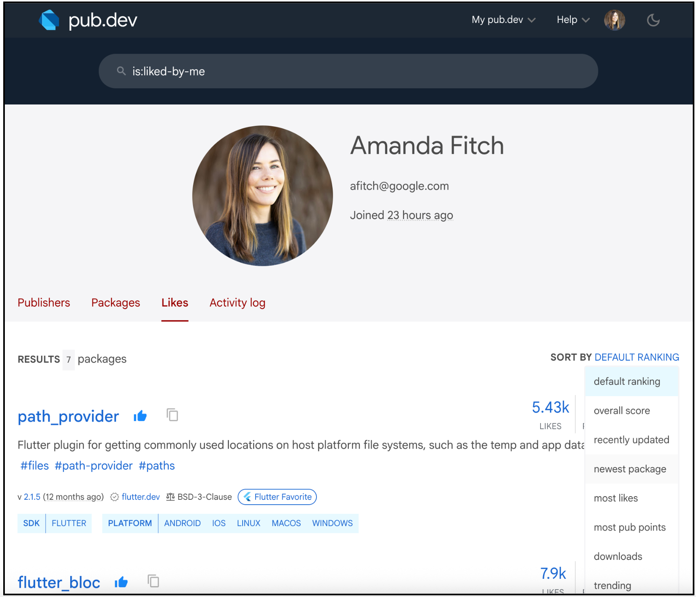
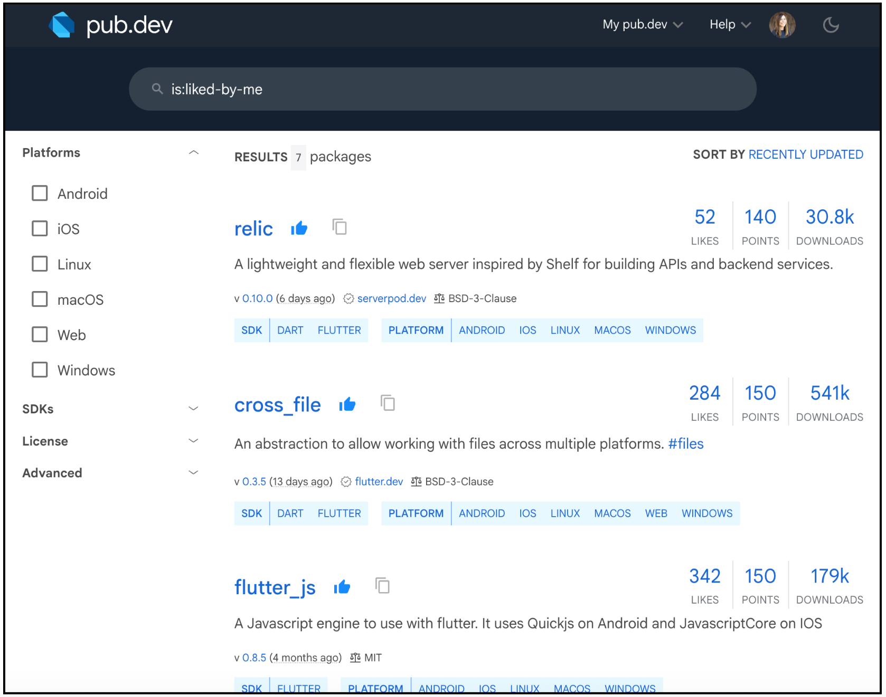

## Announcing Dart 3.10

Today, we’re excited to announce the release of Dart 3.10!

*Announcing Dart 3.10*

This release continues our focus on improving the core developer experience. The new **dot shorthands** (**`.`**) feature will help you write more readable and less verbose code. We’re also introducing a powerful new **analyzer plugin system** that allows you to create custom static analysis rules that integrate directly into your IDE. And we’re excited to announce that **build hooks** are now stable!

This release also brings several improvements to pub.dev and package management. You’ll find new search capabilities in the **“Likes” tab** in your profile, and package authors can now **disable manual publishing** for improved security. Finally, we’ve added a suite of new, more specific **deprecation annotations** to give you finer-grained control over your API’s evolution.

Read on to learn more about these and the other improvements in Dart 3.10.

## Language updates

### Dot shorthands 🆕

Dart 3.10 introduces [**dot shorthands**](https://dart.dev/language/dot-shorthands) (`.`). This new feature lets you omit redundant class or enum names when the compiler can infer the type from the context.

Let’s look at a common scenario: logging. Before, you might have written:

```dart
enum LogLevel { info, warning, error, debug }

void logMessage(String message, {LogLevel level = LogLevel.info}) {
  // ... implementation
}

// Somewhere else in your app
logMessage('Failed to connect to database', level: LogLevel.error);
```


Since the `level` parameter already expects a `LogLevel`, repeating the enum name is unnecessary. With dot shorthands, you can now write:

```dart
enum LogLevel { info, warning, error, debug }

void logMessage(String message, {LogLevel level = .info}) {
  // ... implementation
}

// Somewhere else in your app
logMessage('Failed to connect to database', level: .error);
```


The code now focuses on the *value* (`.error`) rather than the *type* (`LogLevel`).

Dot shorthands aren’t just for enums. You can also use them with constructors, static methods, and static fields. To learn more, read our [Dot shorthands](https://dart.dev/language/dot-shorthands) guide.

## Tools updates

### Analyzer plugins 🆕

Have you ever been reviewing code and thought, “Shouldn’t the analyzer be able to catch that?”. Now it can.

Dart 3.10 introduces a powerful new plugin system for the Dart analyzer. This allows you to write and use your own static analysis rules that integrate directly into IDEs and command-line tools like `dart analyze` and `flutter analyze`. You can use [analyzer plugins](https://dart.dev/tools/analyzer-plugins) to:

* Enforce project-specific rules, such as bespoke lints and warnings to maintain conventions in your team’s codebase.

* Avoid common pitfalls and best practices specific to your domain.

* Automate code changes by providing quick fixes and assists to help automatically correct issues or migrate to new APIs.

This new system is the result of a significant architectural effort to enable a rich ecosystem of community-driven tools, and we’d like to extend a special thanks to community contributor [Felipe Morschel](https://github.com/FMorschel) for his valuable fixes and features for the analyzer in general.

To use an analyzer plugin, simply add it to your [analysis_options.yaml](https://dart.dev/tools/analysis#the-analysis-options-file) file:

```yaml
analyzer:
  plugins:
    - some_plugin
    - another_plugin
```


To learn more about creating your own custom rules, see the documentation for [writing an analyzer plugin](https://dart.dev/tools/analyzer-plugins).

### Build hooks 🚀

Integrating native code (like C++, Rust, or Swift) into a Dart package has often required managing complex, platform-specific build files like CMake or Gradle. With Dart 3.10, this process is now dramatically simpler.

We’re excited to announce that **build hooks **(formerly known as native assets) are now stable. You can use these hooks to compile native code or download native assets (like dynamic libraries) and bundle them directly with your Dart package. This powerful capability lets you reuse existing native code or libraries from within your package and eliminates the need to write separate build files such as SPM, Gradle, or CMake for different operating systems.

To learn more, see the documentation for [writing a build hook](https://dart.dev/tools/hooks), or watch the [Flutter Build show episode](https://www.youtube.com/watch?v=AxNF5dj8HWQ) on build hooks.

### Remove Deprecations lint 🆕

When you release a new major version of a package (like 1.0.0 or 0.2.0), it’s a best practice to remove any APIs you previously marked as deprecated. This keeps your package clean and prevents developers from using outdated code. However, it’s easy to forget this step during the release process.

To help, we’ve introduced a new lint: [**`remove_deprecations_in_breaking_versions`**](https://dart.dev/tools/linter-rules/remove_deprecations_in_breaking_versions/). This lint detects leftover deprecated elements when a package’s version is updated to a new major breaking version. By flagging these cases, the lint helps ensure that your package’s API remains modern and easy for your users to understand.

***`remove_deprecations_in_breaking_versions lint example`***

### @Deprecated annotation ⬆️

The existing **@Deprecated** annotation is a blunt instrument. It informs developers that an API is no longer recommended, but it doesn’t allow for nuance. For example, how do you signal that a class should no longer be extended, but can still be instantiated?

To give package authors more precise control over their API’s evolution, Dart 3.10 introduces a suite of new, more specific deprecation annotations.

You can now deprecate specific use cases for classes and mixins:

* [@Deprecated.extend()](https://api.dart.dev/dev/latest/dart-core/Deprecated/Deprecated.extend.html): The ability to extend a class is deprecated.

* [@Deprecated.implement()](https://api.dart.dev/dev/latest/dart-core/Deprecated/Deprecated.implement.html): The ability to implement a class or mixin is deprecated.

* [@Deprecated.subclass()](https://api.dart.dev/dev/latest/dart-core/Deprecated/Deprecated.subclass.html): The ability to subclass (extend or implement) a class or mixin is deprecated.

* [@Deprecated.mixin()](https://api.dart.dev/dev/latest/dart-core/Deprecated/Deprecated.mixin.html): The ability to mix in a class is deprecated.

* [@Deprecated.instantiate()](https://api.dart.dev/dev/latest/dart-core/Deprecated/Deprecated.instantiate.html): The ability to instantiate a class is deprecated.

Additionally, you can now signal that an optional parameter will become required in a future version using [@Deprecated.optional()](https://api.dart.dev/dev/latest/dart-core/Deprecated/Deprecated.optional.html).

## Pub updates

### Search, sort, and unlike support for your favorite packages 🆕

Managing your favorite packages on pub.dev just got a major upgrade. You can do this through the Search feature or the [Likes tab](https://pub.dev/my-liked-packages) on your profile, where you can now search, sort, and filter your liked packages with the same familiar controls you use for regular searches. This includes sorting by likes, pub points, and popularity. We’ve also improved the UI for unliking packages, making it easier than ever to keep your list of liked packages tidy and up-to-date.

*Search, sort, and unlike support for your favorite packages in your Likes tab*

If you choose to search for your liked packages with the Search feature, simply add `is:liked-by-me` to your query.

*Search, but only include packages you like*

### Enable or disable manual publishing 🆕

To enhance security and prevent accidental publications, you can now disable manual publishing (pub publish) for your packages. This is ideal for packages that have an automated publishing workflow or are no longer being actively published.

By disabling manual publishing, you prevent package updates using personal credentials, reducing the risk of an unauthorized or accidental release.

You can control this feature in your package’s **Admin** tab using the “Enable manual publishing” checkbox.

*Enable or disable manual publishing in the Admin tab*

## Wrap up

The Dart 3.10 release brings a host of improvements focused on developer productivity, tooling, and the overall health of the package ecosystem. From language features like dot shorthands that make your code more concise, to powerful new tooling capabilities like analyzer plugins and stable build hooks, we hope this release empowers you to build even better apps.

We’re incredibly grateful for the many engineers and teams who contributed to this release, including a special thanks to our community contributors who help make Dart better for everyone.

We’re excited to see what you build with Dart 3.10. To get started, you can get the Dart 3.10 SDK today. For a complete list of all the new and updated features, check out the [Dart SDK changelog](https://github.com/dart-lang/sdk/blob/main/CHANGELOG.md).