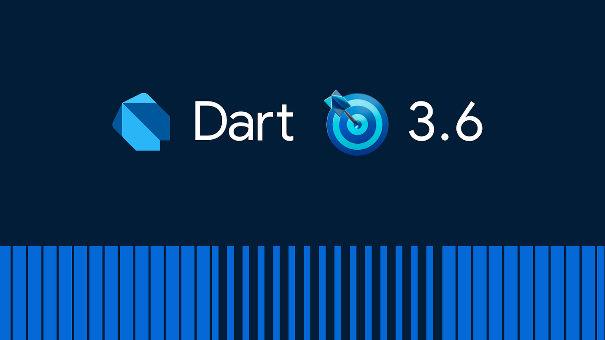

Welcome to Dart 3.6! Today is our last release of the year, alongside [Flutter 3.27](https://medium.com/flutter/whats-new-in-flutter-3-27-28341129570c). We’re excited to share a new feature in the language,* digit separators*. We also have several new features in the pub ecosystem: *pub download counts*, and the highly anticipated* pub workspaces*!

*Dart 3.6*

## Pub workspaces

Pub now supports shared resolution between packages in a monorepo, or workspace. A workspace is a tightly related group of packages developed, resolved, and released together.

The pub workspaces feature ensures that packages in a monorepo share a consistent set of dependencies. This forces you to resolve dependency conflicts between your grouped packages *as they arise,* rather than facing confusion when you start using the packages..

The Flutter analyzer processes all of the packages in a pub workspace in a single analysis context, as opposed to the previous behavior of a separate context for each package. For large repositories, this can significantly reduce the amount of memory the Dart language server consumes, improving IDE performance.

To define a pub workspace, add the workspace field in the root `pubspec.yaml` file and list the related packages, as shown in the following example:

```yaml
name: _
publish_to: none
environment:
  sdk: ^3.6.0
workspace:
  - packages/helper
  - packages/client_package
  - packages/server_package
```


Then run `pub get` anywhere in the repository to complete the mapping and remaining file management.

To use pub workspaces, all workspace packages (but not dependencies) must have an SDK version constraint of `^3.6.0` or greater.

For more information including fully detailed instructions and edge cases coverage, check out the [Pub workspaces (monorepo support)](https://dart.dev/go/pub-workspaces) page.

## Pub download counts

We listened to [your requests](https://github.com/dart-lang/pub-dev/issues/2714) for more precise metrics on pub.dev, and now download counts are here! The download count replaces the previous “popularity score” on individual package pages. Along with the new metric, you will also find a sparkline chart on each page, showing weekly downloads over time.

*A screenshot highlighting the new download count and sparkline graph on pub.dev*

You can learn more about download counts in the [pub.dev scoring documentation](https://pub.dev/help/scoring).

## Digit separators

The Dart language now allows underscores (_) as digit separators, which help make long number literals more readable. Multiple consecutive underscores indicate higher level grouping. Here are some examples of valid digit separator uses in Dart:

```
1__000_000__000_000__000_000
0x4000_0000_0000_0000
0.000_000_000_01
0x00_14_22_01_23_45
```


Remember, digit separators are valid only *between* digits, so literals like `100_`, `0._000_1`, or `1.2e_3` aren’t allowed. It’s also important to use digit separators consistently, so make sure digit groups are the same size between every level of groups.

To use digit separators, you’ll need to bump the minimum SDK in your package to `3.6.0` or greater.

## Closing

That’s all for today. For the full story of what the Dart team has been up to this quarter, check out the [Changelog for 3.6.0](https://github.com/dart-lang/sdk/blob/main/CHANGELOG.md#360). And don’t forget to visit the [Flutter 3.27 release blog](https://medium.com/flutter/whats-new-in-flutter-3-27-28341129570c) post for even more updates. See you next year!