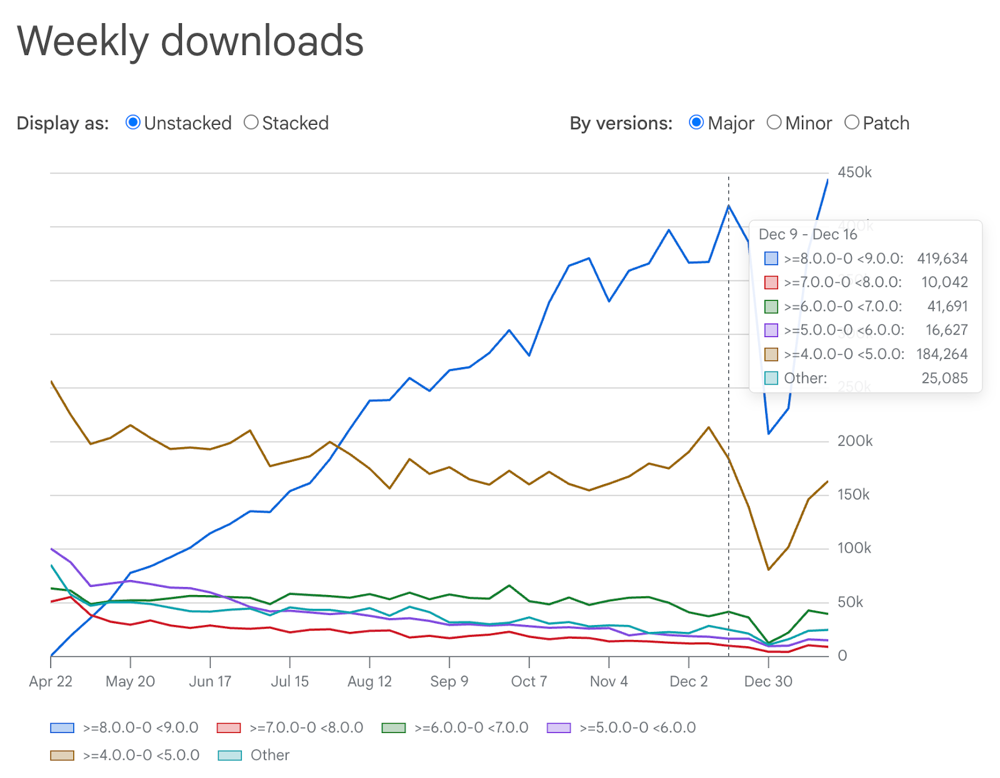
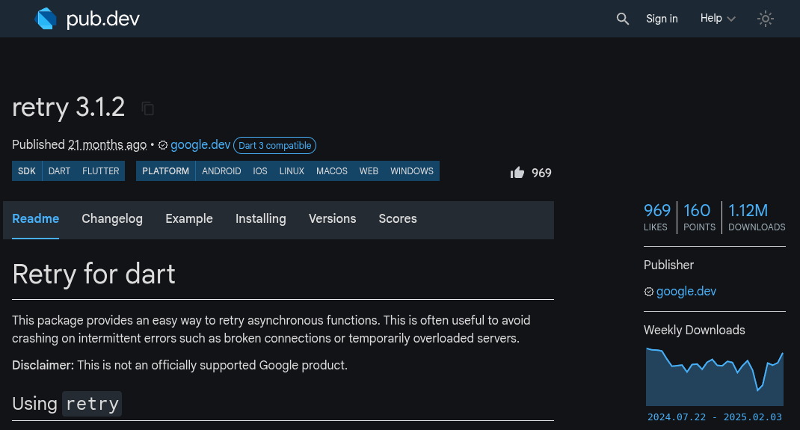
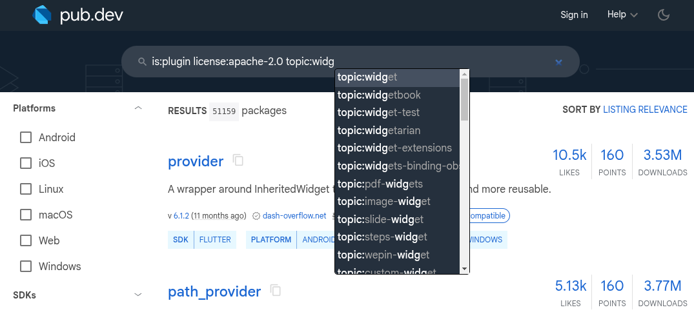

## Announcing Dart 3.7

It’s a new year, and time for a new Dart stable release. Welcome to Dart 3.7!

The theme for this release is *developer productivity*. We’ve made the Dart language more consistent by tweaking how it handles wildcard variables. There’s also a brand new style in the Dart formatter, new quick fixes and lints in the analyzer, and several cool new features on pub.dev. Let’s get into the details!

*Announcing Dart 3.7*

## Macros update

We recently posted updates in the [issue tracker](https://github.com/dart-lang/language/issues/1482#issuecomment-2622895490), as well as a [blog post](https://medium.com/dartlang/an-update-on-dart-macros-data-serialization-06d3037d4f12), stating that we’re stopping work on our experimental macros feature. We’d like to thank the community for being so understanding of this unfortunate outcome.

With this change, however, the team gains back some capacity to invest in other valuable developments. We’re already looking into [improvements to build_runner performance](https://github.com/dart-lang/build/issues/3800), we still expect to launch the [augmentations language feature](https://github.com/dart-lang/language/blob/main/working/augmentation-libraries/feature-specification.md) (perhaps in a slightly different form), and we hope to find new and more direct ways for supporting modeling data and handling [serialization and deserialization](https://github.com/dart-lang/language/issues/4232) (to and from JSON, for example).

## Wildcard variables language feature

Local variables and parameters named `_` are now what functional languages call “wildcards”. This means the name is a placeholder and declares no actual variable.

Currently in Dart, it’s common to use `_` as the name of a callback parameter if the body of the callback doesn’t actually need to use the argument, like so:

```dart
void announceCompletion(Future<void> future) {
  future.then((_) { // <--
    print('Complete!');
  });
}
```


But, if a callback has multiple parameters that you don’t need to use, you end up naming them `_`, `__`, `___`, etc., because otherwise the names collide. Now, in Dart 3.7, parameters and local variables named `_` don’t actually create a variable, so there is no possibility of name collision. You can use `_` for multiple parameters, as in:

```dart
void announceFailure(Future<void> future) {
  future.onError((_, _) { // <--
    print('Error!');
  });
}
```


If you have code that declares a parameter or variable named `_` *and uses it*, that code will no longer work in Dart 3.7. For example:

```dart
var [1, 2, 3].map((_) {
  return _.toString();
  //     ^ Error! Reference to unknown variable.
});
```


You’ll have to rename the parameter or local variable in this situation. This language change only applies to parameters and local variables (not top-level variables or members), so you can do this renaming without breaking your library’s public API.

Wildcard variables are a small feature that make the language more consistent. Variables named `_` in [patterns](https://dart.dev/language/patterns) have always behaved this way:

```dart
var [_, _, third, _, _] = [1, 2, 3, 4, 5];
print(third); // Prints "3".
```


Now parameters and local variables behave the same way.

## New formatting style in the Dart formatter

Dart 3.7 includes a re-written Dart formatter (`dart format`) with a [new formatting style](https://github.com/dart-lang/dart_style/issues/1253). The new style looks similar to the style you get when you add trailing commas to argument lists, except now the formatter will add and remove those commas for you. For example:

```dart
// Old style:
void writeArgumentList(
    Token leftBracket, List<AstNode> elements, Token rightBracket) {
  writeList(
      leftBracket: leftBracket,
      elements,
      rightBracket: rightBracket,
      allowBlockArgument: true);
}

// New style:
void writeArgumentList(
  Token leftBracket,
  List<AstNode> elements,
  Token rightBracket,
) {
  writeList(
    leftBracket: leftBracket,
    elements,
    rightBracket: rightBracket,
    allowBlockArgument: true,
  );
}
```


This is a large change both to the tool, the output it produces, and how it behaves. To make the transition as smooth as possible, the formatting style you get depends on the [language version](https://dart.dev/guides/language/evolution) of the code you’re formatting. If the language version is 3.6 or earlier, the code is formatted with the old style. If it’s 3.7 or later, it gets the new style.

When you upgrade your package to use Dart 3.7 by bumping the SDK constraint in your package’s pubspec (and running `dart pub get`!), you are opting in to the new formatting style.

To determine the language version of each file it formats, `dart format` looks for a `package_config.json`. This means that **you need to run `dart pub get` before formatting code in your package**. If you have format checks in your continuous integration server, make sure it runs `dart pub get`, too.

We don’t intend to support both styles indefinitely. At some point in the future, when most of the ecosystem is on 3.7 or later, support for the old style will be removed.

The new style includes some long-requested features:

* **Project-wide page width configuration.** You can now configure your preferred formatting page width on a project-wide basis in your `analysis_options.yaml` file, like so:

```yaml
    formatter:
      page_width: 123
```


* **Opting out a region of code from formatting.** You can use a pair of special marker comments to opt a region of code out of automated formatting:

```dart
    main() {
      // dart format off
      no   +   formatting     +     here;
      // dart format on
    }
```


There is one **breaking change** as well. The formatter no longer supports `dart format --fix`. Instead, use `dart fix` to apply all the fixes that `dart format` could, and more.

You can find more details in the [CHANGELOG](https://github.com/dart-lang/dart_style/blob/cea5a1a3e974c5065e6f4cc19b2838cd62448f0a/CHANGELOG.md#300) and [FAQ](https://github.com/dart-lang/dart_style/wiki/FAQ).

## Updated quick fixes and new lints in the Dart analyzer

We’re always actively improving Dart to boost developer productivity, and that means improving the analyzer with new lints, quick fixes, and assists in Dart 3.7. One notable addition is the `unnecessary_underscores` lint, which supports the new wildcard variable feature.

Among the wide range of new quick fixes and assists Dart 3.7 includes are fixes for common issues like missing `await` keywords, incorrect import prefixes, and violations of lint rules like `cascade_invocations`. There are also handy assists for refactoring code, such as converting `else` blocks to `else if` and wrapping Flutter widgets with `Expanded` or `Flexible`.

You can find more details about all of these, and much more, in the full list of [analyzer changes](https://github.com/dart-lang/sdk/blob/master/CHANGELOG.md#analyzer-1).

## Moving forward on the Dart web platform

A year ago, we introduced [new libraries and packages](https://medium.com/dartlang/dart-3-3-325bf2bf6c13) for interoperating with JavaScript and browser APIs from Dart. Going forward, the primary JavaScript library is [`dart:js_interop`](https://api.dart.dev/dart-js_interop/dart-js_interop-library.html). For browser APIs, use [`package:web`](https://pub.dev/packages/web).

As part of our continued effort to move the Dart and Flutter ecosystems to WebAssembly-compatible APIs, we are deprecating the associated legacy APIs in the Dart SDK. Seven Dart SDK libraries are deprecated in the Dart 3.7 release:

* `dart:html`

* `dart:indexed_db`

* `dart:js`

* `dart:js_util`

* `dart:web_audio`

* `dart:web_gl`

We plan to remove these libraries at the end of 2025. You can learn about their replacements on the [JavaScript interoperability page](https://dart.dev/interop/js-interop).

## New productivity features on the pub.dev package site

In December we launched [download counts for packages](https://medium.com/dartlang/announcing-dart-3-6-778dd7a80983) on pub.dev. These show monthly downloads along with a small chart showing weekly downloads over time.

Today, we are extending that with support for viewing download counts per package version. It’s now possible to get an indication of how many consumers of a package have upgraded to the latest version (or just the latest major version). These insights are meant to help package authors gauge the value of back-porting fixes to older major versions of a package.

*Weekly downloads chart*

*Weekly downloads chart*

**Dark mode for pub.dev**

Dark mode for pub.dev has long been a [popular request](https://github.com/dart-lang/pub-dev/issues/4416), and as of today it’s now possible to toggle pub.dev to dark mode. This toggle affects both package pages and package API documentation hosted on pub.dev.

*Dark mode for pub.dev*

**Topics for pub.dev**

Last year, we launched support for [topics](https://pub.dev/topics) on pub.dev. You can [add topics](https://dart.dev/tools/pub/pubspec#topics) to your `pubspec.yaml`, and if you see related topics that should be merged you can propose [canonicalization](https://github.com/dart-lang/pub-dev/blob/master/doc/topics.yaml) with a pull request.

Users browsing pub.dev can click on topics to browse related packages. We previously introduced the ability to search for topics on pub.dev, using [search keywords](https://pub.dev/help/search) (like “topic:widget”), but finding these keywords has not always been easy. So, we’ve launched an IDE-like auto-completer for search keywords on pub.dev. You can trigger it by pressing ctrl+space, or automatically trigger it when you type a matching prefix like “topic:” or “license:”.

*Topics search keywords*

## Wrap up

That’s all we have today for Dart 3.7. As always, please let us know what you think! And don’t forget to check out the blog post for today’s [Flutter 3.29 release](https://medium.com/flutter/f90c380c2317) as well. See you next time!