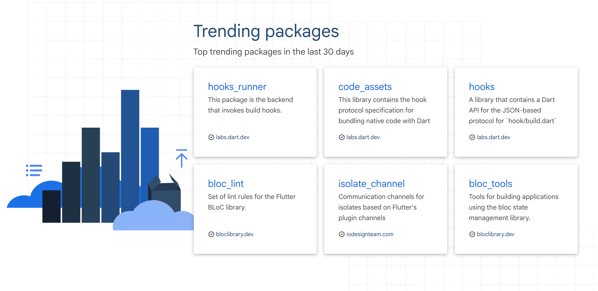
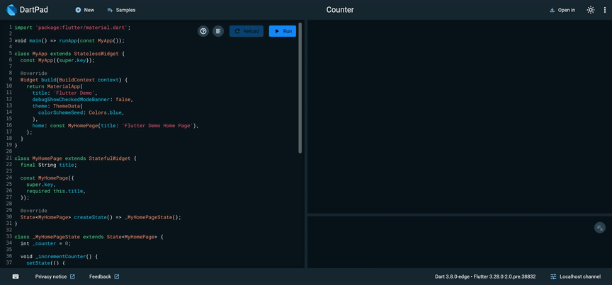

This release brings formatter updates, null-aware elements for collections, new cross-platform development capabilities, a better way to find trending packages on pub.dev, availability of hot reload on the web, and more! We’re also hoping there are a few developers out there who are interested in joining our FFigen and JNIgen early access program.

*Announcing Dart 3.8*

## Formatter updates

In the previous release, Dart included a largely rewritten formatter that supported a new [“tall” style](https://github.com/dart-lang/dart_style/issues/1253). The Dart 3.8 release incorporates additional feedback, fixes bug reports, and adds other improvements.

Note that if you upgrade to the Dart 3.8 SDK, your formatting won’t change until you change your package’s pubspec to opt in to the latest language version.

### **Trailing commas and taller code**

In prior releases, a trailing comma would force the surrounding construct to split. The new formatter now decides whether a construct should split and then adds or removes the trailing comma as needed.

```dart
// Before formatter
TabBar(tabs: [Tab(text: 'A'), Tab(text: 'B')], labelColor: Colors.white70);

// After formatter
TabBar(
  tabs: [
    Tab(text: 'A'),
    Tab(text: 'B'),
  ],
  labelColor: Colors.white70,
);
```


If you prefer the old behavior, you can re-enable it with a [configuration](https://github.com/dart-lang/dart_style/wiki/Configuration) flag.

### **Style changes**

A number of style changes were added that tighten up and improve output. Here are some examples:

```dart
// Previously released formatter (functions)
function(
  name:
      (param) => another(
        argument1,
        argument2,
      ),
);

// Dart 3.8 formatter (functions)
function(
  name: (param) => another(
    argument1,
    argument2,
  ),
);

// Previously released formatter (variables)
variable =
    target.property
        .method()
        .another();

// Dart 3.8 formatter (variables)
variable = target.property
    .method()
    .another();
```


## Cross compilation

There is new support to [compile](https://dart.dev/tools/dart-compile#cross-compilation-exe) to native Linux binaries from Windows, macOS, and Linux development machines. You can do this with the `dart compile exe` or `dart compile aot-snapshot` command and the `--target-os` and `--target-arch` flags.

```shell
// cross compilation example for an exe
$ dart compile exe --target-os=linux --target-arch=arm64

// cross compilation example for an aot-snapshot
$ dart compile aot-snapshot --target-os=linux --target-arch=arm64
```


Sample use cases:

* Quicker compiles for embedded devices (for example, a Raspberry Pi) on a fast developer laptop, as opposed to the less powerful embedded device.

* Quicker compiles for a Linux-based backend on a non-Linux developer machine.

## **Null-aware elements**

New [null-aware elements](https://dart.dev/language/collections#null-aware-element) let you add elements to a collection such as a list, set, or map, if the elements are not null. To make an element a null-aware element in a collection literal, prepend the element with `?`.

A list without null-aware elements that removes null values:

```dart
// Code without null-aware elements
var listWithoutNullAwareElements = [
  if (promotableNullableValue != null)
    promotableNullableValue,
  if (nullable.value != null)
    nullable.value!,
  if (nullable.value case var value?)
    value,
];
```


A list with null-aware elements that removes null values:

```dart
// Code with null-aware elements
var listWithNullAwareElements = [
  ?promotableNullableValue,
  ?nullable.value,
  ?nullable.value,
];
```


## Doc imports

There is now support for doc imports, a new comment-based syntax which enables external elements to be referenced in documentation comments without actually importing them. This tag can be specified in a doc comment above a `library` directive.

In the following example, `[Future]` and `[Future.value]` are imported from the `dart:async` library, but only for documentation comments:

```dart
/// @docImport 'dart:async';
library;

/// Doc comments can now reference elements like
/// [Future] and [Future.value] from `dart:async`,
/// even if the library is not imported with an
/// actual import.
class Foo {}
```


Doc imports support the same URI styles as regular Dart imports, including the `dart:` scheme, `package:` scheme and relative paths. However, they can’t be deferred or configured with `as`, `show`, `hide`.

## Trending packages on pub.dev

The [pub.dev landing page](https://pub.dev/) replaces the “Most Popular Packages” section with the “Trending Packages” section. This new section showcases packages that have recently demonstrated notable growth in adoption and community interest.

*Trending packages section on pub.dev*

## Hot reload on the web (experimental)

Stateful hot reload is now available on the web when you use the Dart Development Compiler (DDC). A redesign of the JS representation of Dart code lets you swap out code in a running application.

Work is still iterating on this feature, but Dart 3.8 provides the first opportunity to try it, starting with Flutter apps. See the [Flutter blog post](https://medium.com/flutter/whats-new-in-flutter-3-32-40c1086bab6e) for instructions on how to enable hot reload.

*Dart stateful hot reload for web*

This was a multiyear effort that included changing the runtime type representation, redesigning class hierarchies, and updating the way code loads into the page. The goal is to reach full parity with the VM’s existing hot reload implementation. In almost all cases, the feature should already be indistinguishable from what you are used to from the VM. You can find all known issues in the [issue tracker](https://github.com/orgs/dart-lang/projects/107/views/1?filterQuery=-status%3ADone).

The focus makes this feature accessible in Flutter apps first, but the plan is to integrate hot reload into `build_web_compilers` for use within non-Flutter web apps later.

## Direct native interoperability

We’re excited to launch an early access program for FFigen and JNIgen, the codegen solutions designed to simplify native platform API integration. We are seeking Flutter plugin authors who want to develop or refactor plugins with these solutions.

To learn more, read the blog post titled [Flutter’s Path Towards Seamless Interop](https://medium.com/@mariam.hasnany/4bf7d4579d9a). It covers our aspirations for direct native interoperability, the roadmap to achieve them, and the early access program.

## Wrap up

Dart 3.8 is a testament to our ongoing commitment to refine the development experience. We encourage you to explore these new features — from the intelligent formatter and cross-compilation support to null-aware elements, web hot reload, and the early access for native interop. Your insights and contributions are vital to Dart and Flutter’s continuous growth, and we can’t wait to see the apps you’ll bring to life.

Upgrade to Dart 3.8 today and happy coding!