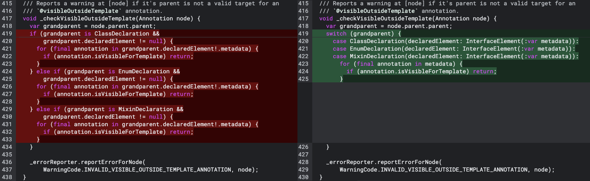
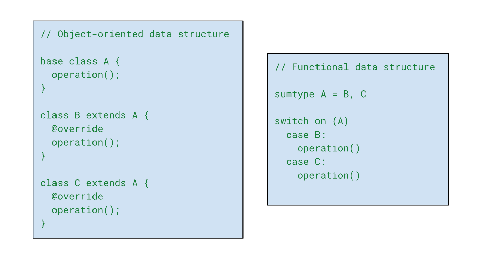
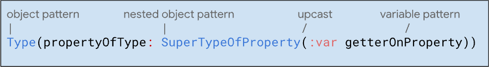

### Pattern matching and exhaustive switches come together to enable functional style data models that blend seamlessly with Dart’s object-oriented core.

*Diff of a Dart 3 refactor using functional style features within Dart’s internal code base*

*Today we’re releasing Dart 3.1, our first stable release since the major [Dart 3.0](https://medium.com/dartlang/announcing-dart-3-53f065a10635) release in May. Dart 3.1 contains a handful of minor updates and a few API adjustments to further use class modifiers introduced in 3.0 (which you can read more about in the [changelog](https://github.com/dart-lang/sdk/blob/main/CHANGELOG.md#310)). Mostly, though, we’ve been spending our time on new roadmap items that we hope to see reach beta and stable over the coming releases. Stay tuned for more about that in the future!*

*So, in place of a traditional release post, we’re revisiting a subset of Dart 3’s major features to talk about how they can completely change, and in some cases, greatly improve the way you write and structure your Dart code.*

## How do you model data?

Object-oriented (OO) and functional languages differ in many ways, but it’s arguable that *how each paradigm models data* is the defining characteristic that separates them. Specifically, the question of modeling different variations of related data and the operations on those variants.

But *“how should I model this data?”* is usually not something we consciously give much thought to when starting a new project. We tend to default to whatever data modeling paradigm is common to the type of language we’re using, as opposed to the inverse of choosing the language based on the model that makes the most sense for our data.

If you’re using an OO language, you’ll model data with class hierarchies and operations on subtypes. If you’re using certain functional languages, the equivalent to the class hierarchy model is the [algebraic data type](https://en.wikipedia.org/wiki/Algebraic_data_type) model, whose equivalent to operating on subtypes is switching over them with [pattern matching](https://en.wikipedia.org/wiki/Pattern_matching).

*Simplified side-by-side comparison of the object-oriented class hierarchy model and the functional algebraic data type model*

Dart is an object-oriented language, but has been steadily incorporating functional features over time, allowing for a more multi-paradigm approach to data modeling. Most recently, Dart 3 added [pattern matching](https://dart.dev/language/patterns), new functionality on [switch](https://dart.dev/language/patterns#switch-statements-and-expressions), and [sealed types](https://dart.dev/language/class-modifiers#sealed). These features make it possible to implement algebraic data types in Dart, allowing you to write functional style code while continuing to maximize the capabilities of Dart’s object-oriented core.

Multi-paradigm languages like Dart give you the tools and the opportunity to choose how you design anything from a single line expression, to entire class hierarchies. You can consider which model makes the most sense for your project, or even just for your personal preference. To help you make the best decision, this article summarizes the structure and strengths of each paradigm separately, and then teaches you how to use new features in Dart 3 to refactor some classic object-oriented designs that most benefit from being written in a functional style.

### Object-oriented approach

When you have operations specific to different data types, the standard organization approach in OO languages is to create a method on a base class, and a set of subclasses that override the base class to define their unique behavior. Each subclass has its data and operations together in one place inside its declaration.

Take this (high-level pseudocode) example of modeling recipes. It makes sense to have recipe objects, coupling ingredients and steps together with the recipe. The recipe base class would probably have some functions for the cooking methods that each recipe overrides with their unique requirements:


Class hierarchies with instance methods make it easy to add new subclasses without having to touch any existing code. This works perfectly for some domains, like Flutter, where you have countless widgets that all extend the `Widget` class. Each widget can uniquely extend and override any necessary behavior directly inside their definition. You *definitely* don’t need to know how every widget subtype defines its methods to add specialized behavior to your own widgets.

### Functional approach (algebraic data types)

You can think of functional style architecture as the inverse of OO architecture. Instead of having all the code for *one type in one place* (OO instance methods in subclass declarations), you have all the code for *one operation in one place* (functional switching over types to define behavior).

Which begs the question, when *does* it make sense to know how every subtype in a hierarchy defines an operation? It could be for a few reasons:

* When adding, maintaining, and understanding variants of the same operation’s behavior across types is easier to do when they’re all side by side in the code.

* When you can’t modify the subclasses yourself, but you want to define new behavior that is specific to each of them.

* When the variations of an operation’s behavior for different types are more related to each other than they are to the types that they’re operating on*.*

Sometimes it’s obvious, but mostly it’s just a perspective shift. Think about the recipe example again. From the point of view of, say, an oven manual, it would make a lot more sense to group bake instructions together in one place for each recipe:


In this example, the program structure is focused on the `bake` operation. Whatever types `bake` operates on are simply different possible outputs of the same function; `bake` is independent of the types it operates on.

This is the **algebraic data type model **(named “algebraic” after mathematical set theory). It’s the core organizational model of functional languages, in the same way class hierarchies are core to OO languages. Algebraic data types separate behavior from data by grouping behavior for all types together by operation.

And now, it’s possible to cohesively implement algebraic data types with Dart 3!

## Modeling object oriented algebraic data types

Functional languages generally implement [algebraic data types](https://en.wikipedia.org/wiki/Algebraic_data_type) by pattern matching over the cases in a [sum type](https://en.wikipedia.org/wiki/Tagged_union) to assign behavior to each variant. Dart 3 achieves the same with [pattern matching](https://dart.dev/language/patterns#switch-statements-and-expressions) in switch cases, and takes advantage of the fact that OO subtyping already naturally models sum types. This allows us to implement truly [multi-paradigm algebraic data types](https://dart.dev/language/patterns#algebraic-data-types) using objects that blend into Dart seamlessly.

The following sections show you how to design algebraic data type models in Dart, alongside pre-Dart 3 examples of the same functionality.

* First, we’ll explain how to group type-based variants of an operation together by switching over [object patterns](https://dart.dev/language/pattern-types#object).

* Then, we’ll take a step back and look at how to architect the subclasses themselves with the new [sealed](https://dart.dev/language/class-modifiers#sealed) class modifier, to ensure the switch defines behavior for [all possible subtypes the object might take](https://dart.dev/language/branches#exhaustiveness-checking).

### Grouping behaviors across types

Individual parts of the Dart language (like statements, classes, and literals) each have their own definitions in class hierarchies, but are all subject to operations from multiple systems (such as parser, formatter, and compiler operations). Imagine how confusing the language implementation would be if every function that applied to every language element had to be defined inside those elements’ declarations! It would look something like this:


Dart’s internal code already naturally leans towards the functional approach of separating functions from type definitions for this reason. Take the [`annotation_verifier`](https://github.com/dart-lang/sdk/blob/main/pkg/analyzer/lib/src/error/annotation_verifier.dart) library in Dart’s analyzer. It contains functions that define behavior for annotations (like `@override` or `@deprecated`) depending on the part of code the annotation is attached to (like how `@override` affects a class as opposed to a field).

But assigning behavior per type is not as straightforward as making the decision to separate the behavior out in the first place. The standard way to define behaviors by type uses chained `if-else` statements, which you see a lot in the annotation verifier. Take the following verification function written without using any Dart 3 features. It verifies the behavior of the [recently contributed](https://github.com/dart-lang/sdk/commit/4079a47cc4fb8f88e2dd9b7faff3bd587931a379) `@visibleOutsideTemplate` annotation that opts out of the cascading effects of another annotation, `@visibleForTemplate`:


The function uses elaborate chained `if-else` statements, testing whether the grandparent of the annotation is a certain kind of declaration (either `ClassDeclaration`, `EnumDeclaration`, or `MixinDeclaration`), and then defining its behavior based on the type.

With Dart 3, you can use object patterns in switch cases to significantly refactor this structure to a more declarative style, making it shorter and easier to read. And the original author [did just that](https://github.com/dart-lang/sdk/blob/4079a47cc4fb8f88e2dd9b7faff3bd587931a379/pkg/analyzer/lib/src/error/annotation_verifier.dart#L417-L426)! 16 lines of chained `if-else` statements are pared down to a 7-line switch statement:


Each case here is an [object pattern](https://dart.dev/language/pattern-types#object) that matches against the static type of `grandparent`. Instead of saying `if (object is Type && object.property != null)`, each case checks if the object’s pattern matches the pattern `Type(propertyOfType)`. Plus, when an object matches an object pattern, it implicitly requires that it’s not `null`, so there’s no need for an explicit null check!

Object patterns can also contain nested [variable patterns](https://dart.dev/language/pattern-types#variable) that allow you to extract (or [*destructure*](https://dart.dev/language/patterns#destructuring)) property values from an object in the same line of code you’re matching against. The syntax `(:var metadata)` just means “match and declare a new variable with the same name as this getter”. This is how the variable `metadata` comes into scope for the final for loop. Pretty concise!

Notice that the `for` loop is now common between each case. Each type’s `declaredElement` property is actually a different subtype of another type, `InterfaceElement` (either a `classElement`, `enumElement`, or `mixinElement`). So, the pre-Dart 3 chained `if-else` statement iterated over `metadata` in each `if` clause separately, to ensure `final annotation` would be type safe for each of the possible types that `metadata` could take.

Now, the refactored structure uses deeply nested object patterns for each case, to upcast `metadata` to its supertype, `InterfaceElement`. This makes a single shared `for` loop iterating over `metadata` type safe across the cases.

*Annotated depiction of the syntax for a deeply nested object and variable patterns*

Switching over object patterns matters to Dart’s algebraic data type implementation because of its ability to concisely test subtypes and destructure values. A nice side effect is the simultaneous assurances that can be provided by a single line of code. To reiterate, each case pattern in this refactor is simultaneously verifying:

* The object is one of the types `ClassDeclaration`, `EnumDeclaration`, or `MixinDeclaration`.

* The object has the property `declaredElement`.

* `declaredElement` has the property `metadata`.

* `metadata` is of type `InterfaceElement`.

* None of the objects or properties in question are `null`.

This is the perfect example of how thoroughly Dart 3 implements patterns to account for so many nuances of OO languages, and really make object-oriented algebraic data types a realistic design option in Dart.

Type tests over object patterns are great for separating behavior from types. But its missing one feature of OO subtyping, where the compiler lets you know if you declare a new subtype but don’t define behavior for one of its supertype’s abstract methods. How can Dart’s algebraic data type model implement the same safety assurances when we’re no longer dealing with instance methods on type declarations? The answer is *exhaustiveness checking*.

### Exhaustiveness checking

Functional languages’ implementations of algebraic data types use enumerable sum types, which means the compiler is always aware of all the possible variations of the type being switched over. The compiler can then let you know if your switch is missing a case, and therefore that it’s possible some values might fall through that switch without being addressed.

This is called [exhaustiveness checking](https://dart.dev/language/branches#exhaustiveness-checking). It has technically always existed in Dart for enumerable types like enums and booleans. Those types have a set of possible values that cannot change, and if you’re switching over them, the compiler knows when you’ve missed one and warns you. Using a `default` clause is another kind of pseudo exhaustiveness. Since `default` matches all cases not explicitly accounted for, it causes the compiler to consider a switch exhaustive without knowing if all potential types are actually accounted for.

As mentioned, we wanted to use subtypes instead of sum types for Dart’s version of algebraic data type modeling. But since classes in Dart can be extended from any library, it would be impossible for the compiler to exhaustively enumerate subtypes of a class since it can’t know if any subclasses are declared in external libraries.

To get around this and complete Dart’s algebraic data type implementation, we added the [`sealed` class modifier](https://dart.dev/language/class-modifiers#sealed) to Dart 3. A `sealed` class cannot be extended or implemented from any library but its own ([the file that contains its definition](https://dart.dev/language/libraries)). This ensures the compiler is always aware of any and all possible subtypes, making them fully enumerable.

Here’s an example of an actual refactor that went into the Dart SDK as part of the 3.1 release: [sealing `FileSystemEvent`](https://github.com/dart-lang/sdk/commit/c3e815bc7ad488eddf00344ab4106485a9d1ba32#diff-e98c6de423bf7e0b5b961cd10efed50330004229243aa87c18ad6314fef054b0L879-R879) so its subtypes can be exhaustively switched over. Brace yourself, refactors are hard…


Just kidding, that wasn’t hard at all! It should be noted, though, that sealing an existing class hierarchy is a breaking change. Code targeting older versions of Dart won’t be able to implement or extend the class, so always check dependencies and alert any users that might be subtyping your classes elsewhere.

Sealing `FileSystemEvent` allows the events produced by `FileSystemEntity.watch`, which correspond to the subtypes of `FileSystemEvent`, to be exhaustively switched over. It’s typical to listen to this stream of events and use [chained `if-else`](https://github.com/dart-lang/sdk/issues/52273) statements to determine an action based on the type of the events that occur.

But sealing the base class doesn’t only allow you to switch over object patterns, like the `_checkVisibleOutsideTemplate` example in the previous section. It also ensures that while doing so, you’re accounting for every possible value that could arise for that type, without the need for a `default` case:


If a new subtype was ever added that extends `FileSystemEvent`, perhaps `FileSystemSyncEvent` for example, the compiler would be aware of it because it could only be added to the [same library](https://github.com/dart-lang/sdk/blob/main/sdk/lib/io/file_system_entity.dart) as `FileSystemEvent`. Since the class hierarchy is sealed, the compiler requires any switch over its instances to be exhaustive, and will generate [an error](https://dart.dev/tools/diagnostic-messages#non_exhaustive_switch_expression) to alert the user (who wrote the switch, not the library owner) of unhandled cases:

```bash
The type 'FileSystemEvent' is not exhaustively matched by the switch cases since it doesn't match 'FileSystemSyncEvent'
```


Combining sealed classes and switches over object patterns enables a complete, object-oriented algebraic data type style of program architecture in Dart.

### Bonus functional features

The exhaustive switch example above includes even more functional features from Dart 3 than just the ones that facilitate algebraic data types.

Notice that the switch is to the right of the `_fileListener` function’s return statement—that’s Dart 3’s new [switch expression](https://dart.dev/language/branches#switch-expressions). General emphasis on expressions and functions is a key element of functional languages. Dart 3 made switch expressions that can produce a value and go anywhere an expression is allowed.

And what is `_fileListener` returning in the previous example, anyway? That’s a [record](https://dart.dev/language/records), another new Dart 3 feature also related to functional programming. Records let you return multiple heterogeneous values from a function, extending the usefulness of functions in Dart, and moving further away from reliance on custom classes (which would be the only other way to return multiple values of different types without losing their types in the process).

## Summary

You can model algebraic data types in Dart by:

* Writing a function that switches *on* an instance of a sealed class, and *over* its subtypes,

* And defining variances in the behavior of each subtype in the switch cases.

Switching over object patterns allows you to keep all the operations together in a succinct way, and exhaustiveness checking ensures the compiler will alert you if you’re missing behavior definitions for any types. And it’s all built on top of the object-oriented classes Dart already uses.

The best part is, you don’t have to pick either an object-oriented or functional style; the two paradigms blend together and you can use whichever style best fits the operation you’re defining.

You can make existing class hierarchies more functional with minor modifications, and even mix the use of instance methods with algebraic data types within the same class hierarchy. Whether it makes sense to couple behavior closely to a type, or group behavior for different types in one function, you can use the style that makes the most sense.

We hope this introduction piques your interest in functional programming and trying out the new Dart 3 features. Who knows, maybe we’ll see the first fully-functional-style Dart program from one of you soon!

### Resources

*To learn more about functional programming in and around Dart, check out these resources:*

* The official Dart documentation on [patterns](https://dart.dev/language/patterns) and [exhaustiveness checking](https://dart.dev/language/branches#exhaustiveness-checking).

* The [patterns and records codelab](https://codelabs.developers.google.com/codelabs/dart-patterns-records#0) about refactoring Flutter code with Dart 3.

* This [community talk](https://www.droidcon.com/2023/08/07/the-joy-of-functional-programming-in-dart/) from FlutterCon about functional programming in Dart.

* This [blog post](https://journal.stuffwithstuff.com/2023/08/04/representing-heterogeneous-data/) about modeling heterogeneous data from the personal blog of Bob Nystrom (who wrote [the design for patterns in Dart](https://github.com/dart-lang/language/blob/main/accepted/3.0/patterns/feature-specification.md)!).