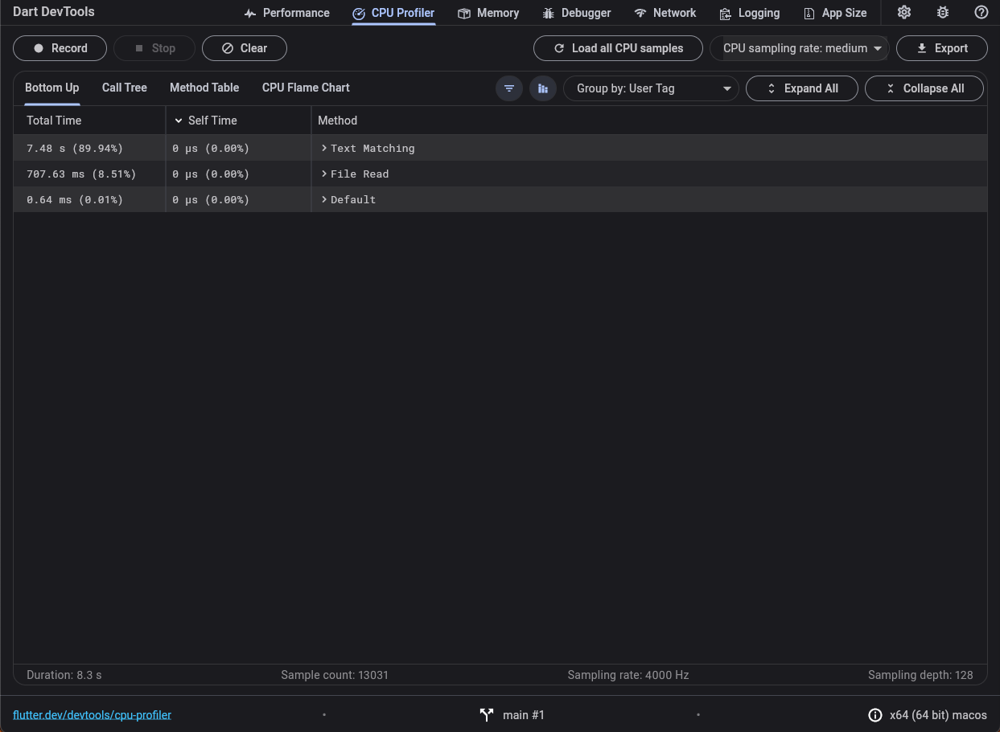
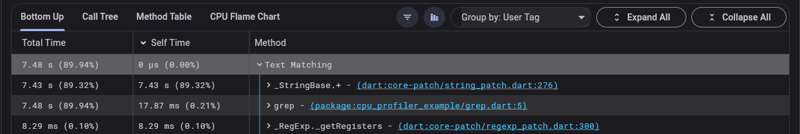
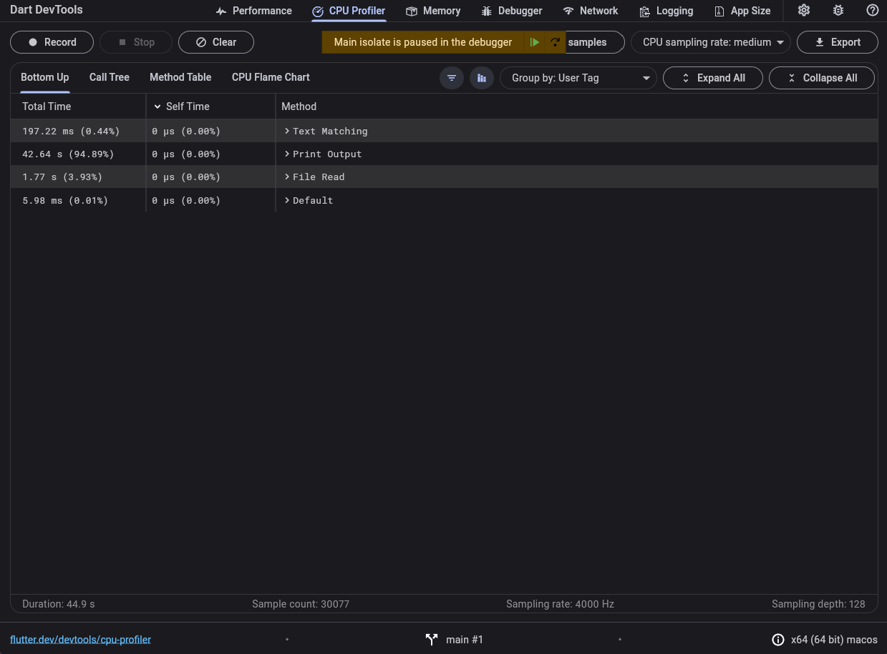

Tracking down performance issues in a code base can be a daunting task. There are multiple ways to write Flutter code such that it runs slower than it should. Some are glaringly obvious and others nefariously subtle. For example, perhaps you used the wrong API or data structure for a particular situation.

This article works through a simple case study examining the performance of a slow Dart command-line interface (CLI) application. You’ll learn about:

* General CPU profilers and their importance.

* The sampling CPU profiler that ships with Dart and Flutter.

With this new understanding of CPU profiling, we’ll debug the performance of our program. We’ll do so using the Dart DevTools CPU Profiler and `dart:developer`’s `UserTag` functionality to pinpoint the inefficient code. We’ve got lots to cover, so let’s get started!

*Note: Dart DevTools is also referred to as Flutter DevTools, but shouldn’t be confused with Chrome DevTools.*

## Case Study: Implementing grep in Dart

Consider the following simple Dart CLI application:

```dart

// filename: grep.dart
import 'dart:io';

/// Finds and prints all instances of [pattern] in the [file].
void grep(File file, String pattern) {
  // Open the file and read its contents.
  final lines = file.readAsLinesSync();

  String output = '';
  int lineNum = 1;
  // Check each line to see if it matches `pattern`.
  for (final line in lines) {
    final matcher = RegExp(pattern);
    if (matcher.hasMatch(line)) {
      final foundMessage = '$lineNum:$line';
      output += foundMessage;
    }
    lineNum++;
  }
  stdout.writeln(output);
}

void main(List<String> arguments) { 
  if (arguments.length != 2) {
    print('Usage: dart grep.dart <path> <pattern>');
    exitCode = 64;
    return;
  }
  final path = arguments[0];
  final pattern = arguments[1];

  final file = File(path);
  if (!file.existsSync()) {
    stderr.writeln("Error: unable to open file '$path'");
    exitCode = 64;
    return;
  }

  grep(file, pattern);
}
```


The `grep.dart` program implements a version of the common Unix tool. It allows users to search files for the occurrence of a string of characters that matches a specified pattern. For example, given a file `names.txt` containing:

```shell
$ cat names.txt
Frank
Bob
Franny
June
Ben
Francis
```


Let’s find all lines containing the string `'Fran'`:

```shell
$ dart grep.dart names.txt 'Fran'
1:Frank
3:Franny
6:Francis
```


Excellent! We should expect this output from `grep`. That said, `names.txt` is a *small* file. Let’s try and find all the instances of `'Hummingbird'` in a larger text document. What if we ran the same program on a 437,000 line, 147 MiB file about hummingbirds?

```shell
$ dart grep.dart hummingbird_encyclopedia.txt 'Hummingbird'
```


Huh… it doesn’t complete, even after **two minutes**. How does Unix `grep` perform?

```shell
$ grep -n 'Hummingbird' hummingbird_encyclopedia.txt
16:'''Hummingbirds''' are [[bird]]s native to the…
22:Hummingbirds have the highest…
24:Hummingbirds split from their [[Sister taxon|sister group]]…
// Output continues
```


Unix’s `grep` searched the entire file and returned all lines containing `Hummingbird` in about 45 seconds. Clearly there’s something strange in our code that we should investigate. But how can we identify the cause of our performance issues? The **CPU Profiler** shipped with Dart DevTools is a great place to start!

## What is a CPU profiler?

CPU profiling tools track where a program spends its time when executing. To provide the most computationally efficient CPU profiling experience, the Dart virtual machine (VM), powering Dart CLI and Flutter applications, uses a **sampling** CPU profiler. When used with tools like Dart DevTools, you can identify performance bottlenecks in Dart programs.

A sampling CPU profiler takes a statistical approach to collecting application performance data. It collects samples by interrupting threads at regular intervals and taking a snapshot of the current call stack and other relevant execution state. These samples can be processed to gain insights into approximately how much time is spent executing specific functions, and how frequently functions appear on different call stacks.

The frequency that samples are collected is known as the **sampling rate** and is measured in samples per second (otherwise known as hertz or Hz). Most sampling profilers have sampling rates of 1000 Hz or higher. Higher sampling rates result in more detailed CPU profiles, at the expense of higher sampling overhead in the target process. At reasonable sampling rates, sampling CPU profilers are efficient and have little to no impact on the performance characteristics of the profiled application. As an added bonus, the collected data is typically less computationally expensive to process for analysis when compared to tracing profilers.

## Deep Dive: How does a sampling profiler work?

*This section goes into detail about how the Dart VM’s sampling CPU profiler works. You don’t need to know these details when analyzing CPU profiles. If you don’t care about the nitty gritty details of sampling CPU profilers, skip this section.*

The Dart VM’s sampling CPU profiler has three important components: the thread interrupter, the sample collector, and the sample processor.

### Thread Interrupter

The [**thread interrupter**](https://github.com/dart-lang/sdk/blob/main/runtime/vm/thread_interrupter.cc) runs on a dedicated thread and triggers the CPU sample collection on each thread that the VM manages. The thread interrupter is typically inactive, only waking up once per sampling interval. After each sampling interval, the interrupter iterates over the list of threads, informing each thread that it should pause and collect a sample. The thread interrupter has slightly different behavior on different platforms due to operating system specific details.

On most platforms which support [signal-based control flow](https://en.wikipedia.org/wiki/Signal_(IPC)) (Android and Linux), the [`SIGPROF`](https://www.gnu.org/software/libc/manual/html_node/Alarm-Signals.html) signal is sent to each thread. This triggers an [interrupt](https://en.wikipedia.org/wiki/Interrupt) that invokes a signal handler registered by the CPU profiler on the target thread that then collects the CPU sample before resuming its work.

On other platforms which don’t support signals (Windows and Fuchsia) or have poor performance in some situations when using SIGPROF (MacOS and iOS), the thread interrupter uses system calls to explicitly pause and resume each thread after collecting the CPU sample. In this case, sample collection is done on the thread interrupter thread rather than on the thread being sampled.

### Sample collection

Once a thread has been interrupted, the CPU profiler [collects a sample](https://github.com/dart-lang/sdk/blob/bbacf39e9c1085650b5f2a180285792ad0dd76d9/runtime/vm/profiler.cc#L1311) of the thread’s current execution state. Each [sample](https://github.com/dart-lang/sdk/blob/bbacf39e9c1085650b5f2a180285792ad0dd76d9/runtime/vm/profiler.h#L195) includes metadata such as:

* thread and isolate identifiers

* active [user tag](https://api.dart.dev/stable/dart-developer/UserTag/UserTag.html) for the thread

* collection timestamps

* current stack trace of the sampled thread

The collected stack trace consists of a list of program counters (PCs), which correspond to the return addresses of each Dart and native function found on the stack. These PCs are collected through a process known as “walking the stack”. While performing a [stack walk](https://github.com/dart-lang/sdk/blob/bbacf39e9c1085650b5f2a180285792ad0dd76d9/runtime/vm/profiler.cc#L208), the stack walker uses the top frame’s frame pointer (FP) and the known layout of each stack frame to find and record the PC associated with the function as well as the FP of the previous stack frame. The stack walker repeats this process, using the previous frame’s FP as a starting point, until it reaches the end of the stack as shown in Figure 1.

****Figure 1: An example of stack trace collection on an ARM64 system. The stack walker starts at `FP(N+1)`, retrieves the program counter (PC) from address FP(N+1) + 0x10, and adds it to the stack trace as Frame 0. The stack walker then looks up FP(N) from address FP(N+1) + 0x8, repeating the same procedure using FP(N) to look up details for Frame 1.****

Each collected sample is stored in the VM’s sample buffer, a [circular buffer](https://en.wikipedia.org/wiki/Circular_buffer) that can store a limited number of CPU samples. This allows for the VM to avoid the need for additional allocations at runtime, which can negatively impact performance or [cause bad things to happen if done in the signal handler](https://en.wikipedia.org/wiki/Signal_(IPC)#Risks).

The size of the sample buffer is fixed at runtime and, once full, old samples will be overwritten with new samples by the profiler. The rate at which the sample buffer fills up depends on the sampling rate and average stack depth of each sample. For example, higher sampling rates and deeper stacks cause the buffer to wrap around more quickly. In DevTools, developers can control how quickly the sample buffer wraps around by [choosing](https://docs.flutter.dev/tools/devtools/cpu-profiler#cpu-sampling-rate) between low (1000 Hz), medium (4000 Hz), and high (20,000 Hz) sampling rates.

### Sample processing

When a client sends a request for a CPU sample profile via the [VM service protocol](https://github.com/dart-lang/sdk/blob/main/runtime/vm/service/service.md#getcpusamples), the CPU profiler needs to process the collected samples before sending them to the client. The profiler:

1. Iterates over the sample buffer, using filters to only retrieve samples for the isolate and time period specified by the client.

1. *Symbolizes*, or maps PCs to function names, each stack frame in the set of samples.

1. Serializes the entire processed sample buffer to JSON.

1. Sends the JSON back to the client.

Even after processing done by the profiler, the [CPU samples response](https://github.com/dart-lang/sdk/blob/main/runtime/vm/service/service.md#cpusamples) is low-level and requires additional processing by developer tooling to be useful. For example, Dart DevTools can convert the list of CPU samples into various structural representations that allow for identifying expensive functions ([Bottom Up](https://docs.flutter.dev/tools/devtools/cpu-profiler#bottom-up)) and costly call paths ([Call Tree](https://docs.flutter.dev/tools/devtools/cpu-profiler#call-tree) and [CPU Flame Chart](https://docs.flutter.dev/tools/devtools/cpu-profiler#flame-chart)), and inspecting caller and callee statistics ([Method Table](https://docs.flutter.dev/tools/devtools/cpu-profiler#method-table)) for individual methods.

## Using Dart DevTools to Profile Dart and Flutter Applications

Now that you’re familiar with what sampling CPU profilers are and how they work, let’s debug the performance of our `grep` implementation. Let’s run the code again with `--observe` and open up the Dart DevTools CPU Profiler tab:

***Note:** You don’t need to use the `--observe `flag when testing a Flutter app in DevTools.*

```shell
$ dart — observe grep.dart hummingbird_encyclopedia.txt 'Hummingbird'
The Dart VM service is listening on http://127.0.0.1:8181/omxEtsCtW9k=/
The Dart DevTools debugger and profiler is available at: http://127.0.0.1:8181/omxEtsCtW9k=/devtools?uri=ws://127.0.0.1:8181/omxEtsCtW9k=/ws
// At this point, the terminal hangs with no output.
```


Yikes! Of all the samples collected in a period of 11.6 seconds, the isolate spent more than 90% of its CPU time executing `_StringBase.+`. It’s likely that this is related to our performance issues, but it might not be obvious what block of code in our `grep` function is the source of the slowdown. Luckily, we can further narrow down the location of the expensive calls to `_StringBase.+` using **user tags.**

## Categorizing CPU samples with User Tags

When the Dart CPU profiler interrupts a thread to collect a new sample, it records the current user tag set for the isolate. The [`dart:developer`](https://api.dart.dev/stable/dart-developer/dart-developer-library.html) library provides the [`UserTag`](https://api.dart.dev/stable/dart-developer/dart-developer-library.html) class that allows you to specify and set custom tags for sections of code that you’re interested in profiling.

To better understand where we’re spending time in our `grep` implementation, we can instrument the function with user tags:

```dart
// filename: grep.dart
import 'dart:developer';
import 'dart:io';

/// Finds and prints all instances of [pattern] in the [file].
void grep(File file, String pattern) {
  final defaultTag = getCurrentTag();
  final fileReadTag = UserTag('File Read');
  final textMatchTag = UserTag('Text Matching');
  final printTag = UserTag('Print Output');

  // Set the 'File Read' tag as the current user tag.
  fileReadTag.makeCurrent();

  // Open the file and read its contents.
  final lines = file.readAsLinesSync();

  // Set the 'Text Matching' tag as the current user tag.
  textMatchTag.makeCurrent();
  String output = '';
  int lineNum = 1;
  // Check each line to see if it matches `pattern`.
  for (final line in lines) {
    final matcher = RegExp(pattern);
    if (matcher.hasMatch(line)) {
      final foundMessage = '$lineNum:$line';
      output += foundMessage;
    }
    lineNum++;
  }

  // Set the 'Print Output' tag as the current user tag.
  printTag.makeCurrent();
  stdout.writeln(output);

  // Reset the user tag to the tag set when grep was invoked.
  defaultTag.makeCurrent();
}
```


Now, let’s re-run our program and open up the CPU Profiler. To see our categorized profile, select the **Group by: User Tag** option from the dropdown:



When we expand the **Text Matching** tag, we confirm that the `_StringBase.+` method is called in our text-matching loop:



With this information, we should be able to take a closer look at our code and identify the issue:

```dart
  // Set the ‘Text Matching’ tag as the current user tag.
  textMatchTag.makeCurrent();
  String output = '';
  int lineNum = 1;
  // Check each line to see if it matches `pattern`.
  for (final line in lines) {
    final matcher = RegExp(pattern);
    if (matcher.hasMatch(line)) {
      final foundMessage = '$lineNum:$line';
      // Ahah! This is our call to _StringBase.+!
      output += foundMessage;
    }
    lineNum++;
  }
```


There it is! We’ve made the classic mistake of appending content to a [`String`](https://api.dart.dev/stable/dart-core/String-class.html) multiple times rather than using a [`StringBuffer`](https://api.dart.dev/stable/dart-core/StringBuffer-class.html). Appending content to a `String` creates a new string to store the result of the `_StringBase.+` method. As a result, we copy `output + foundMessage` into a new string each time we find a match.

As output gets longer, appending data to it becomes more expensive, taking `O(m*n)` to perform the copies, where `m` is the average number of characters in a match and `n` is the total number of characters in the final string. If we use a `StringBuffer`, we don’t copy `output` each time we append to it, instead concatenating the matches in a single `O(n)` operation at the end of the function.

Now that our app uses [`StringBuffer.writeln`](https://api.dart.dev/stable/dart-core/StringBuffer/writeln.html) instead of appending to a `String`, let’s look at our function:

```dart
// filename: grep.dart
import ‘dart:developer’;
import 'dart:io';

/// Finds and prints all instances of [pattern] in the [file].
void grep(File file, String pattern) {
  final defaultTag = getCurrentTag();
  final fileReadTag = UserTag(‘File Read’);
  final textMatchTag = UserTag(‘Text Matching’);
  final printTag = UserTag(‘Print Output’);

  // Set the ‘File Read’ tag as the current user tag.
  fileReadTag.makeCurrent();

  // Open the file and read its contents.
  final lines = file.readAsLinesSync();

  // Set the ‘Text Matching’ tag as the current user tag.
  textMatchTag.makeCurrent();
  final output = StringBuffer();
  int lineNum = 1;
  // Check each line to see if it matches `pattern`.
  for (final line in lines) {
    final matcher = RegExp(pattern);
    if (matcher.hasMatch(line)) {
      final foundMessage = '$lineNum:$line';
      // Add the match to the buffer without creating a copy.
      output.writeln(foundMessage);
    }
    lineNum++;
  }

  // Set the ‘Print Output’ tag as the current user tag.
  printTag.makeCurrent();
  // output.toString() concatenates each entry in the buffer
  // into a new String, only performing a single allocation of
  // size `output.length`. 
  stdout.writeln(output);

  // Reset the user tag to the tag set when grep was invoked.
  defaultTag.makeCurrent();
}
```


Let’s run our test again to see if there’s any improvement:

```shell
$ dart grep.dart hummingbird_encyclopedia.txt 'Hummingbird'
16:‘’’Hummingbirds’’’ are [[bird]]s native to the…
22:Hummingbirds have the highest…
24:Hummingbirds split from their [[Sister taxon|sister group]]…
// Output continues
```


Using `StringBuffer`, we can find all the instances of `'Hummingbird'` in about **45 seconds**. That’s much better and almost the same as the Unix `grep` implementation! Let’s take another look at the CPU profiler to see if we can improve performance further:



A quick glance at the profile tells us that we spend most of our time printing matches and that the actual matching only takes about 200ms. We should focus on the code that falls under the `'Print Output'` tag:

```dart
  // Set the ‘Print Output’ tag as the current user tag.
  printTag.makeCurrent();
  // output.toString() concatenates each entry in the buffer
  // into a new String, only performing a single allocation of
  // size `output.length`. 
  stdout.writeln(output);
```


There doesn’t seem much we can do as we are only making a single call to [`stdout.writeln`](https://api.dart.dev/stable/dart-io/stdout.html), a member of the core [`dart:io`](https://api.dart.dev/stable/dart-io/dart-io-library.html) library. Looking at the [CPU flame chart in the profiler](https://docs.flutter.dev/tools/devtools/cpu-profiler#flame-chart), we see that this code is in the SDK and that we can make no more performance gains in our code.

With that, we’re done!

## Summary

We’ve accomplished a lot since the beginning of this article. We:

* Wrote a simple `grep` tool in Dart.

* Identified our program had poor performance.

* Learned about CPU profilers and explored the Dart VM’s sampling CPU profiler.

* Used the Dart DevTools’ [CPU Profiler](https://docs.flutter.dev/tools/devtools/cpu-profiler) to identify and fix our program’s performance issues.

Having a good understanding of performance tooling is an important skill and, as we’ve shown in this article, can help you identify potentially subtle performance issues in your code. The CPU Profiler is only one of many tools shipped with [Dart DevTools](https://docs.flutter.dev/tools/devtools/overview) that can help you better understand the behavior and performance of your Dart CLI and Flutter applications.

In future articles, we’ll explore other ways to use Dart DevTools to debug and optimize your apps, including:

* Analyzing memory usage through the [Memory](https://docs.flutter.dev/tools/devtools/memory) screen

* Examining execution timelines through the [Performance](https://docs.flutter.dev/tools/devtools/performance) screen

* Inspecting HTTP traffic through the [Network](https://docs.flutter.dev/tools/devtools/network) screen

Until then, happy hacking!

*If you feel so inclined, [follow me on GitHub](https://github.com/bkonyi) to keep up with my work on Flutter and the Dart virtual machine, as well as my other pet projects.*