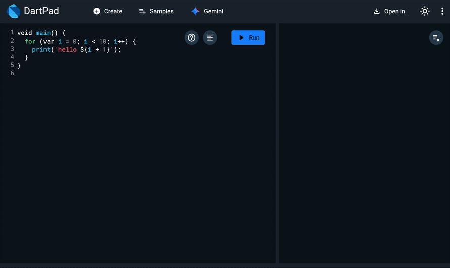
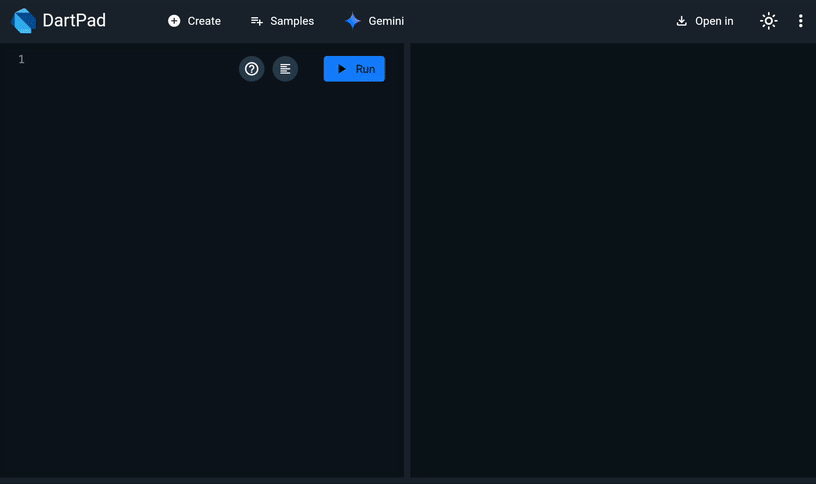
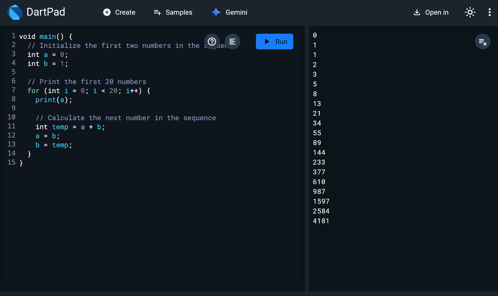
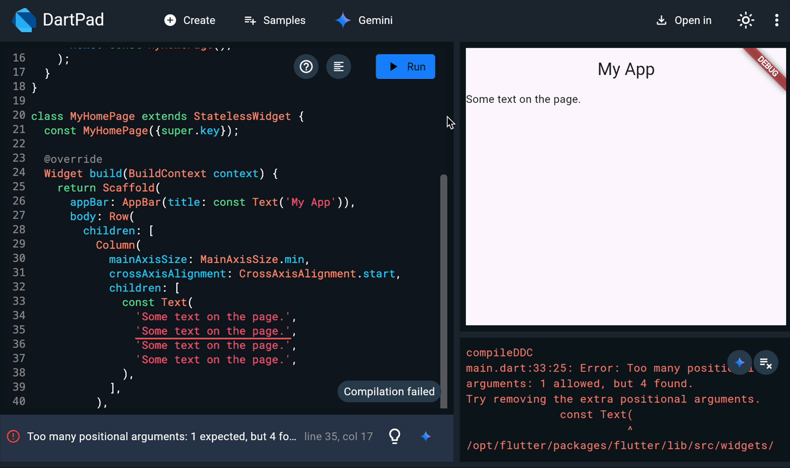

## Gemini for DartPad

### DartPad gets a Gemini boost

Hi developers!

DartPad is where so many of us try out new ideas, learn the nuances of Dart and Flutter, and experiment right in the browser. We’re excited to make that process even faster and more productive. Say hello to **Gemini in DartPad!** You can now:

* Generate new code from a prompt.

* Use images such as UX mocks and screenshots for code generation.

* Refactor existing code from a prompt.

* Suggest code fixes for analysis and run-time errors.

Let’s go over these cool new features in detail.

## Generate new code from a prompt

DartPad users can now leverage Gemini to generate new Dart or Flutter code snippets directly from a natural language prompt.

*Create Dart & Flutter code from an AI prompt*

## Use images to aid in code generation

You can also add images to your prompts. The images can be used to aid in code generation.

*Use images to aid in code generation*

## Refactor existing code from a prompt

Beyond generating entirely new snippets, Gemini in DartPad can help you iterate and modify your existing code.

*Refactor existing code from a prompt*

## Suggest code fixes for analysis errors

Building upon DartPad’s existing capability to display diagnostic messages from the Dart Analyzer, we’ve integrated Gemini to help address issues that might arise in your code. If your code snippet has errors flagged in the analysis panel, you can simply select the Gemini icon in the analysis panel, review the suggested change, and accept it if you agree.

*Suggest code fixes for analysis errors*

## Suggest code fixes for run-time errors

DartPad can also provide error fix suggestions for run-time errors.

*Suggest code fixes for run-time errors*

## In conclusion

DartPad is focused on finding ways to lower the barrier to try new ideas and learn more about Dart and Flutter. Our new integration with Gemini is another step along that path and makes it even easier for you to experiment and explore. We can’t wait to see what you build!