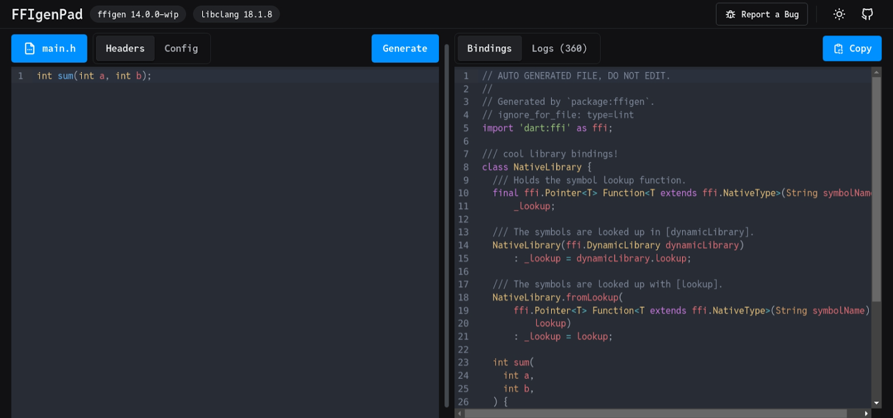

The [Google Summer of Code](https://summerofcode.withgoogle.com/) (GSoC) program focuses on engaging new developers worldwide with open source software development. Google sponsors contributors to work with a mentoring open source organization on a 12-week programming project during the summer. Over the past 19 years, more than 20,000 contributors have participated in Google Summer of Code.


In 2024, Dart participated as a mentoring organization in Google Summer of Code for a fifth consecutive year. This year we received 50 project proposals from prospective participants around the world. Today, we spotlight some of the projects we mentored this summer. The contributors describe their projects in this post.

## HTTP client using JNI bindings from OkHttp

*By Anikate De*

Existing Dart HTTP clients couldn’t interact with native Android APIs, limiting support for KeyStore PrivateKeys, System Proxy, and User-Installed Certificates (all highly requested features by Dart users).

The open-source project, [`OkHttp`](https://square.github.io/okhttp/), a popular choice for network-intensive applications on Android, possesses APIs that can seamlessly implement the above functionalities. Hence, `OkHttp` was chosen as a starting point for this project. Using the GSoC 2022 project, [`package:jnigen`](https://pub.dev/packages/jnigen), JNI Bindings for Dart were generated for several `OkHttp` APIs. The `OkHttpClient` is fully conformant with the existing HTTP Clients. allowing for a hassle-free transition to using `OkHttpClient` from any alternatives.

Besides asynchronous HTTP requests, [`package:ok_http`](https://pub.dev/packages/ok_http) also supports WebSockets, which requires passing all tests in `package:web_socket_conformance_test`. This allows a smooth transition from any WebSocket alternative. Flutter applications using the `package:ok_http` benchmark report the smallest APK size out of all the other HTTP clients Dart offers.

Leveraging the benefits of the `OkHttpClient` in your Flutter projects is as simple as importing it, and editing your current `Client` object!

Read more about the details of the project in the [GSoC contributor’s report.](https://github.com/Anikate-De/gsoc-2024-project-report)

## Swift2ObjC: ObjC wrappers generator

*By Mohammad Eid*

Dart can (indirectly) communicate with Swift code. This is done “through” ObjC, as Dart can communicate with C-based languages (like ObjC) using the [`ffi`](https://dart.dev/interop/c-interop) package. Swift APIs can be annotated with `@objc`to request that the compiler generate ObjC headers for them. Generating the `ffi` bindings for Dart is done automatically with [ffigen](https://pub.dev/packages/ffigen). For Swift, you’ll manually annotate the APIs that you want to communicate with..

Annotating Swift APIs might be more involved than adding an `@objc`annotation. What if you don’t own the module? If you can’t edit it, you must make a custom wrapper that mirrors the APIs so that you can annotate the methods. Also, since Swift is a modern language, and ObjC isn’t, you will likely encounter APIs that are not representable in ObjC out of the box, so you must work around these cases, too.

Swift2ObjC handles these things for you: It generates wrappers for Swift modules and annotates them with `@objc`, while ensuring that all the APIs are representable in ObjC — the Swift module won’t compile, otherwise. I explain the implementation details in this [article](https://medium.com/@mohammad.mossad.eid/swift2objc-more-convenient-swift-dart-interoperability-b152dd5bed13) on Medium (which you can reference if you’re considering contributing to the tool as it’s still in active development). You can also dive into the source code in the [swift2obj](https://github.com/dart-lang/native/tree/cf13658c3bc92e62893ec15659dc1370a7d07e8a/pkgs/swift2objc) repo on GitHub.

## Testing documentation comments with `dartdoc_test`

*By Takuma Ichikawa*

Dart allows code samples to be embedded within documentation comments. This is a beneficial practice, because it’s also published as API documentation and shows how to use the package in a way that is easy to understand for both package users and developers. However, code samples in documentation comments are not analyzed or tested, making it difficult to find errors and making them less maintainable. As projects and documentation grow, this issue becomes more significant.

Therefore for GSOC, I have developed the [`dartdoc_test`](https://pub.dev/packages/dartdoc_test) package to solve such problems. The `dartdoc_test` tool can extract and analyze code samples in documentation comments to find potential errors. By adding the package to your project and running it from the command line, you can find errors in all code samples. You can also perform static analysis of code samples when running the `dart test` command, by adding the `dartdoc_test` test file.

It’s easy to try `dartdoc_test`on your Dart project by running the following two commands.

```shell
dart pub add dev:dartdoc_test
dart run dartdoc_test
```


To learn more, check out [`dartdoc_test`](https://pub.dev/packages/dartdoc_test) on pub.dev.

## Generate dart:ffi bindings on the web using WASM with FFIgenPad

*By TheComputerM*

Dart, as a language that can be compiled to various targets, includes capabilities that facilitate communication with native binaries. You can use packages like [`dart:ffi`](https://dart.dev/interop/c-interop) to interact with C APIs and [`package:jni`](https://pub.dev/packages/jni) to interact with Java code. You merely write some glue code to specify the type signature of the native function you are calling.

The problem arises when you use a library that has many exports, too many to write by hand. This problem is solved with [`ffigen`](https://pub.dev/packages/ffigen) (a previous GSoC project), a tool that generates the bindings using just the library’s header files. To do that you would have to install `ffigen`, set up all the proper dependencies and requirements, then (likely) iterate again and again. This isn’t exactly the definition of seamless and easy. So FFIgenPad came into being.



Another goal of the project was to test out the `dart2wasm` compiler (you can find my experiments in [this blogpost](https://thecomputerm.hashnode.dev/dirty-deeds-done-dart-cheap-experiments-with-dart2wasm)). Sure, we could have run `ffigen` on a server and stuck a UI on it. Instead, I made sure that FFIgenPad runs fully on the browser by compiling both `libclang` and `ffigen` to WebAssembly (why use a server for computation when you can use the client’s system).

Check out the demo at [`https://ffigenpad.surge.sh/`](https://ffigenpad.surge.sh/) and the source code in [my fork](https://github.com/TheComputerM/dart-native/tree/ffigenpad) on GitHub. I would like to thank my mentors [Prerak Mann](https://github.com/mannprerak2), [Daco Harkes](https://github.com/dcharkes), and [Jackson Gardner](https://github.com/eyebrowsoffire) for chiming in whenever I asked for help.