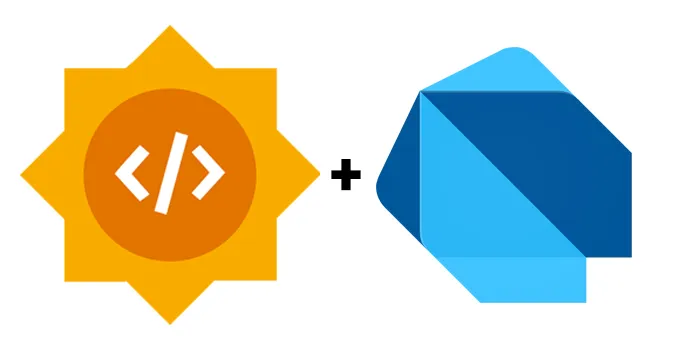
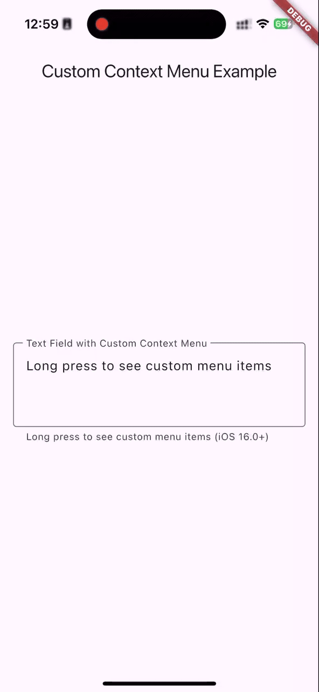
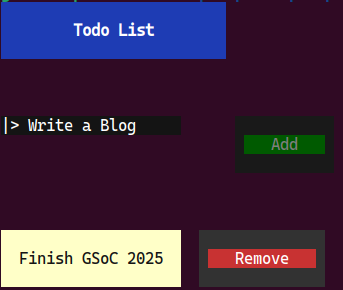
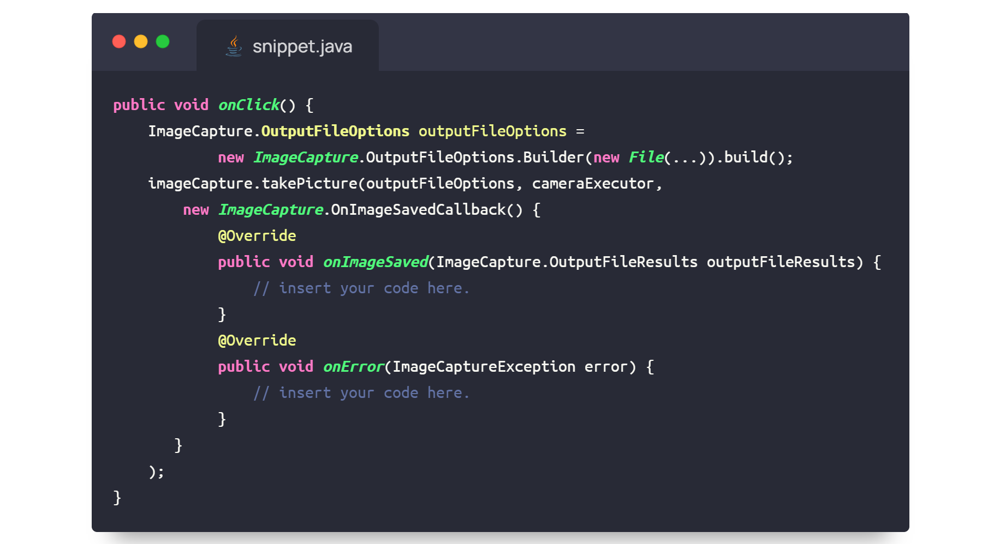
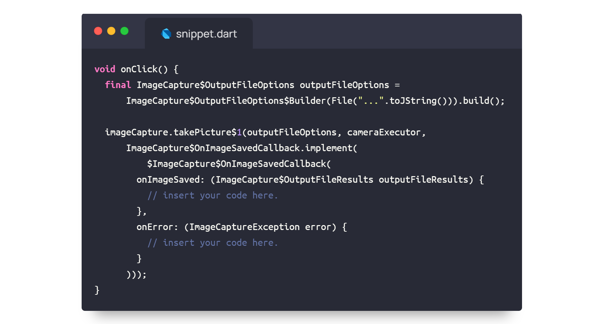
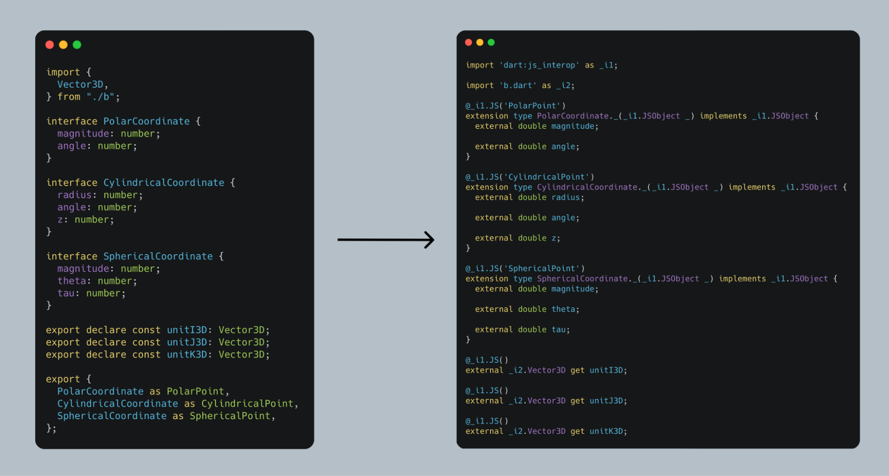

## Google Summer of Code 2025 Results

The [Google Summer of Code](https://summerofcode.withgoogle.com/) (GSoC) program focuses on engaging new developers worldwide with open source software development. Google sponsors contributors to work with a mentoring open source organization on a 12-week programming project during the summer. Over the past 20 years, more than 20,000 contributors have participated in Google Summer of Code.

In 2025, Dart participated as a mentoring organization in Google Summer of Code for a sixth consecutive year. This year we received well over a 100 project proposals from prospective participants around the world. Today, we spotlight some of the projects we mentored this summer. The contributors describe their projects in this post.

## Custom iOS context menu items

*By Jing Shao*

A key goal in mobile app development is delivering a truly native experience. Before this project, Flutter apps on iOS had a major limitation — developers couldn’t add custom actions to the native iOS context menu. During GSoC 2025, I successfully implemented custom context menu support for Flutter iOS, which significantly enhanced Flutter apps’ interaction capabilities on iOS.

This project created the new `IOSSystemContextMenuItemCustom` API, allowing developers to easily add custom actions to the native iOS menu through `TextField`’s `contextMenuBuilder` property; developers can add menu items with custom titles and callbacks. The implementation bridges Flutter with the native iOS UIMenu system, ensuring custom items integrate seamlessly with standard iOS menu options (copy, paste) while maintaining the native look and feel.

With this improvement, Flutter developers can now build more expressive and feature-rich applications. This work marks an important step forward for Flutter in delivering excellent cross-platform native experiences, giving developers powerful tools to build outstanding apps. For more details, check out my technical blogs and PRs on [GitHub](https://gist.github.com/jingshao-code/f489d263bcd97a489896afafe0c99ccd). Feel free to reach out for any questions! I would like to thank my mentors [Justin ](https://github.com/justinmc)and [Huan](https://github.com/hellohuanlin) for their invaluable guidance and support throughout this project.

Below is an example showing custom menu items like **Clear Text**, **Add Heart ❤️**, and **Uppercase** alongside standard iOS menu items in the native context menu.

## Dart TUI framework

*By Gedion Ezra*

Before this project, Dart developers who wanted to build interactive terminal applications often had to switch to Rust, Go, or Python. There was no mature text-based, user-interface (TUI) framework in Dart, limiting developers to GUIs or static CLI tools. As part of GSoC 2025, we built [Pixel Prompt](https://github.com/primequantuM4/pixel_prompt), a terminal UI framework inspired by Flutter’s declarative, component-based approach. Pixel Prompt allows developers to create dynamic interactive apps entirely in Dart.

Pixel Prompt introduces a Component to a ComponentInstance model, inspired from Flutter’s layered architecture that maps a widget (in the widget layer) to an element layer and, in turn, to the RenderObject layer. Components describe the UI declaratively while `ComponentInstances` manage state layout and rendering. Check out a simplified version of the architecture:

The framework supports stateful and stateless components, input handling, and optimized rendering with double buffering and ANSI diffing. This improves performance by minimizing terminal redraws and enables reliable golden testing with a virtual terminal interpreter.

To give a visual sense of what Pixel Prompt can achieve, screenshots of some demo are available below. These demonstrate the declarative layout, interactive components, and real-time updates that the framework supports, showing that Dart can now power fully interactive terminal applications without leaving its ecosystem.

While Pixel Prompt already enables building core terminal applications, there’s more to come: the support for complex components like `TextArea` and `Tables`, a flex-like layout system, a dedicated animation API, and a visual debugger are planned for future contributions. Interested developers can explore open issues and contribute on the [pixel_prompt](https://github.com/primequantuM4/pixel_prompt) repo.

## TestGen — LLM-based test generation tool

*By Amr Ahmed*

The primary goal of **TestGen**, an experimental project that automates unit test generation for Dart, is to improve test coverage by generating test cases that specifically **target uncovered lines** in the codebase. By leveraging large language models (LLMs) to produce meaningful tests, TestGen reduces the manual effort required to write tests, helping developers achieve higher coverage and improve code quality.

One of the main challenges in using LLMs for automated test generation is deciding how much code context to give the model. For example, if a function needs testing and we provide the entire file as context, the LLM might get overwhelmed and produce irrelevant or inaccurate tests. If we provide only the function itself, the model can miss important dependencies inside the function, leading to incomplete or broken tests. To solve this, TestGen uses the Dart analyzer to parse the whole codebase into **Declarations,** which are classes that represent a code construct like a function, variable, class, or mixin**. **After parsing, it constructs a **dependency graph** across these declarations, which shows exactly the pieces of code on which a given declaration depends. This is done by traversing the **Abstract Syntax Tree (AST**) of a given declaration and recording its dependencies during the visit. Using this graph, TestGen can provide the LLM with only the** **relevant context *(context-aware prompting)* at a configurable depth, helping it generate accurate and focused tests without extra noise.

**The figure shows the dependency graph generated for the given Dart file. When testing toBeTestedFunction, the graph helps us easily retrieve all relevant context to include in the prompt. The LLM now can better understand the function and its surroundings, leading to a more effective and accurate test generation process.**

To make test generation effective, TestGen integrates with **`package:coverage`** to automatically detect which parts of the code are not yet tested and target those. The tool connects to **Gemini models** through `package:google_generative_ai`, *using variants like gemini-2.5-pro, gemini-2.5-flash, and gemini-2.5-flash-lite* to generate test cases. These tests then go through a validation and feedback loop, where they are executed and checked for errors. If issues are found, the errors are fed back into the LLM so it can refine the output, making the final tests more accurate and reliable.

There is more to come for this package, including new features, improved testing, and adding support for Flutter projects. You can check the current list of issues on the [dart_testgen repo](https://github.com/AmrAhmed119/dart-testgen/issues). For a sample of how the generated prompts look, see the [default-prompt](https://github.com/AmrAhmed119/dart-testgen/blob/main/example/default_prompt.md) example. More details about the project are available in the full [GSoC report](https://github.com/AmrAhmed119/GSoC-2025-Report/blob/main/README.md).

## LLM-powered translation of Android (Java/Kotlin) docs into Dart using JNIgen bindings

*By Marshelino Maged*

Android libraries and utilities are typically documented with Java/Kotlin code snippets. While JNIgen makes it possible to generate Dart bindings for these libraries, writing Dart code against the bindings can be challenging due to syntactic and structural differences between the languages. This means developers cannot directly reuse the many Java/Kotlin examples found in official Android documentation and tutorials. The native_doc_dartifier project was created to address this gap by automatically translating Java and Kotlin snippets in Android documentation into their Dart equivalents.

*Example Java snippet.*

*Example snippet Translation.*

The project builds on JNIgen, which generates Dart bindings for Java and Kotlin APIs through foreign function interface (FFI). Because Java and Dart differ in both syntax and semantics, a direct translation is not sufficient. For example, Java supports method overloading while Dart does not, leading JNIgen to disambiguate bindings with renamed methods such as `add$1` and `add$2`. To generate accurate Dart code, the translation model must take these binding conventions into account rather than relying on surface-level conversion.

A major technical challenge was scale: bindings for Android libraries often include hundreds of thousands of lines of boilerplate code,** far exceeding the input limits** of even the largest language models (currently 1M token). To address this, the project introduced** Abstract Syntax Tree (AST) extraction**, which reduces the bindings to their public API surface — resulting in about** 6%** of the original size — while preserving critical information. This was combined with **retrieval-augmented generation (RAG)**, where each class’s AST is stored separately and only the most relevant classes are retrieved based on the snippet being translated.

By combining **AST extraction with retrieval-based context selection**, `native_doc_dartifier` is able to produce Dart translations that are both accurate and aligned with the generated bindings, while remaining efficient within LLM context constraints. The result is a practical solution that reduces friction for Dart developers working with Android documentation and strengthens interoperability between the Java/Kotlin and Flutter ecosystems.

Since translations are generated by an LLM, occasional errors can occur when compiling the produced Dart code. To improve reliability, the system incorporates a feedback loop: compilation errors are returned to the LLM for several iterations, allowing it to refine and correct the translation until a working version is produced. This iterative approach further increases the robustness of the generated examples.

For more information, visit the [native_doc_dartifier](https://github.com/dart-lang/native/tree/main/pkgs/native_doc_dartifier) repo.

## Translate TS Declarations to Dart JS Interop Interfaces

*By Nikechukwu Okoronkwo*

Dart provides powerful interop with JavaScript through `dart:js_interop`, which can be used to interface with code written in JavaScript. However, writing bindings for large libraries and packages can be time-consuming and error-prone. To solve this, we created the JS Interop Generator. It automatically generates Dart wrappers from a [TypeScript declaration file](https://www.typescriptlang.org/docs/handbook/declaration-files/by-example.html) (`.d.ts`). This helps with Dart’s adoption on the web and allows Dart and Flutter developers to more easily leverage the vast ecosystem of JS libraries from NPM and elsewhere.

The generator works by parsing a `.d.ts` file and transforming its TypeScript declarations into their Dart equivalents. The declarations are generated based on how Dart interops with JS, ensuring correctness in terms of interop implementation with the JS code represented by the TS declaration code, as well as closeness to the TS declaration’s representation of the code, where possible.

It supports a wide range of TS features, including variables, functions, enums, classes, interfaces, namespaces, and type-aliases. The generator produces equivalent Dart representations of TS types and leverages existing types from `dart:js_interop` and `package:web` when possible. This includes support for advanced TypeScript features like anonymous objects, anonymous closures, unions, merged types, and `typeof` / `keyof`.

You can see many examples in the [integration test suite](https://github.com/dart-lang/web/tree/main/web_generator/test/integration/interop_gen). We’ve already used the generator to successfully create bindings for popular packages like [nanoid](https://www.npmjs.com/package/nanoid) and [uuid](https://www.npmjs.com/package/uuid). For more details on this, see the [generator test results](https://gist.github.com/nikeokoronkwo/dd83becbb6cee4d98f63556ba108e14b).

The project is available in the `web_generator` package in the [web repo](https://github.com/dart-lang/web). You can try it out by running the `bin/gen_interop_bindings.dart` script. If you encounter any issues or bugs, feel free to file an issue and/or contribute!