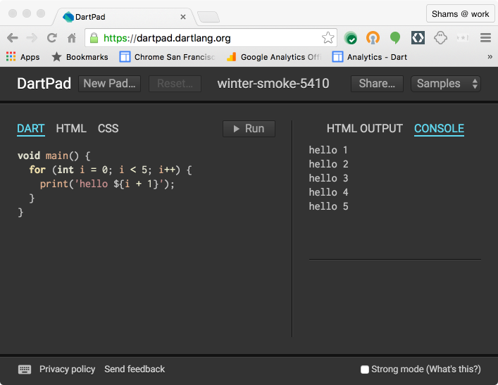

DartPad, an open-source tool,
allows you to play with the Dart language features in any modern browser.

As you can see in the following screenshot, DartPad launches with a simple counting
function it's been pre-loaded with a different example:

It's easy to get started!

## Open DartPad, and run some samples {#step-1-open-and-run}

<ol markdown="1">
  <li markdown="1">
  Go to <a href="{{site.custom.dartpad.direct-link}}" target="_blank">dartpad.dartlang.org</a>.

  A sample appears on the left and the output appears on the right.
  If you've played with DartPad before,
  you can click **New Pad** to get back to the original sample.

  <aside class="alert alert-info" markdown="1">
  **What about mobile?**
  DartPad has a slightly different user interface on mobile devices.
  To run an app, click the red button, which takes you to the output.
  </aside>
  </li>

  <li markdown="1">
  Click **Run**.

  The sample runs again, updating the output.
  </li>

  <li markdown="1">
  Choose an HTML sample, using the **Samples** list at the upper right.

  For example, choose **Hello World HTML**.
  Again, the output appears to the right.
  By default, you see the HTML output—what you'd see in a browser.
  </li>

  <li markdown="1">
  Click **CONSOLE** to view the sample's console output.
  </li>

  <li markdown="1">
  On the left, click the **HTML** tab to view the sample's HTML markup.
  </li>
</ol>

## Create a command-line app {#step-2-server}

To create a simple command-line app, use **New Pad**.

<ol markdown="1">
  <li markdown="1">
  Click the **New Pad** button.

  The source code for the Hello World app appears
  under the DART tab.
  </li>

  <li markdown="1">
  Change the code. For example, change the `main()` function
  to contain this code:

<!-- ch03/string-tests.dart -->

for (var char in 'hello'.split('')) {
  print(char);
}


  As you type, DartPad shows hints, documentation,
  and autocomplete suggestions.
  </li>

  <li markdown="1">
  Run your app.
  </li>

  <li markdown="1">
  If you didn't happen to have any bugs while you were entering the code,
  try introducing a bug.

  For example, if you change `split` to `spit`,
  you get warnings at the bottom of the window and in the Run button.
  If you run the app, you'll see output from an uncaught exception.
  </li>

  <li markdown="1">
  Save your app by clicking **Share**.

  DartPad gives you links to the app,
  both in DartPad and in gist.github.com.
</li>
</ol>

## Create a web app {#step-3-web}

To create a simple web app, start with the Hello World HTML sample.

<ol>
  <li>
    Click <b>Sample</b>, and choose <b>Hello World HTML</b>.
    If you've already edited Hello World HTML,
    click <b>Reset</b> to restore the original version.
  </li>

  <li>
    Edit the HTML:
    <ol>
      <li>
        Click <b>HTML</b> to view the HTML code.
      </li>
      <li>
        Change the text inside the h2 element
        from <code>Hello world</code> to something else—perhaps
        <b>Hola mundo</b>.
      </li>
    </ol>
    

      The display under HTML OUTPUT updates as you type.
    

  </li>

  <li>
    Edit the Dart code:
    <ol>
      <li>
        Click <b>DART</b> to view the Dart code.
      </li>
      <li>
        Change the value displayed by <code>count.text</code>.
        For example, change <code>'${i}'</code> to <code>'#${i}'</code>.
      </li>
      <li>
        Click <b>Run</b> to compile and run the Dart code,
        updating the HTML OUTPUT display.
      </li>
    </ol>
  </li>
</ol>

---

Note that DartPad doesn't support importing packages.
When you are ready to leverage libraries,
download a Dart SDK.
