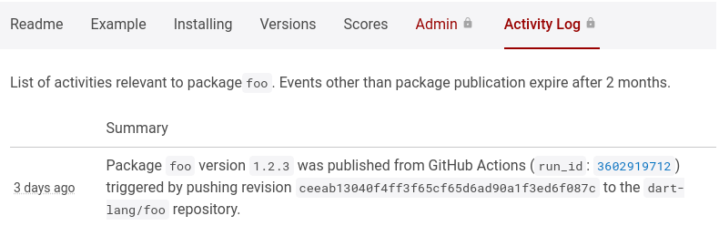
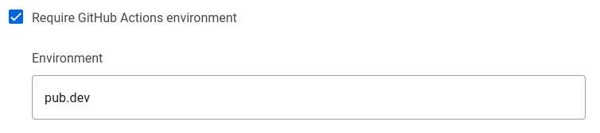
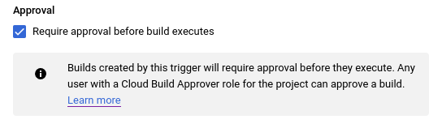
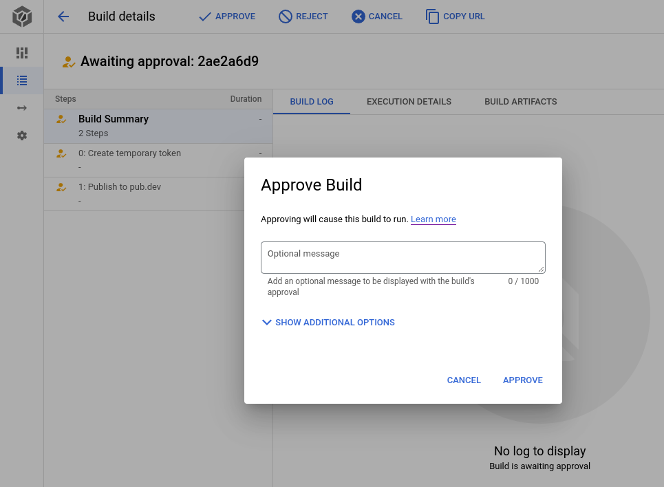

You can automate publishing package updates to pub.dev using
GitHub Actions.

{{site.alert.note}}
  Today, you can only automate publishing of existing packages.
  To create a new package, publish the first version using
  `dart pub publish`.
{{site.alert.end}}

This automation requires authenticating to `pub.dev` using either
[GitHub-signed OpenID Connect tokens][1] or a [GCP Service Account][2].

With these methods of automated publishing, you don't need to store
long-lived secrets. The `dart pub` client authenticates using temporary
tokens that either GitHub Actions or Google Cloud IAM have signed.


## Enable publishing packages using GitHub Actions

To publish from [GitHub Actions](https://github.com/features/actions),
you must:

1. Enable automated publishing for the package on `pub.dev`.
   You need to provide the following information in `pub.dev`:
   * Your package's GitHub _repository_ from which you publish the
     package.
   * A _`tag-pattern`_ that git tags must match to permit publishing.
1. Create a GitHub Action workflow for publishing in GitHub.
1. Create a `pubspec.yaml` file in your repository.
   This file requires a `version` key with a value that matches the
   `tag-pattern`.
1. Create a git tag for your latest commit.
   This tag also must match the `tag-pattern`.

{{site.alert.note}}
  GitHub Actions can publish to `pub.dev` only when a push of a git tag
  to GitHub triggers the Action _workflow_.
  If a GitHub Actions triggers publishing without a tag, `pub.dev`
  rejects it.
  This ensures that events that don't trigger publish result in
  publishing new versions.
{{site.alert.end}}


## Configure automated publishing from GitHub Actions on pub.dev

### Check for required `pub.dev` permissions

To automate publication from GitHub Actions to `pub.dev`, you need one
of the following roles:

* An _uploader_ on the package
* An _admin_ of the publisher if a publisher owns the package

### Configure automated publishing

To enable `pub.dev` to accept GitHub Action publishing, complete the
following steps.

1. Navigate to the **Admin** tab (`pub.dev/packages/<package>/admin`).
1. Find the **Automated publishing** section.

   

1. Click **Enable publishing from GitHub Actions**.
   Additional fields display when you select this checkbox.
1. Write the GitHub repository in the **Repository** field.

   A _repository_ contains all of your package's files on GitHub.
   This field expects a format of `<organization>/<repository>`.
   For example: If the URL for your repository resembles
   `https://github.com/dart-lang/pana`, write `dart-lang/pana` in the
   **Repository** field.

1. Write the _`tag-pattern`_ into the **Tag pattern** field.

   A `tag-pattern` represents the version of the package.
   This field expects a string that includes the literal
   `{{version}}`.
   Github Actions can publish your package only if a push of a git tag
   matching this `tag-pattern` triggers the Action.
   The package's `pubspec.yaml` file requires the `version` key.
   This key's value must match the `{{version}}`
   in the `tag-pattern`.

1. Click **Update**.

<!-- **Example:** You wrote your `tag-pattern` as `v{{version}}`.
You then tag this commit and push it.

```shell
git tag v1.2.3 && git push v1.2.3
```

This push triggers Github Actions to publish version `1.2.3` of
your package. -->

If your repository contains multiple packages, give each a separate
`tag-pattern`. Consider using a `tag-pattern` like
`my_package_name-v``{{version}}` for a package
named `my_package_name`.

## Prepare your package repository for automated publishing


After you enable automated publishing from GitHub Actions on pub.dev,
you need to make two changes to your package repository.

1. Modify the package's `pubspec.yaml` file.
2. Create a GitHub Action workflow file.

### Update pubspec.yaml with the package version

The `pubspec.yaml` file must reflect the current version of the package.

1. Navigate to the root of your local copy of your package repository.
1. Open the `pubspec.yaml` file using your preferred editor.
1. Update or add the `version` key with the correct version number.
   The version number must follow [semantic versioning][27].

    ```yaml
    package: my_package_name
    version: 1.2.3  # must match the version number used in the git tag
    environment:
      sdk: ^2.18.0
    ...
    ```

### Create a GitHub Action workflow to publish to pub.dev

create a GitHub Action workflow in the package repository.

1. Navigate to the root of your local copy of your package repository.
1. Create a `.github/workflows/publish.yml` file using your preferred
   editor.
1. Add the following content to this file.
   This content assumes that you wrote your `tag-pattern` in `pub.dev`
   as `v{{version}}`.

    ```yaml
    # .github/workflows/publish.yml
    name: Publish to pub.dev

    on:
      push:
        tags:
        # must align with the tag pattern configured on pub.dev, often just replace
        # {{version}} with [0-9]+.[0-9]+.[0-9]+*
        - 'v[0-9]+.[0-9]+.[0-9]+*' # tag pattern on pub.dev: 'v{{version}}'
        # If you prefer tags like '1.2.3', without the 'v' prefix, then use:
        # - '[0-9]+.[0-9]+.[0-9]+*' # tag pattern on pub.dev: '{{version}}'
        # If you repository contains multiple packages consider a pattern like:
        # - 'my_package_name-v[0-9]+.[0-9]+.[0-9]+*'

    # Publish using the reusable workflow from dart-lang.
    jobs:
      publish:
        uses: dart-lang/setup-dart/.github/workflows/publish.yml
        # with:
        #   working-directory: path/to/package/within/repository
    ```

Make sure to match the pattern in `on.push.tags` with the `tag-pattern`
specified on pub.dev. Otherwise, the GitHub Action workflow won’t work.

<!--
TODO: The file described in the following passage does not exist.
We can re-include it once the file has been created and merged.

The preceding workflow file uses
`dart-lang/setup-dart/.github/workflows/publish.yml` to publish the package.
This _[reusable workflow][3]_ allows the Dart team to maintain
the publishing logic and enables `pub.dev` to know how the package was published.
Though optional, the Dart team encourages using this reusable workflow.
-->

### Create a custom GitHub Action workflow to publish to pub.dev

If you need generated code in your package, check this generated code
into your repository. This simplifies verifying if the files
published on `pub.dev` match the files from your repository. If you cannot
check in generated or built artifacts into your repository, you
can create a custom workflow. This workflow could resemble the
following YAML markup:

```yaml
# .github/workflows/publish.yml
name: Publish to pub.dev

on:
  push:
    tags:
    - 'v[0-9]+.[0-9]+.[0-9]+*' # tag pattern on pub.dev: 'v{{version}}'

# Publish using custom workflow
jobs:
  publish:
    permissions:
      id-token: write # This is required for authentication using OIDC
    runs-on: ubuntu-latest
    steps:
      - uses: actions/checkout@v3
      - uses: dart-lang/setup-dart
      - name: Install dependencies
        run: dart pub get
      # Here you can insert custom steps you need
      # - run: dart tool/generate-code.dart
      - name: Publish
        run: dart pub publish --force
```

The workflow authenticates to `pub.dev` using a temporary [token][1].
Create and configure this token in the `dart-lang/setup-dart` `step` in
the `publish.yaml` file.
To publish to `pub.dev`, subsequent steps can run
`dart pub publish --force`.

{{site.alert.note}}
  At this point in this guide, anyone with push access to your
  repository can publish new versions of the package.
  Consider using [tag protection rules][sec-gh-tag-protection] or
  [GitHub deployment Environments][sec-gh-environment] to limit who can
  publish.
{{site.alert.end}}

[sec-gh-tag-protection]: #hardening-security-with-tag-protection-rules-on-github
[sec-gh-environment]: #hardening-security-with-github-deployment-environments


## Trigger automated publishing using Github Actions

After you have completed the preceding activities, you can publish a
new version of your package.

1. Verify your package's version.

    ```console
    $ cat pubspec.yaml
    package: my_package_name
    version: 1.2.3            # must match the version number used in the git tag
    environment:
      sdk: ^2.18.0
    ...
    ```

1. Tag the latest commit with the matching `tag-pattern`.

    ```console
    $ git tag v1.2.3          # assuming my tag pattern is: 'v{{version}}'
    ```

1. Push the tag to GitHub.

    ```console
    $ git push origin v1.2.3  # triggers the action that publishes my package.
    ```

1. Review the GitHub Action workflow logs at
   `https://github.com/<organization>/<repository>/actions`.

If you don't like using the `git` command to create tags, you can
create _releases_ on GitHub.
To learn more, check out [managing releases in a repository][4] in the
GitHub documentation.


## Troubleshoot issues with GitHub Actions

* If the Action didn't trigger, check that the pattern configured in
  `.github/workflows/publish.yml` matches the pushed _git tag_.
* If the Action failed, the GitHub Action logs may contain clues as to
  why it failed. If the log offered no clues, check that you set the
  proper `organization/repository` and `tag-pattern` on `pub.dev`.

Once published, you can see the publication event in the **Activity Log** on
`pub.dev`.
The **Activity Log** entry should contain a link to the GitHub Action run
that published the package version.



## Hardening security of automated publishing

### Hardening security with tag protection rules on GitHub


Configuring automated publishing from GitHub Actions has one security
flaw. Any GitHub user who can push a tag to your repository can publish
your package.
To restrict who can push tags to your repository, use
[tag protection rules][5] on GitHub.

By limiting who creates tags matching your `tag-pattern`,
you limit who can publish the package.

At this time, these [tag protection rules][5] lack flexibility. You may
want to restrict who can trigger publishing using _GitHub Deployment
environments_. The next section outlines this process.


### Hardening security with GitHub Deployment Environments

When configuring automated publishing from GitHub Actions in `pub.dev`,
you can require a _[GitHub Actions environment][6]_.
To use a GitHub Actions environment for publishing you must:

1. Navigate to the **Admin** tab (`pub.dev/packages/<package>/admin`)
   in `pub.dev`.
1. Find the **Automated publishing** section.
1. Click **Require GitHub Actions environment**.
   The **Environment** field displays.

    

1. Write an environment name into the **Environment** field.
   To keep the process simple, use `pub.dev`.
1. Click **Update**.

When you configure an environment on `pub.dev`, you need to update the
`publish.yml` file for GitHub Action workflow in your repository.
You need to add the `environment` key with a value that matches the
**Environment** field value in `pub.dev`.

1. [Create an environment][8] in your GitHub repository.
   This environment must use the same name you provided in `pub.dev`.
1. Open your `.github/workflows/publish.yml` workflow file in your
   preferred editor.
1. Add the `environment` key with the corresponding value.
   The result should resemble the following file:

    ```yaml
    # .github/workflows/publish.yml
    name: Publish to pub.dev

    on:
      push:
        tags:
        - 'v[0-9]+.[0-9]+.[0-9]+*' # for tags like: 'v1.2.3'

    jobs:
      publish:
        uses: dart-lang/setup-dart/.github/workflows/publish.yml
        with:
          # Specify the github actions deployment environment
          environment: pub.dev
          # working-directory: path/to/package/within/repository
    ```

The temporary [GitHub-signed OpenID Connect token][1] includes the
environment value used to authenticate with `pub.dev`. 
This prevents a user with push permission on your repository from
modifying the workflow file to circumvent
[environment protection rules][7].

In your GitHub repository settings, you can use
[environment protection rules][7] to set _required reviewers_.
If you configure this option, GitHub prevents actions with
the environment from running until one of the required reviewers have
approved the run.


## Publishing from Google Cloud Build

To publish from [Google Cloud Build][9] you must:
1. Register a Google Cloud Project.
1. Create a [service account][10] for publishing to `pub.dev`.
1. Enable automated publishing for the package on `pub.dev`.
   Add the email of the service account you created.
1. Grant the default Cloud Build service account permission to impersonate the
   service account created for publishing.
1. Create a `cloudbuild.yaml` file which obtains a temporary OIDC `id_token`
   and uses it for publishing to `pub.dev`.
1. Configure a Cloud Build trigger, for running the steps in `cloudbuild.yaml`
   in your project on Google Cloud Build.


{{site.alert.note}}
  When you enable automated publishing from a _service account_ you must carefully
  review who has the ability to impersonate this service account, either by
  calling through APIs, exporting service account keys or through changing
  IAM permission in the cloud project.
  To learn more, check out [managing service account impersonation][11].
{{site.alert.end}}


### Create a service account for publishing

To create a service account that can publish to `pub.dev`, you must:

1. Create a cloud project, if you don't have an existing project
   check out [creating and managing projects][12]. 
1. Create a _service account_. This account needs permission to publish your
   package on `pub.dev` and must exist in the same cloud project where you run
   Cloud Build.
   Run the following command to create a service account:

   ```console
   gcloud iam service-accounts create pub-dev \
     --description='Service account to be impersonated when publishing to pub.dev' \
     --display-name='pub-dev'
   ```

   This command results in a service account named:
   `pub-dev@$PROJECT_ID.iam.gserviceaccount.com`.

1. Grant the service account permission to publish your package.

   This step requires _uploader_ permission on the package or
   _admin_ of the publisher that owns the package.

   1. Navigate to the **Admin** tab (`pub.dev/packages/<package>/admin`).
   1. Click **Enable publishing with Google Cloud Service account**.
      The **Service account email** field displays.
   1. Type the email of the service account into the
      **Service account email** field.
      You created this account in the previous step:
      `pub-dev@$PROJECT_ID.iam.gserviceaccount.com`

      


1. Click **Update**.


With this procedure complete, anyone who can impersonate the service
account can publish new versions of the package.
Review who has permissions to [impersonate the service account][11] and
change permissions in the cloud project as needed.


### Grant Cloud Build permission to publish

To publish from Cloud Build, give the 
[default Cloud Build service account][13] permission to
[impersonate the service account][11] you created in the previous
section.

1. Enable the [IAM Service Account Credentials API][] in the cloud
   project. Attempts to impersonate the service account fail without
   this API.

   ```console
   gcloud services enable iamcredentials.googleapis.com
   ```

1. Find the project number.

   ```console
   gcloud projects describe $PROJECT_ID --format='value(projectNumber)'
   ```

1. Grant permission to impersonate the publishing service account.

   ```console
   gcloud iam service-accounts add-iam-policy-binding \
     pub-dev@$PROJECT_ID.iam.gserviceaccount.com \
     --member=serviceAccount:$PROJECT_NUMBER@cloudbuild.gserviceaccount.com \
     --role=roles/iam.serviceAccountTokenCreator
   ```

### Create a Cloud Build Configuration File

To publish from Cloud Build, enable Cloud Build to:

* Impersonate the service account to obtain a temporary OIDC `id_token`
* Provide the temporary `id_token` to `dart pub` for use when publishing
* Call `dart pub publish` to publish the package

You specify these steps for Google Cloud Build in a `cloudbuild.yaml`
file. To learn more about the format of this file, check out
[build configuration file schema][15].

A Cloud Build configuration file that works with this example should
resemble the following YAML markup:

```yaml
# cloudbuild.yaml
steps:
- id: Create temporary token
  name: gcr.io/cloud-builders/gcloud
  volumes:
  - name: temporary-secrets
    path: /secrets
  script: |
    gcloud auth print-identity-token \
      --impersonate-service-account=pub-dev@$PROJECT_ID.iam.gserviceaccount.com \
      --audiences=https://pub.dev \
      --include-email > /secrets/temporary-pub-token.txt
  env:
  - PROJECT_ID=$PROJECT_ID
- id: Publish to pub.dev
  name: dart
  volumes:
  - name: temporary-secrets
    path: /secrets
  script: | 
    cat /secrets/temporary-pub-token.txt | dart pub token add https://pub.dev
    dart pub publish --force
```

The `Create temporary token` step features the
`gcloud auth print-identity-token` script.
This script performs the following actions:

* It creates an OpenID Connect `id_token`.
  Google signs this `id_token`. The signature that expires within one
  hour.
* The `--impersonate-service-account` option identifies the service
  account to impersonate. This example uses the service account created
  in a previous activity in this guide.
* The `--audiences` option identifies `pub.dev` as the intended
  recipient of the token. 
* The `--include-email` option requests that `pub.dev` recognize the
  service account.

Once you create the `id_token`, Google Cloud writes it to a file that
resides in a _volume_. Google Cloud uses this mechanism to
[pass data between steps][16].
Don't store the token in `/workspace`.
Google Cloud checks out your repository into `/workspace`.
If you store the token in `/workspace`, your published package includes
the `id_token`.


### Creating a Cloud Build trigger

With a service account configured and a `cloudbuild.yaml` file in
the repository, use [console.cloud.google.com](https://console.cloud.google.com/cloud-build/triggers)
dashboard to create a _Cloud Build Trigger_.
To create a build trigger, you need to connect to a _source repository_
and specify which events should trigger a build. You can use [GitHub][18],
[Cloud Source Repository][19], or one of the [other options][20].
To learn how to configure a _Cloud Build Trigger_, check out
[creating and managing build triggers][21].

To publish packages using the Cloud Build Configuration file you created:

1. Open the **Triggers** page in the Google Cloud console.
1. Select your project from the project selector drop-down menu at the
   top of the page.
1. Click **Open**.
1. If you have an existing trigger, open it. 
   If you need a new trigger, [create it][28].
1. Scroll to the **Configuration** section.
1. Click **Cloud Build Configuration**.

    

1. Do **not** specify a **Service account** to trigger the build.
   Let Cloud use its default service account.


{{site.alert.note}}
  You can configure the Cloud Build trigger to run under a custom
  _service account_. If you want to do this, create a new service
  account for this purpose. Allow this service account to impersonate
  the `pub-dev@$PROJECT_ID.iam.gserviceaccount.com` account which can
  publish to pub.dev.

  In the configuration of the `pub-dev@$PROJECT_ID.iam.gserviceaccount.com`
  service account, the default Cloud Build service account
  `$PROJECT_NUMBER@cloudbuild.gserviceaccount.com` can impersonate the
  `pub-dev@$PROJECT_ID.iam.gserviceaccount.com` service account.

  To learn more about custom service accounts for running Cloud Builds,
  check out [Configuring user-specified service accounts][22].
{{site.alert.end}}

When configuring your Cloud Build Trigger, consider who can trigger the
build. _Anyone who can trigger the build can publish your package._
Consider allowing only manual builds or use
[Cloud Build approvals][17] to gate builds as outlined in next section.

### Hardening security with Cloud Build Approvals

When configuring a Cloud Build Trigger, you can select
**require approval before build executes**. If a Cloud Build Trigger
requires approval, it won't run when triggered. It waits for approval.
Use this to limit who can publish new versions of your package.



Only a user with the **Cloud Build Approver** role can give approval.
When giving a approval, the approver can specify a URL and comment.



You can also configure notifications for pending approvals.
To learn more, check out [gate build on approval][17].


## Publish from anywhere using a Service Account

To do automated publishing outside of GitHub Actions, you may
authenticate using service accounts in way similiar to _Cloud Build_.

* [Create a service account for publishing][create-svc],
* Impersonate the publishing service account in one of two ways:
  * Workload Identity Federation
  * Exported Service Account Keys

The section for _Cloud Build_ outlined how to
[create a service account for publishing][create-svc].
This should provide a service account that resembles
`pub-dev@$PROJECT_ID.iam.gserviceaccount.com`.

[create-svc]: #creating-a-service-account-for-publishing


### Publish using workload identity federation

When running on a cloud service that supports OIDC or SAML,
you can impersonate a GCP service account using
[Workload Identity Federation][23]. This enables you to
leverage your cloud provider's identity services.

For example: If you deploy on EC2, you can
[configure workload identity federation with AWS][24]. This allows
temporary AWS tokens from the EC2 metadata service to impersonate a
service account.
To learn how to configure these flows, check out
[workload identity federation][25].


### Publish using exported service account keys

When running on a custom system without identity services, you
can export service account keys. Exported service account keys allow
you to authenticate as a service account.
To learn more, check out how to
[create and manage service account keys][26].

#### Export service account keys

1. Create exported service account keys for an existing service account.

    ```console
    gcloud iam service-accounts keys create key-file.json \
      --iam-account=pub-dev@$PROJECT_ID.iam.gserviceaccount.com
    ```

1. Save the `key-file.json` file for later use.

Treat the `key-file.json` like a password.
Anyone who gains access to it can authenticate as the service account
and publish your package.

#### Publish packages using exported service account keys

To publish a package using exported service account keys:

1. Setup gcloud to authenticate using key-file.json

    ```console
    gcloud auth activate-service-account --key-file=key-file.json
    ```

1. Create a temporary token for pub.dev and add it to
   `dart pub token add`.
   To impersonate service account, include the `--include-email` option.

    ```console
    gcloud auth print-identity-token \
      --audiences=https://pub.dev \
      | dart pub token add https://pub.dev
    ```

1. Publish using the temporary token.
   Add the `--force` option to skip the `yes/no` prompt.

    ```console
    dart pub publish --force
    ```


{{site.alert.note}}
  Consider using [Workload Identity Federation][23] if possible. This
  avoids long-lived secrets. Relying on workload identity federation
  allows you to use short-lived secrets that your cloud provider signs.
  As short-lived secrets expire, this limits the negative implications
  if leaked in logs or similar ways.
{{site.alert.end}}


[1]: https://docs.github.com/en/actions/deployment/security-hardening-your-deployments/about-security-hardening-with-openid-connect
[2]: https://cloud.google.com/iam/docs/service-accounts
[3]: https://docs.github.com/en/actions/using-workflows/reusing-workflows#calling-a-reusable-workflow
[4]: https://docs.github.com/en/repositories/releasing-projects-on-github/managing-releases-in-a-repository
[5]: https://docs.github.com/en/repositories/managing-your-repositorys-settings-and-features/managing-repository-settings/configuring-tag-protection-rules
[6]: https://docs.github.com/en/actions/deployment/targeting-different-environments/using-environments-for-deployment
[7]: https://docs.github.com/en/actions/deployment/targeting-different-environments/using-environments-for-deployment#environment-protection-rules
[8]: https://docs.github.com/en/actions/deployment/targeting-different-environments/using-environments-for-deployment#creating-an-environment
[9]: https://cloud.google.com/build
[10]: https://cloud.google.com/iam/docs/service-accounts
[11]: https://cloud.google.com/iam/docs/impersonating-service-accounts
[12]: https://cloud.google.com/resource-manager/docs/creating-managing-projects
[13]: https://cloud.google.com/build/docs/cloud-build-service-account
[14]: https://console.cloud.google.com/apis/api/iamcredentials.googleapis.com
[15]: https://cloud.google.com/build/docs/build-config-file-schema
[16]: https://cloud.google.com/build/docs/configuring-builds/pass-data-between-steps
[17]: https://cloud.google.com/build/docs/securing-builds/gate-builds-on-approval
[18]: https://cloud.google.com/build/docs/automating-builds/github/connect-repo-github
[19]: https://cloud.google.com/source-repositories/docs/create-code-repository
[20]: https://cloud.google.com/build/docs/triggers
[21]: https://cloud.google.com/build/docs/automating-builds/create-manage-triggers
[22]: https://cloud.google.com/build/docs/securing-builds/configure-user-specified-service-accounts
[23]: https://cloud.google.com/iam/docs/workload-identity-federation
[24]: https://cloud.google.com/iam/docs/workload-identity-federation-with-other-clouds
[25]: https://cloud.google.com/iam/docs/how-to#workload-identity-federation
[26]: https://cloud.google.com/iam/docs/creating-managing-service-account-keys
[27]: https://semver.org/
[28]: https://cloud.google.com/build/docs/automating-builds/github/build-repos-from-github
