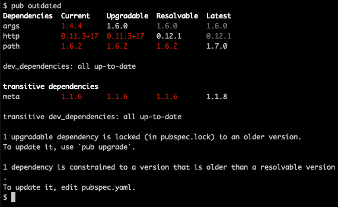

_Outdated_ is one of the commands of the [pub tool](/tools/pub/cmd).


$ pub outdated [options]


Use `pub outdated` to identify out-of-date [package dependencies][]
and get advice on how to update them.
[Best practices for dependency management][best practices]
include using the most recent stable package versions,
so you can get the latest bug fixes and improvements.

{{site.alert.version-note}}
  The `pub outdated` command was introduced in Dart 2.8.
{{site.alert.end}}

## Overview

Here's how you can use `pub outdated` to help you
update the dependencies of a package that you own
(whether it's an app or library package):

1. If your package doesn't have a `pubspec.lock` file
   checked into source control,
   **run `pub get`** in the top directory of the package —
   the directory that contains your package's
  [`pubspec.yaml`](/tools/pub/pubspec) file.
1. **Run `pub outdated`**
   to identify which package dependencies are out-of-date.
   Note the affected packages,
   so that later you can test the behavior of code that uses them.
1. Follow the recommendations of `pub outdated` for updating the packages.
   Some updates might require only running `pub upgrade`.
   Others might require updating `pubspec.yaml` before running `pub upgrade`.
1. **Run `pub outdated`** to confirm that you've updated all the dependencies.
1. **Test** your package to confirm that it still works as expected.

You might still have out-of-date dependencies due to
[transitive dependencies][].
If you want to determine the cause,
try running [`pub deps`][] and searching the output for
the name of each out-of-date package.


## Example

Here's an example of running `pub outdated` on
an example that has several out-of-date dependencies.
Three of the dependencies (`args`, `http`, and `path`) are direct,
and one is transitive (`meta`).
As the following screenshot shows,
`pub outdated` colorizes the output by default
when you run it on the command line.
(For a text version of the screenshot, see the
[Output columns section](#output-columns).)



The **Resolvable** column shows which versions you can upgrade to
for each out-of-date dependency.
You can get more information by looking for
the **leftmost column** with a **non-red value**.
For example, you can upgrade `args` to 1.6.0 by running `pub upgrade`.
You can upgrade `http` to 0.12.1 if you edit your package's pubspec.
The `path` and `meta` packages aren't the most current versions,
but are the most current _resolvable_ versions,
considering all the other dependencies.

{{site.alert.tip}}
  To see what changed in the new version of a package
  that's published on [pub.dev,]({{site.pub}})
  look at the changelog in the package page.
  For example, you can look at the **Changelog** tabs on the pages for the
  [`args`][] and [`http`][] packages.
{{site.alert.end}}

To fix the first dependency (`args`),
you just need to run `pub upgrade`:

```terminal
$ pub upgrade
Resolving dependencies... 
> args 1.6.0 (was 1.4.4)
  ...
Changed 1 dependency!
$
```

To fix the second dependency (`http`),
you can change the pubspec's `http` entry to use
the version in the **Resolvable** column, or a compatible higher version.
In [caret syntax][], that's **`^0.12.1`**.
Here's the diff for `pubspec.yaml`:


  [TODO: Improve the formatting of the following diff]


```diff
-  http: ^0.11.0
+  http: ^0.12.1
```

After editing `pubspec.yaml`, you run `pub upgrade` to
update the `pubspec.lock` file.
You can then run `pub outdated` to confirm that
you've made all necessary changes.

```terminal
$ pub upgrade
...
$ pub outdated
Found no outdated packages.
$
```

{{site.alert.important}}
  Test your code to verify that it still works as expected
  after updating the packages.
{{site.alert.end}}

The `path` and `meta` packages are still out-of-date,
due to reasons that this package doesn't control:

```terminal
$ pub outdated
Dependencies  Current  Upgradable  Resolvable  Latest  
path          1.6.2    1.6.2       1.6.2       1.7.0   

dev_dependencies: all up-to-date

transitive dependencies
meta          1.1.6    1.1.6       1.1.6       1.1.8   

transitive dev_dependencies: all up-to-date

Dependencies are all on the latest resolvable versions.
Newer versions, while available, are not mutually compatible.
$
```

To see why these packages are out-of-date, you can run `pub deps`
and look for dependencies on these packages:

```terminal
$ pub deps -s list
...
dependencies:
...
- terminal_tools 0.1.0
  - path 1.6.2
  - meta 1.1.6
...
$ 
```

As the preceding output shows,
this package depends on the `terminal_tools` package,
which depends on old versions of `path` and `meta`.
Once the `terminal_tools` package is updated,
it should be possible to update this package.


## Output columns

The output of `pub outdated` has four columns of version information
for each out-of-date dependency.
The following example
(which has the same text as the screenshot in the [Example section](#example))
shows the four columns:
Current, Upgradable, Resolvable, and Latest.

```terminal
$ pub outdated
Dependencies  Current    Upgradable  Resolvable  Latest  
args          1.4.4      1.6.0       1.6.0       1.6.0   
http          0.11.3+17  0.11.3+17   0.12.1      0.12.1  
path          1.6.2      1.6.2       1.6.2       1.7.0   

dev_dependencies: all up-to-date

transitive dependencies
meta          1.1.6      1.1.6       1.1.6       1.1.8   

transitive dev_dependencies: all up-to-date

1 upgradable dependency is locked (in pubspec.lock) to an older version.
To update it, use `pub upgrade`.

1 dependency is constrained to a version that is older than a resolvable version.
To update it, edit pubspec.yaml.
$
```

Current
: The version used in your package, as recorded in `pubspec.lock`.
  If the package isn't in `pubspec.lock`,
  the value is `-`.

Upgradable
: The latest version allowed by your `pubspec.yaml` file.
  This is the version that `pub upgrade` resolves to.
  The value is `-` if the value in the **Current** column is `-`.

Resolvable
: The latest version that can be resolved,
  when combined with all other dependencies.
  This version corresponds to what you get if
  you set all version constraints in `pubspec.yaml` to `any`
  and then run `pub upgrade`.
  A value of `-` means that the package won't be needed.

{{site.alert.important}}
  We don't recommend actually using `any` as the constraint,
  because then running `pub upgrade` might surprise you by making
  incompatible version changes.
{{site.alert.end}}

Latest
: The latest version of the package available,
  excluding prereleases unless you use the option `--prereleases`.

For example, say your app depends on the `foo` and `bar` packages,
but the latest version of `bar` depends on an old major version of `foo`.
The result is that the latest _resolvable_ version of `foo`
is different from the _latest_ version of `foo`.

When you edit the `pubspec.yaml` file,
you generally update the **dependencies** and **dev_dependencies** sections
so that each package uses the versions in the **Resolvable** column.


## Options

For options that apply to all pub commands, see
[Global options](/tools/pub/cmd#global-options).

`--json`
: Use this option to generate output in JSON format.

`--[no-]color`
: Use this option to change whether the output uses color for emphasis.
  The default depends on whether you're using this command at a terminal.
  At a terminal, `--color` is the default;
  otherwise, `--no-color` is the default.

`--[no-]up-to-date`
: Use `--up-to-date` to make the output include dependencies that
  are already at the latest version.
  The default is `--no-up-to-date`, which saves space.

`--[no-]prereleases`
: Use `--prereleases` to include prereleases when determining
  the latest package versions.
  By default, prerelease versions aren't considered.

`--[no-]dev-dependencies`
: Use `--no-dev-dependencies` to ignore [dev dependencies][dev dependency].

`--[no-]dependency-overrides`
: Use `--no-dependency-overrides` to ignore [`dependency_overrides`][]
  when resolving package constraints.

<aside class="alert alert-info" markdown="1">
**Problems?**
See [Troubleshooting Pub](/tools/pub/troubleshoot).
</aside>

[`args`]: {{site.pub-pkg}}/args
[best practices]: /tools/pub/dependencies#best-practices
[caret syntax]: /tools/pub/dependencies#version-constraints
[constraints]: /tools/pub/dependencies#caret-syntax
[Customizing static analysis]: /guides/language/analysis-options
[dev dependency]: /tools/pub/dependencies#dev-dependencies
[`dependency_overrides`]: /tools/pub/dependencies#dependency-overrides
[package dependencies]: /tools/pub/dependencies
[`http`]: {{site.pub-pkg}}/http
[using http]: /guides/language/analysis-options#default-google-rules-http
[`pub deps`]: /tools/pub/cmd/pub-deps
[`pub get`]: /tools/pub/cmd/pub-get
[`pub upgrade`]: /tools/pub/cmd/pub-upgrade
[transitive dependencies]: /tools/pub/glossary#transitive-dependency
